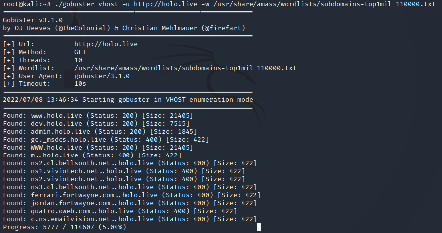

Name: Hololive
Date:  
Difficulty: Hard
Description: Holo is an Active Directory (AD) and Web-App attack lab that aims to teach core web attack vectors and more advanced AD attack techniques. This network simulates an external penetration test on a corporate network. 
Better Description:  
Goals: OSCP revision, demonstrate how far I have come since Throwback..
Learnt:

## Intial Recon

I ran a masscan and alarm so that the network did not shutdown.

The inital nmap:


#### Task 8 Answers

What is the last octet of the IP address of the public-facing web server?
```
33
```
How many ports are open on the web server?
```
3
```
What CME is running on port 80 of the web server?
```
wordpress
```
What version of the CME is running on port 80 of the web server?
```
5.5.3
```
What is the HTTP title of the web server?
```
holo.live
```

## Web App Exploitation

#### Task 9 Answers



```bash
gobuster vhost -u http://holo.live -w /usr/share/amass/wordlists/subdomains-top1mil-110000.txt
```

What domains loads images on the first web page?
```
www.holo.live
```
What are the two other domains present on the web server? Format: Alphabetical Order
```
admin.holo.live, dev.holo.live
```

```bash
git clone https://github.com/danielmiessler/SecLists.git
```

## Exploit

## Foothold

## PrivEsc

      
