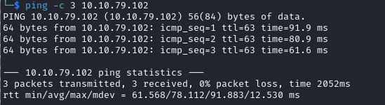

# Anonymous Writeup

Name: Anonymous
Date:  
Difficulty:  
Goals:  
Learnt:
Beyond Root:

- [[Anonymous-Notes.md]]
- [[Anonymous-CMD-by-CMDs.md]]

Warning this machine contains references to Cowboy Bebop as finally I can use it to describe my [CTF experiences like me waiting to get good](https://www.youtube.com/watch?v=b_K_fu-mPNU).  
## Recon

The time to live(ttl) indicates its OS. It is a decrementation from each hop back to original ping sender. Linux is < 64, Windows is < 128.

Answers to the first three questions

Answer to fourth question

Just checking what crackmapexec would output to compare with nmap 

Connect and enjoy a Russian women's Corgi pictures for whatever reason. Anyway because I can finally use this [VIP Corgi Hacks a machine](https://www.youtube.com/watch?v=5YRTY5G8YRs), because we can just replace the clean.sh script with a a malicious clean.sh script to give us a reverse shell. Why? Because there is a cronjob running and we have write access to FTP and therefore can replace the script.

My head turned at the idea that the this required a [Cathode-ray_tube](https://en.wikipedia.org/wiki/Cathode-ray_tube)

FTP is also 

Then I saw the error. `rw-r--r--` ...woops 

https://stackoverflow.com/questions/30103662/append-data-to-file-on-ftp-server-in-python from Phind 

- There is lxc and namelessone is part of the lxd group 
## Exploit

## Foothold

## Privilege Escalation

I thought this was capabilities, before I realised it is actually a set uid binary...

And [root](https://www.youtube.com/watch?v=pghpRi3mJ6A)

## Post-Root-Reflection  

LLM and Search Engine Dorking is making my brain funky... need to fix this

## Beyond Root

Finally the [bestest boy](https://www.youtube.com/watch?v=Ml4QlAmogxA)

