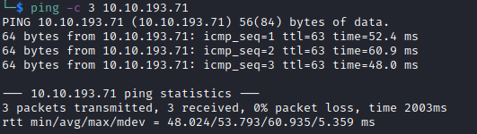

# Aratus Helped-Through

Name: Aratus
Date:  
Difficulty:  Medium
Goals:  
- Anisble High Level overview and prompt research
- Script the temporary default content bustery
Learnt:
Beyond Root:
- Ansible Research
- Ansible Template a Vulnerable VM 

## Recon

The time to live(ttl) indicates its OS. It is a decrementation from each hop back to original ping sender. Linux is < 64, Windows is < 128.

Anonymous FTP that is executable and readable.

## Exploit

## Foothold

## PrivEsc

## Beyond Root

      
