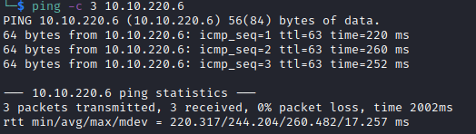

# Biblioteca Helped-Through

Name: Biblioteca
Date:  10/01/2023
Difficulty:  Medium
Goals:  
- Warm up brain after work
- Have fun
- Fundementals
Learnt:
Beyond Root:

Fundementals are important and warming up and having fun while prepping for arduious Hacking and Learning later. I thought I would start evening with another newbie tuesday from [Alh4zr3d](https://www.youtube.com/watch?v=Uz4iv7kHxpI). Also I need to finished patching [[Agent-T-Writeup]] and this might prompt it to occur and swiftly. Also I need to exercise and finish [[Bucket-Helped-Through]] before going on a massive Azure related educative spree. 0xTiberious and H3l3N_0F_t0r join the stream along with all the regular.

## Recon

The time to live(ttl) indicates its OS. It is a decrementation from each hop back to original ping sender. Linux is < 64, Windows is < 128.

	
## Exploit

## Foothold

## PrivEsc

## Beyond Root

      
