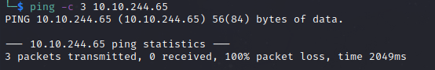

# Brainstorm Writeup
Name: Brainstorm
Date:  
Description: Reverse engineer a chat program and write a script to exploit a Windows machine
Difficulty:  Medium
Goals:  OSCP Prep
Learnt:

## Recon

The time to live(ttl) indicates its OS. It is a decrementation from each hop back to original ping sender. Linux is < 64, Windows is < 128.

- 2 days later I realised I made this error of not using `binary` before transfering a binary file over FTP, as I had compatbility issues possible due to corruption over file transfer... \*facepalm...

Has both strcmp and the safer C function strncmp, due to my radare not being as good I want I will also use ghidra aswell for sake of speed.

Reading the Task 3 Access section and subsequently testing port 9999 with `ncat` 

## Exploit

Either:
1. Username vulnerable - It is not
2. Message

Ghidra was not very helpful. Either the bufferover need `Username \x0a` - carriage return, then overflow the message or its the username size. 

Fuzzing username with 100 - got to 4200.. with 400 "A"s  ++400. C knowledge, why have a buffer for username that is that size, Must be the message.

Fuzzing crashed at 4700

I tried testing on my Windows VM, but the application is either 32bit/16bit whereas my VM is 64bit - had trouble getting Windows 7. I checked [TCM Video for his setup](https://www.youtube.com/watch?v=T1-Sds8ZHBU) he has a Windows 7 VM . Found [techpp article with all the links](https://techpp.com/2018/04/16/windows-7-iso-official-direct-download-links/). Windows 7 32 bit immunity debugger does not work.. Window 10 32 bit it is...
2 days later I after research the various issues  my error being that  not using `binary` before transfering a binary file over FTP, as I had compatbility issues possible due to corruption over file transfer... \*facepalm...

## Foothold

## PrivEsc

      
