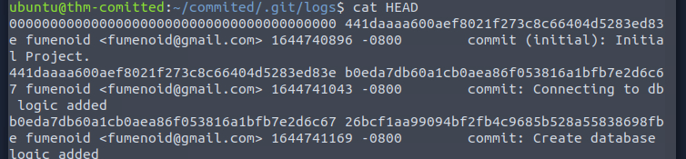

Name: Committed
Date:  
Difficulty:  
Description:  
Better Description:  
Goals: 
Learnt:

Oh no, not again! One of our developers accidentally committed some sensitive code to our GitHub repository. Well, at least, that is what they told us... the problem is, we don't remember what or where! Can you track down what we accidentally committed

Discloses user fumenoid, but user does have a home directory.
The box has no internet so no addition packages are required.
Therefore neither the sensitive code is on a mysql database or remote package, but in the .git. Or an abuse of the p[ython script, but maybe usages of it or older versions of the code, but there is zero branches to rebase to.
