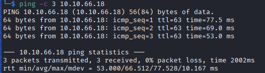

# Corridor Helped-Through

Name: Corridor
Date:  08/01/2023
Description: Can you escape the Corridor?
Difficulty: Easy  
Goals: 
- Hack while tired and ill 
- Warm up
- Python website beyond
Learnt:
Beyond Root:
- Learn about general python webserver file directory and such
- Harden the webserver

This and [[Jason-Helped-Through]] are from [Newbie Tuesdays with Alh4zr3d](https://www.youtube.com/watch?v=2e9pGJbZpJg). I wanted to warm up while ill, get THM streak, harden some webservers mostly for the Json - mostly have fun before I before return to [[Support-Writeup]].

## Recon

The time to live(ttl) indicates its OS. It is a decrementation from each hop back to original ping sender. Linux is < 64, Windows is < 128.

## Exploit

## Foothold

## PrivEsc

## Beyond Root

      
