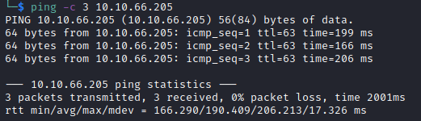

# CyberHeroes Writeup

Name: CyberHeroes
Date:  10/01/2023
Difficulty:  Easy
Goals:  
- Warm up brain after work
- Have fun
- Fundementals
Learnt:
- I need to review OSI model to make sure I am absolutely 100% on it. 
Beyond Root:
- Explain the OSI model after redoing the room, because Al getting it wrong through my sideways in [[Biblioteca-Helped-Through]] 

Fundementals are important and warming up and having fun while prepping for arduious Hacking and Learning later. I thought I would start evening with another newbie tuesday from [Alh4zr3d](https://www.youtube.com/watch?v=Uz4iv7kHxpI). Also I need to finished patching [[Agent-T-Writeup]] and this might prompt it to occur and swiftly. Also I need to exercise and finish [[Bucket-Helped-Through]] before going on a massive Azure related educative spree. 0xTiberious and H3l3N_0F_t0r join the stream along with all the regular.

## Recon & Exploit

The time to live(ttl) indicates its OS. It is a decrementation from each hop back to original ping sender. Linux is < 64, Windows is < 128.

I was already in the source 

54321@terceSrepuS -> SuperSecret@12345

Is the password.

## Migitation

Don't hardcode passwords
Don't put authenicate source code in external user visability.
      
I changed this to a Writeup, because I already got there first. But the OSI model discuss made me want to a beyond root, but there is none here see [[Biblioteca-Helped-Through]].