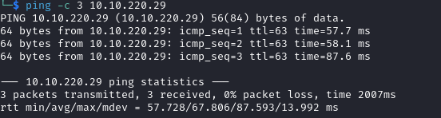

# Cyborg Writeup

Name: Cyborg
Date:  
Difficulty:  
Goals:  
Learnt:
Beyond Root:

- [[Cyborg-Notes.md]]
- [[Cyborg-CMD-by-CMDs.md]]


## Recon

The time to live(ttl) indicates its OS. It is a decrementation from each hop back to original ping sender. Linux is < 64, Windows is < 128.



Dorking the Borg like I am prepare

> [Borg](https://borgbackup.readthedocs.io/en/stable/) *"BorgBackup (short: Borg) is a deduplicating backup program. Optionally, it supports compression and authenticated encryption. The main goal of Borg is to provide an efficient and secure way to backup data. The data deduplication technique used makes Borg suitable for daily backups since only changes are stored. The authenticated encryption technique makes it suitable for backups to not fully trusted targets. See the [installation manual](https://borgbackup.readthedocs.org/en/stable/installation.html) or, if you have already downloaded Borg, `docs/installation.rst` to get started with Borg. There is also an [offline documentation](https://readthedocs.org/projects/borgbackup/downloads) available, in multiple formats."

Going through this initially by just getting a understanding of the data of the files in the archive.tar I had the ominous feeling as the keys, hashing algorithms and the notion that the only way is SSH that this box could be a nasty rabbit hole down cryptography way... My misgivings are probably due to my experience with Cryptographic rooms and more puzzle-y boxes on THM and the [[Hawk-Helped-Through]]. After RTFM what the Borg utility was. I can now at least not fret to much about the combinatoric nightmare of hoarding data and then trying combinations. [Divide and Conqueror, unlike the Star Trek Borg and probably more like the Q...](https://www.youtube.com/watch?v=UolX8swBJHc) 


 config
```
[repository]
version = 1
segments_per_dir = 1000
max_segment_size = 524288000
append_only = 0
storage_quota = 0
additional_free_space = 0
id = ebb1973fa0114d4ff34180d1e116c913d73ad1968bf375babd0259f74b848d31
key = hqlhbGdvcml0aG2mc2hhMjU2pGRhdGHaAZ6ZS3pOjzX7NiYkZMTEyECo+6f9mTsiO9ZWFV
	L/2KvB2UL9wHUa9nVV55aAMhyYRarsQWQZwjqhT0MedUEGWP+FQXlFJiCpm4n3myNgHWKj
	2/y/khvv50yC3gFIdgoEXY5RxVCXhZBtROCwthh6sc3m4Z6VsebTxY6xYOIp582HrINXzN
	8NZWZ0cQZCFxwkT1AOENIljk/8gryggZl6HaNq+kPxjP8Muz/hm39ZQgkO0Dc7D3YVwLhX
	daw9tQWil480pG5d6PHiL1yGdRn8+KUca82qhutWmoW1nyupSJxPDnSFY+/4u5UaoenPgx
	oDLeJ7BBxUVsP1t25NUxMWCfmFakNlmLlYVUVwE+60y84QUmG+ufo5arj+JhMYptMK2lyN
	eyUMQWcKX0fqUjC+m1qncyOs98q5VmTeUwYU6A7swuegzMxl9iqZ1YpRtNhuS4A5z9H0mb
	T8puAPzLDC1G33npkBeIFYIrzwDBgXvCUqRHY6+PCxlngzz/QZyVvRMvQjp4KC0Focrkwl
	vi3rft2Mh/m7mUdmEejnKc5vRNCkaGFzaNoAICDoAxLOsEXy6xetV9yq+BzKRersnWC16h
	SuQq4smlLgqml0ZXJhdGlvbnPOAAGGoKRzYWx02gAgzFQioCyKKfXqR5j3WKqwp+RM0Zld
	UCH8bjZLfc1GFsundmVyc2lvbgE=


```


https://borgbackup.readthedocs.io


`strings index.5`

```
BORG_IDXd
%J_I
FDB9
DIy?
s~16*
(_$i
|C*c
vN&W
|)RK
TzJ?
p2ky
.	e;
O@n;_
^rVm
.W3^
K0`L
Q+;,
	f&nHS.
ihQL1
 y@-
TOT[M$9
_nj0
we"b
r!gT
jN:&
t-@ A
!nWSx
[D.m
R6V@
!_}~
|Yr.
)	y0V>
E2^d
vTtg
I o1A
OUWT
-4o~W6
+sA9
pUak
v~iV
i8ML
uF7Jw;
>7g&
	I6Bg
q|NF
_,]6
`v/(D~

```

```json
versionhints@{"algorithm": "XXH64", "digests": {"final": "05178884e81563d7"}}indexb{"algorithm": "XXH64", "digests": {"HashHeader": "146e9cb969e480a3", "final": "b53737af67235823"}}

```

nounce for cyrptography 
```
00000000200000b9
```


https://github.com/Cyan4973/xxHash


```bash
echo 'hqlhbGdvcml0aG2mc2hhMjU2pGRhdGHaAZ6ZS3pOjzX7NiYkZMTEyECo+6f9mTsiO9ZWFV
        L/2KvB2UL9wHUa9nVV55aAMhyYRarsQWQZwjqhT0MedUEGWP+FQXlFJiCpm4n3myNgHWKj
        2/y/khvv50yC3gFIdgoEXY5RxVCXhZBtROCwthh6sc3m4Z6VsebTxY6xYOIp582HrINXzN
        8NZWZ0cQZCFxwkT1AOENIljk/8gryggZl6HaNq+kPxjP8Muz/hm39ZQgkO0Dc7D3YVwLhX
        daw9tQWil480pG5d6PHiL1yGdRn8+KUca82qhutWmoW1nyupSJxPDnSFY+/4u5UaoenPgx
        oDLeJ7BBxUVsP1t25NUxMWCfmFakNlmLlYVUVwE+60y84QUmG+ufo5arj+JhMYptMK2lyN
        eyUMQWcKX0fqUjC+m1qncyOs98q5VmTeUwYU6A7swuegzMxl9iqZ1YpRtNhuS4A5z9H0mb
        T8puAPzLDC1G33npkBeIFYIrzwDBgXvCUqRHY6+PCxlngzz/QZyVvRMvQjp4KC0Focrkwl
        vi3rft2Mh/m7mUdmEejnKc5vRNCkaGFzaNoAICDoAxLOsEXy6xetV9yq+BzKRersnWC16h
        SuQq4smlLgqml0ZXJhdGlvbnPOAAGGoKRzYWx02gAgzFQioCyKKfXqR5j3WKqwp+RM0Zld
        UCH8bjZLfc1GFsundmVyc2lvbgE='  | tr -d '\n' | sed 's/        //g' | base64 -d
```


```bash
apt install borgbackup
```

Usually -thm is enough. I removed the final ) to the markdown picture linking:


## Beyond Root


