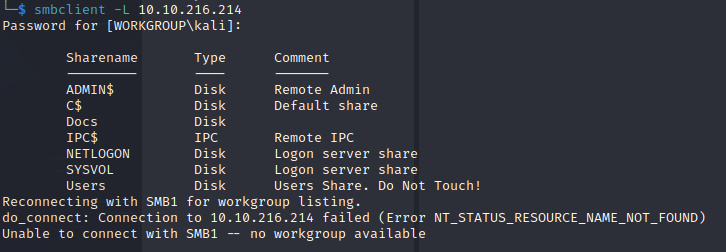
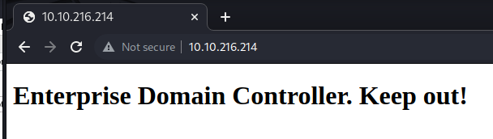
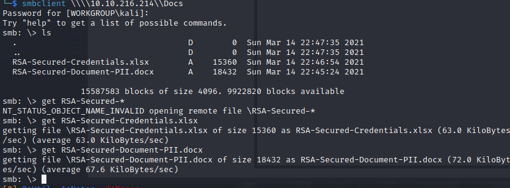

Name: EnterpriseV2
Date:  
Difficulty:  Hard
Description:  You just landed in an internal network. You scan the network and there's only the Domain Controller...
Better Description:  Disclose all the passwords the box, till System..
Goals:  OSCP Prep
Learnt:
- My OSINT game requires the cyber mentor cert to up my game


## Recon









Got the hash could not crack. [Went to enjoy a good couple of hours of Alh4zr3d.](https://www.youtube.com/watch?v=Su3rl9xjyqU&t=800s) and learn some Windows and Active Directory from a professional, while I do OSCP recon and execises that I know  I can just background. Spoilers I thought I rinsed everything, apparently I missed the "hisory" thinking it was just protected on the LAD-ADMIN user, because error messages. 


Cannot view or get these in Default, but cannot get Public


[bitbucket](https://bitbucket.org/product) is Github alternative.
```
altbitbucket
bitbucket
nik
replication
spooks
korone
banana
cake
Contractor
sensitive-account
contrator-temp
varg
adobe-subscription
joiner
```

No virtual hosts found with the gobuster.  We can't DNS Zone transfer

![[digthedns.png]]


This file cost me this being a writeup.


Anyway `replication:101RepAdmin123!!`


## Exploit

Thought nothing of this..


My OSINT is crippled by my learning of this with CTFs, one day I will be good, but probably never geoguessing madness - idea AI geoguesser - people are making stuff.


`nik : ToastyBoi!`


`littleredbucket`; HTTP/LAB-DC; bitbucket - also bitbucket is a member of sensitive-account

Both nik and bitbucket have similar share access


To scratch on the inside of my skull


## Foothold

RDP as `lab.enterprise.thm\bitbucket` 


Practiced my `IEX` for a shell, used the .bat version so the me eyes  do not melt from the terminal colouring characters and my sanity does not strain of trying to read between the ascii colour coding. 

## PrivEsc


I have not done one of these in awhile and have wanted to for awhile.
    

I hate RDP as nostalgic as file explorer is I am too far gone with RDP, terminals also @malwarejake points out historically sysadmin use GUI and miss alot of issues. So I will pause the video and use `icacls` [RTFM](https://learn.microsoft.com/en-us/windows-server/administration/windows-commands/icacls).
`dir /q` file ownship

At the top you can see that it `BUILTIN\Users:permission Inherited from parent container ,Object Inherit,Container Inherit and Write!` 


```powershell
# perm is a permission mask and can be specified in one of two forms:
        # a sequence of simple rights:
                N - no access
                F - full access
                M - modify access
                RX - read and execute access
                R - read-only access
                W - write-only access
                D - delete access

	# a comma-separated list in parentheses of specific rights:
                DE - delete
                RC - read control
                WDAC - write DAC
                WO - write owner
                S - synchronize
                AS - access system security
                MA - maximum allowed
                GR - generic read
                GW - generic write
                GE - generic execute
                GA - generic all
                RD - read data/list directory
                WD - write data/add file
                AD - append data/add subdirectory
                REA - read extended attributes
                WEA - write extended attributes
                X - execute/traverse
                DC - delete child
                RA - read attributes
                WA - write attributes

# inheritance rights may precede either form and are applied
        # only to directories:
                (OI) - object inherit
                (CI) - container inherit
                (IO) - inherit only
                (NP) - don't propagate inherit
                (I) - permission inherited from parent container
```


The executable has to be called Zero.exe due to the pathing to find the executable will pick Zero.exe. 

