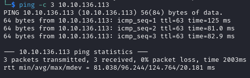

# Grep Helped-Through

Name: Grep
Date:  1/3/2024
Difficulty:  Easy
Goals:  
- Formalise my very lacking OSINT experience with some Question Based Methodology
- Learn from others and read 4 Writeups
Learnt:
- HOLY MOLY
Beyond Root:
- All the OSINT HTB retired challenge 50/50 till good...
- Question based and OSINT methodology and automation 

- [[Grep-Notes.md]]
- [[Grep-CMD-by-CMDs.md]]

Writeups used
- https://infosecwriteups.com/grep-v-1-7-writeup-tryhackme-7589bcb72922
- https://medium.com/@5kyf1/grep-tryhackme-walkthrough-dd6e4c1cb664
- https://medium.com/@niceselol/tryhackme-grep-8e0249947190
- https://cyberiumx.com/write-ups/tryhackme-grep/

In response to my general lack of OSINT experience and not having to have to really do it and wanting to do lots more and automate a lot I need to get good. There was a rumour that the HTB OSINT boxes were easy points once upon a time, but I was not for easy points for HTB and purely just TJ NULL list flailing and failing till I got good. Now that prioritise have changed and a requirement to actually be good at OSINT methodology and automating some of the busy work away has become mandatory for my life going forward.

- Follow up retired HTB Challenges 50/50 Writeup/Helped-Through - hints allowed for Monstrosity 
	- ID Exposed
	- Money Flowz
	- Infiltration
	- Easy Phish
	- Block Hunt3r
	- Missing in Action
	- Monstrosity

Before starting the directory was populated with minimal automated recon and I will give myself a half an hour to just try to answer questions other than Question 4 from what I have and using persuading my brain to operate faster due to time limit - if I fail then I will read all the Writeups and document what I did not do or had not used, learnt before this... using the 3-5 minutes for the machine to startup correctly to just enumerate what data I have..
## Recon

The time to live(ttl) indicates its OS. It is a decrementation from each hop back to original ping sender. Linux is < 64, Windows is < 128.

There is grep.thm in nmap for 443, so adding it to the hosts file is required and fuzzing for subdomains is next and important step. 


Gobuster erroring hard on all ports indicates that subdomain fuzzing needs to be prioritised rather than waited to complete.


login.js
```js
function login() {
    var username = document.getElementById('username').value;
    var password = document.getElementById('password').value;
    fetch('../../api/login.php', {
      method: 'POST',
      headers: {
        'Content-Type': 'application/json',
      },
      body: JSON.stringify({
        username: username,
        password: password,
      }),
    })
    .then(response => response.json())
    .then(data => {
      if (data.error) {
        alert(data.error);
      } else {
        // Redirect to the dashboard or the admin page based on the role
        window.location.href = data.role == 'admin' ? 'admin.php' : 'dashboard.php';
      }
    })
    .catch((error) => {
      console.error('Error:', error);
    });
  }
```

register.js
```js
function login() {
    var username = document.getElementById('username').value;
    var password = document.getElementById('password').value;
    fetch('../../api/login.php', {
      method: 'POST',
      headers: {
        'Content-Type': 'application/json',
      },
      body: JSON.stringify({
        username: username,
        password: password,
      }),
    })
    .then(response => response.json())
    .then(data => {
      if (data.error) {
        alert(data.error);
      } else {
        // Redirect to the dashboard or the admin page based on the role
        window.location.href = data.role == 'admin' ? 'admin.php' : 'dashboard.php';
      }
    })
    .catch((error) => {
      console.error('Error:', error);
    });
  }
```

Started have trouble connecting to 443


While my entire existence in every aspect continuously starts to rate limited in various ways 

..


## OSINT skills [ENHANCE](https://www.youtube.com/watch?v=CMBfSbpXvsE)

-   [infosecwriteups](https://infosecwriteups.com/grep-v-1-7-writeup-tryhackme-7589bcb72922)
	- OSINT organisation on Github -> Use good dorks before continuing to find the correct SearcMe!


Still puzzling over how to deal with AI and search engine dorking madness of late 2023 and 2024 issues..


- https://medium.com/@5kyf1/grep-tryhackme-walkthrough-dd6e4c1cb664
	- language:PHP


Now github is rate limiting me...


- https://medium.com/@niceselol/tryhackme-grep-8e0249947190
	- reminded me to read the task...


TIL: Github search is case insensitive!


How in the every living `git good` is Github tracking anything on their site?


While my head is reeling from the madness that is search engine dorking these days, I started noting questions I needed to answer for my beyond root and the OSINT methodology and for my own sanity while git clone the repository for fine combing through.

```bash
git clone https://github.com/supersecuredeveloper/searchmecms.git
```

There is also an uploads directory with file uploading be a feature of this site.
```php
<?php
session_start();
require 'config.php';
$uploadPath = 'uploads/';

function checkMagicBytes($fileTmpPath, $validMagicBytes) {
    $fileMagicBytes = file_get_contents($fileTmpPath, false, null, 0, 4);
    return in_array(bin2hex($fileMagicBytes), $validMagicBytes);
}

$allowedExtensions = ['jpg', 'jpeg', 'png', 'bmp'];
$validMagicBytes = [
    'jpg' => 'ffd8ffe0', 
    'png' => '89504e47', 
    'bmp' => '424d'
];

if ($_SERVER['REQUEST_METHOD'] === 'POST') {
    if (isset($_SESSION['username'])) {
        if (isset($_FILES['file'])) {
            $file = $_FILES['file'];
            $fileName = $file['name'];
            $fileTmpPath = $file['tmp_name'];
            $fileExtension = strtolower(pathinfo($fileName, PATHINFO_EXTENSION));

            if (checkMagicBytes($fileTmpPath, $validMagicBytes)) {
                $uploadDestination = $uploadPath . $fileName;
                move_uploaded_file($fileTmpPath, $uploadDestination);

                echo json_encode(['message' => 'File uploaded successfully.']);
            } else {
                echo json_encode(['error' => 'Invalid file type. Only JPG, JPEG, PNG, and BMP files are allowed.']);
            }
        } else {
            echo json_encode(['error' => 'No file uploaded.']);
        }
    } else {
        echo json_encode(['error' => 'User not logged in.']);
    }
} else {
    echo json_encode(['error' => 'Unsupported request method.']);
}
?>
```

Bang out the tufflehog which I have not used before
```bash
trufflehog git https://github.com/supersecuredeveloper/searchmecms --only-verified
```

I got carried away with thoroughness to just GFTJ: go for the juggular


For whatever reason I did not like the admin2 username or admin password, so idiot I am and on and on - including intercept the Response in burp too


Noice clicking of rate limiting overflowing my brain as I decide to restart the machine said the author calmly (Stephen Fry voice-over)... as that is best way to enjoy that book and way to go about life.


The good Bug Bounty Hunting methodology of:
- https://infosecwriteups.com/grep-v-1-7-writeup-tryhackme-7589bcb72922
- https://medium.com/@5kyf1/grep-tryhackme-walkthrough-dd6e4c1cb664
- https://medium.com/@niceselol/tryhackme-grep-8e0249947190

All go for the authenticated directory brute forcing for the maximum data collection - as expressed in the writeups

- https://cyberiumx.com/write-ups/tryhackme-grep/ 

Mentioned knowledge of upload.php, which they all should have as they found the GitHub repository.


Reference a previously scrap bit of source code as a way of mention how I am sometimes not blinded by my own inanepitude -> ineptitude... 


_

In my endless quest to have a catalogue all known file types - the [BMP file format](https://en.wikipedia.org/wiki/BMP_file_format) *"is a [raster graphics](https://en.wikipedia.org/wiki/Raster_graphics "Raster graphics") [image file format](https://en.wikipedia.org/wiki/Image_file_format "Image file format") used to store [bitmap](https://en.wikipedia.org/wiki/Bitmap "Bitmap") [digital images](https://en.wikipedia.org/wiki/Digital_image "Digital image"), independently of the [display device](https://en.wikipedia.org/wiki/Display_device "Display device") (such as a [graphics adapter](https://en.wikipedia.org/wiki/Graphics_adapter "Graphics adapter")), especially on [Microsoft Windows](https://en.wikipedia.org/wiki/Microsoft_Windows "Microsoft Windows")[[2]](https://en.wikipedia.org/wiki/BMP_file_format#cite_note-bmp-2) and [OS/2](https://en.wikipedia.org/wiki/OS/2 "OS/2")[[3]](https://en.wikipedia.org/wiki/BMP_file_format#cite_note-os2bmp-3) operating systems.The BMP file format is capable of storing [two-dimensional](https://en.wikipedia.org/wiki/2D_computer_graphics "2D computer graphics") digital images in various [color depths](https://en.wikipedia.org/wiki/Color_depth "Color depth"), and optionally with [data compression](https://en.wikipedia.org/wiki/Data_compression "Data compression"), [alpha channels](https://en.wikipedia.org/wiki/Alpha_compositing "Alpha compositing"), and [color profiles](https://en.wikipedia.org/wiki/Color_management "Color management"). The [Windows Metafile](https://en.wikipedia.org/wiki/Windows_Metafile "Windows Metafile") (WMF) specification covers the BMP file format."*

Very helpfully we could just paste `424d` into a web shell and take a nice screenshot: 


I forget to edit it with `hexedit`, I was right to paste it in first to prevent messing up the rest of the file

This failed, but did do similarly to the https://cyberiumx.com/write-ups/tryhackme-grep/ so head patting myself


There is interesting redirection that is worth noting...

But it did not happen again

Here is the burp history for to enjoyers of computer related weirdness


If only passing the buttery smoothness of doing this was frictionless... 


And we are double-u, double-u, double-u dash dator


And then this machine make me feel like an absolute idiot.


Then as I read it would take four hours to crack this with Rockyou.txt the idiocy just kept coming... thankful I have a methodological review and planned expansion of the Question-based methodology in my Archive! 


#### What is the API key that allows a user to register on the website?


```
ffe60ecaa8bba2f12b43d1a4b15b8f39
```
#### What is the first flag?

```
login to the site...
```

#### What is the email of the "admin" user?


```
admin@searchme2023cms.grep.thm
```
#### What is the host name of the web application that allows a user to check an email for a possible password leak?

`nmap --script discovery` automatically enumerates SSL certificates with that subscript


```
leakchecker.grep.thm 
```

#### What is the password of the "admin" user?

```
$2y$10$3V62f66VxzdTzqXF4WHJI.Mpgcaj3WxwYsh7YDPyv1xIPss4qCT9C
```

## Post OSINTed Reflection

- Truly this box has helped grep for enlightenment on just how bad I am, the existence of rate limiting in every sense is and how humble and calm I am to put up with everything and myself.

- Pathing like chess
- Deductive reasoning like columbo


Thank you to:
- https://infosecwriteups.com/grep-v-1-7-writeup-tryhackme-7589bcb72922
- https://medium.com/@5kyf1/grep-tryhackme-walkthrough-dd6e4c1cb664
- https://medium.com/@niceselol/tryhackme-grep-8e0249947190
- https://cyberiumx.com/write-ups/tryhackme-grep/
## Beyond Root


- The word mangler of truth needs to be found or developed
- There is a lot to be automated out of OSINT manually - modular not h4ddixb4dg3r monolithic 
- Gzhodan has now acquired more uses OSINTing bot