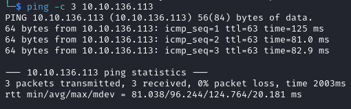

# Grep Writeup

Name: Grep
Date:  
Difficulty:  
Goals:  
Learnt:
Beyond Root:

- [[Grep-Notes.md]]
- [[Grep-CMD-by-CMDs.md]]

## Recon

The time to live(ttl) indicates its OS. It is a decrementation from each hop back to original ping sender. Linux is < 64, Windows is < 128.

	
## Exploit

## Foothold

## PrivEsc

## Beyond Root

