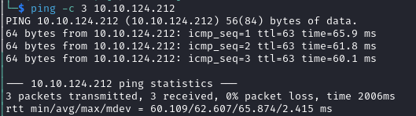

# Internal Writeup

Name: Internal
Date:  
Difficulty:  Hard
Goals:  
- GLHF on another of TheMayor boxes.. 
Learnt:
- MORE CLI Cool Commands
Beyond Root:
- Unintend SQL injection to retain Writeup status - CVE is 2022 and box is 2020 and its a Offensive Path box from the TheMayor and the last one was evil. I have spent so much time painfully flailing on this machine. I can only justify do this for completionism

- [[Internal-Notes.md]]
- [[Internal-CMD-by-CMDs.md]]

Starting and restarting this Writeup multiple times, this will be the final time. I am already aware the SQL Injection before this attempt. This going in for this final attempt, the this is a TheMayor Box and the last one I did  was not pretty. I almost wanted to run for Senate in the US and filibuster with infinite jibberish out of frustrated madness till I clone myself a proxy to run for Mayor that is more arbitrary and absurd than myself out the mismatch *real* upbringing to oust him... it was a weird and painful experience - [cue battle music to humiliation](https://www.youtube.com/watch?v=ACULtdKEVdY). It made realise I am bad, the box was bad and digging yourself out of the inverse learning curve hole is (and still sort of is continuously going to be a nightmare. Lots of other really like these boxes, but they could all be of CM tribe online surging and back-patting or I just got unlucky with other user trolling me. It could also be that these boxes were before HTB, PG and THM start standardising what a box is actually suppose to be and what the objective actually is with it. Having been blissful unaware of the nerdy-bullshit of unstrategic-mindmeddling of epeen insecurity honeypot-to-fill-the-creator ego for most of my life, the rude awaking to that kind of bullshit that does not exist outside of most *hardcore* Video Games, Specific subculture-forums and Cartoon-Cults. Internally I am *hoping* this will 3 hours maximum.  I live and cope. The beyond root for this is just finishing this. 
## Recon

The time to live(ttl) indicates its OS. It is a decrementation from each hop back to original ping sender. Linux is < 64, Windows is < 128.



```bash
wpscan --url $url --rua -e --api-token $APIKEY -o zeroauth.wpscan
```

Wordlists to try
```bash
/usr/share/wordlists/seclists/Discovery/Web-Content/URLs/urls-wordpress-3.3.1.txt
/usr/share/wordlists/seclists/Discovery/Web-Content/CMS/wordpress.fuzz.txt
/usr/share/wordlists/seclists/Passwords/Honeypot-Captures/wordpress-attacks-july2014.txt
```

Short cutting to enumerating just one vulnerability - replaced the original I did with -B 

One day I hope the Offensive Security Web App Cert just understand how anyone is suppose to do the job that get for a job does what they do in a week. Tiber1ous and the like boggle my brain sometimes. Grep all the potential vulnerabilities found by `wpscan` and when each was fixed:
```bash
cat zeroauth.wpscan | grep 'Title' -A 1
```


Another weirdness


Terrapin BR?


> WHY WOULD YOU MAKE ANOTHER ADMINISTRATIVE USER IN WORDPRESS IT GOES AGAINST THE TIERING OF ADMINISTRATIVE ACCOUNTS ITS MADNESS.
 Another `admin`  user - [[CVE-2017-5487-http___internal.thm_wordpress__rest_route=_wp_v2_users_-.md]]
> WHY WOULD YOU MAKE ANOTHER ADMINISTRATIVE USER IN WORDPRESS IT GOES AGAINST THE TIERING OF ADMINISTRATIVE ACCOUNTS ITS MADNESS.


Regardless, version verification is the current objective, either from:
- Forcing SQL Errors on `WP_Query` or `WP_Meta_Query` 
- Deduction, Abduction, ...
- Version indicator on the website

`SE-dork:`  `wordpress 6.0.3` depending on whether that feature was released prior to 2022.

- https://en.wikipedia.org/wiki/Deductive_reasoning


https://developer.wordpress.org/reference/classes/wp_query/
```php
// wp-includes/class-wp-query.php
<?php
// The Query.
$the_query = new WP_Query( $args );

// The Loop.
if ( $the_query->have_posts() ) {
	echo '<ul>';
	while ( $the_query->have_posts() ) {
		$the_query->the_post();
		echo '<li>' . esc_html( get_the_title() ) . '</li>';
	}
	echo '</ul>';
} else {
	esc_html_e( 'Sorry, no posts matched your criteria.' );
}
// Restore original Post Data.
wp_reset_postdata();
// ... no closing on the page `?`+`>`
```
Search for posts 

https://developer.wordpress.org/reference/classes/wp_meta_query/


*[WP_Meta_Query](https://developer.wordpress.org/reference/classes/wp_meta_query/) is a class defined in wp-includes/meta.php that generates the necessary SQL for meta-related queries. It was introduced in Version 3.2.0 and greatly improved the possibility to query posts by custom fields. In the WP core, it’s used in the [WP_Query](https://developer.wordpress.org/reference/classes/wp_query/ "Class Reference/WP Query") and [WP_User_Query](https://developer.wordpress.org/reference/classes/wp_user_query/ "Class Reference/WP User Query") classes, and since Version 3.5 in the [WP_Comment_Query](https://developer.wordpress.org/reference/classes/wp_comment_query/ "Class Reference/WP Comment Query") class. Unless you’re writing a custom SQL query, you should look in the *Custom Field Parameters* section for the corresponding class.*


1. Version
2. Guess the probable SQL query
3. Force an error 

First stop [HackTricks](https://book.hacktricks.xyz/network-services-pentesting/pentesting-web/wordpress)

Wordpress Version `/license.txt` or `/readme.html`, there is a nuclei template I got jebaited by my brainlessness brain almost into actually be able to contribute to something.


```bash
curl https://$victim.tld/$wordpress | grep 'content="WordPress'
```

Given the latest of these CVEs I am going to assume this is not the intended path.


https://www.redhat.com/sysadmin/formatting-date-command
```bash
date --date="5 year ago"
date --date="1360 day ago"
```
Perspective.. 


```bash
curl -H 'Cache-Control: no-cache, no-store' -L -ik -s https://wordpress.org/support/article/pages/ | grep -E 'wp-content/plugins/' | sed -E 's,href=|src=,THIIIIS,g' | awk -F "THIIIIS" '{print $2}' | cut -d "'" -f2
```

```bash
curl -H 'Cache-Control: no-cache, no-store' -L -ik -s https://wordpress.org/support/article/pages/ | grep http | grep -E '?ver=' | sed -E 's,href=|src=,THIIIIS,g' | awk -F "THIIIIS" '{print $2}' | cut -d "'" -f2
```

## Exploit

For the spoiler as a bypassing the insult of wasting your time reading this and moving on with your life.


#### Intended Path to avoid waste even more time on these *special* boxes

After the agonising over 24 hour plus allegorical prometheus's feculent vomiting the stones of barbed-wired wrapped molten glass of the [[Relevant-WTFisTHIS]] machine and the unintended pathes, intended paths of Internal. I decided at the SQL injection being from 2022 and this box being 2020 based and prior to view the official writeup for the intended path to atleast have more streamlined painful couple of hours trying to get the unintended way of get the admin and or the wp-admin users password through the SQL injection. Unfortunately I cannot do the *official* way or follow what the official walkthrough, because reasons. 


I understand to some this is the ultimate opportunity for me to shart another away 24-48 hours. Learning nothing, gaining nothing and doing very, very little that is relevant to the modern world. There are better networks and boxes for the "Pre-engagement Briefing". 

At least given my lack capability 

Please tell me the real world were this makes any sense both to implement as security and CTF. 


The scars on my brain of doing the [[Relevant-WTFisTHIS]] machine still hurt. Once I actually have some actually credibility of any kind, as TheMayor actually does this for a Job I think in addition to whatever I contribute I will use AI to scrap all these to figure out for other whether these old machine actually were worth doing for others:
- i.e. You must do this no hints, or this contains  bullshit that is of its time like racism or homophobia, use a guide for X part you will not learn anything but that this arsehole has either a big following, ego this box is just not supported like more modern HTB boxes.

The preemptive counter argument here is: Video Game Industry has had shovelware, untested nonsense for decades - why are you replicating the same rubbish for clout and get you by in one job interview?

Quality control exists to actually make us better as why use a platform if the curation is so bad that there is not a warning about this. A discord channel and community doing your work is not a solution. This the exact reason the same idiots are worrying that AI will take their security jobs. Commitment. 

WHY WOULD YOU MAKE ANOTHER ADMINISTRATIVE USER IN WORDPRESS IT GOES AGAINST THE TIERING OF ADMINISTRATIVE ACCOUNTS ITS MADNESS.
https://infosecwriteups.com/tryhackme-internal-writeup-480ce471efdd. 

How is this hard.


After I ranted at myself at the State of the West, Cultures, Conflicts of the day, Corporations failing even while being successful. I decided it best to parallel the issues with how I learning and changing. I think this the real systemic problem for world and I. I am reminded of may past cynicism and knowing how things would play out in the world, the futility of knowing the people(s) chose this with all the technology and capability and inventive to do so. And yet here I am humiliating myself to reach a more meta point about the direction of me just trying to make a better life for myself than care about the world. Its not problem of new or old strategy its just a character-of-how-we-get-there problem. We need unified truth on the best path, its costs and its rewards. 
- If I monopolise my time without growing and cultivating novelty, I am not adapting like nature does
- If dogmatically pursue self enforced predestination by perspective without surrendering to change I waste time 
- If I am honest and use proofs instead opinion and guise then at the least the environment offence kneels to my acquired might through neural work. 
- If do not pay the price or sacrifice to adapt I will never endure
- If my interest is in the short term the inflation in the long term is greater - cheating yourself 

Sometimes I amazing myself at my own patience. The laws of nature and the universe are so evident yet it ourselves not the technology that is the issue.

So to return to the point. The reason why I do this is the same reason that the rich want to go space, it is a way to find new technology that works this is just cheaper and good for the brain. I written down multiple times *"well I focused on the idea of SQL because the 3 other times trying this I came to this conclusion and that seemed to line up with the versioning, difficulty of box and I should learn more SQL because failing to do this is frustrating and I do not have mentors or a job doing this...."* 

Piece and puzzles and the differences on realism or difficulty or puzzle-y type of boxes is ... pain when in this situation. It is so bad I am starting to talk other people activities... This has left me with a lot of life and wtftodowiththeworld-kind of questions.


```
admin : my2boys
```


Queue the Angry Scarlet Johanssen walk from Ghost in the Shell... I will atleast feel as good web shelling this machine for the probably easy PrivEsc like [Aramaki Shoot out](https://www.youtube.com/watch?v=TRS4tYeeouA) and turn the moral upside-down on the hourglass of hacking-moral. One day I will get good at this...

Well....another restart later after I did not read the email is correct WHAT


At this point I the hilarious absurd timelords-dodging-the-genocide-the-universe-inquiry final Dr Who episode ever in 6969 come to mind. At email is correct nonsense. Level of triggering and upsetting for all involved. Second restart


Well nothing is working for me these days, because the same old external issues, but regardless it is all worth it.

It is times like these were I am reminded of the corrupting influence of the dragon of mars  in 40k. I will finish my echoesofthemahcinegod rust convert a play a base64 version of Children of the Omnissiah. My hope is to after I final figure how to actually write rust to try huffman encoding it.


Another reminder to go passwordless by 2025!


All data at rest or in-transit is just like those cool Japanese restaurants with horizontal food escalators, more food, more passwords, more flags, more flags more lessons etched like the tired marks of your head stuck in the escalators. William even writes his passwords done like he is writing the pastebin dump:

```
william:arnold147
```


[Zip Bomb](https://en.wikipedia.org/wiki/Zip_bomb) - for the later BR on Windows Defender for one of these old machine.


Shells if we need any
```bash
# You can reverse shell by editing templates (404.php, footer.php...)
# Theme Editor use a 404 template as it won't break the site.
# Plugin Editor  then go to /wp-content/plugins/<pluginname.php>
# Beware Theme must be active 
/usr/share/wordlists/seclists/Web-Shells/WordPress
/usr/share/wordlists/Web-Shells/laudanum-1.0/wordpress/templates/shell.php
```


Minor improvements from https://www.hackingarticles.in/wordpress-reverse-shell/
```
msfconsole -q -x 'use exploit/unix/webapp/wp_admin_shell_upload'
set RHOST internal.thm
set USERNAME admin
set PASSWORD my2boys 
set targeturi /wordpress
exploit
```

```php
/wordpress/wp-content/themes/twentyfifteen/404.php
```

Two restarts and mistakes in a laboratory environment is not, but the login screen is still the lavatory flushing away my time.


Better for everyone doing this box in the future
- Do not `Press remind my later` or `This is my email`
- press `update`

## Foothold

Re-leafing the tree of trump with a health dose of relief 


## Privilege Escalation

Atleast it is not a GTFObin


The temptation to pwnkit this machine is quite real. And I try and ruined the potentially without another painful restart. Do not worry another fly WTF moment again.


Thought nginx was runner on localhost 8080, but it is Jenkins


But Jenkins is being run by aubreanna
## Post-Root-Reflection  

My *"House"* motto - In time.. there is truth

Funny GOT hacking related house mottos
- "admin : password"
- "It's always DNS"
- "I RTFM"
- I use Arch BTW
- "dash S C and dash S V for default scripts"
- My knee-high socks as large as rc files
## Beyond Root

Deduction, ... 

Unintended SQLi above to reatin Writeup status of this box.

Try to turtle a terrapin
https://en.wikipedia.org/wiki/Terrapin_attack
https://jfrog.com/blog/ssh-protocol-flaw-terrapin-attack-cve-2023-48795-all-you-need-to-know/
https://github.com/RUB-NDS/Terrapin-Artifacts


#### Unintended retain Writeup Status path

I would really like to do one of the SQL injections myself and Rule of Acquisation number 17 is a contract is a contract is a contract - but between ferengi. And hacker without flags is no hacker at all. Quality of the flags and should be subject to the same scrutiny written above, terms and your attention is mine on the condition that I even succeed. Lmao.

```bash
# Does require another sed command to remove the ` ^[[31m^[[0m ` unless you copy from post-stdout  
cat zeroauth.wpscan | grep SQL -A 1 | sed 's/ | //g' | sed 's/--//g' | sed 's@\[!\]@@g'
```

Dork  `-Internal` each of these 

> Title: WordPress < 5.8.3 - SQL Injection via WP_Query 
	 Fixed in: 5.4.9
	 CVE-2022-21661

https://www.exploit-db.com/exploits/50663


```sql
where database == wordpress; select * from wp-users
```


- Find an action=FUZZ

 > Title: WordPress 4.1-5.8.2 - SQL Injection via WP_Meta_Query
    Fixed in: 5.4.9
    CVE-2022-21664

 > Title: WP < 6.0.2 - SQLi via Link API
    Fixed in: 5.4.11

 > Title: WP < 6.0.3 - Reflected XSS via SQLi in Media Library
    Fixed in: 5.4.12

 > Title: WP < 6.0.3 - SQLi in WP_Date_Query
    Fixed in: 5.4.12
