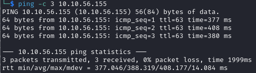

# Jurassic Park Helped-Through

Name: Jurassic-Park
Date:  
Difficulty: Hard  
Goals: 
- Had some trouble with SQLi
- Learn some MySQL
	- Had forgotten `group_concat()` exists
	- Union based injections from a URL parameter throw myself off a building level of why do I not need quotation marks.
- Turn flashcards into UltraMethods for the eventual cheatsheet of doom (TTPs) for CTFs and get excited to use everything   
- AOC no insiderPHD help or reading https://tryhackme.com/room/adventofcyber2023
Learnt:
- `nuclei` needs `-etags cve` to prevent autoexploiting
- The meme are very strong with this box
- Start smaller in sql injection
- THE NO LOGIC REQUIRED IS THE ISSUE - WHY PHIND WHY?!
	- AND combine 
Beyond Root:
- MySQL install
- Make 2 databases, fill it with data, then make cli queries without incrementally enumerating rows and columns - make smart query with brain please to understand the SQL  

https://tryhackme.com/room/jurassicpark
https://www.youtube.com/watch?v=EqUJxKQzaSM

- [[Jurassic-Park-Notes.md]]
- [[Jurassic-Park-CMD-by-CMDs.md]]


## Recon

The time to live(ttl) indicates its OS. It is a decrementation from each hop back to original ping sender. Linux is < 64, Windows is < 128.



## Exploit

PHP is making backend requests  

- Disclosure of the stack having a MySQL server
```html
<!--<div class="error">Error: You have an error in your SQL syntax; check the manual that corresponds to your MySQL server version for the right syntax to use near "%" at line 13</div>-->
```

- Play guess the non-parameterised SQL query
```sql
SELECT name, price, quantity FROM packages WHERE id=
```

`1 OR 2`


- Stopped at - https://www.youtube.com/watch?v=EqUJxKQzaSM 1:26:49 as I want try the rest myself after being genlte pushed back to having a direction after the no logic conundrum of AoC 2023 that threw me 


## Foothold

## Privilege Escalation

## Post-Root-Reflection  


## Beyond Root

Play audio, music and troll with with JavaScript
```js
<video src="[assets/magic.mp3](http://10.10.150.172/assets/magic.mp3)" autoplay></video>
<script>
async function lol() {
	let i = 1;
	while (i < 100) {
		document.querySelector('#magicwork').innerHTML += "<b>YOU DIDN'T SAY THE MAGIC WORD!</b></br>";
		await sleep(50);
		i++;
	}
	document.querySelector('#magicwork').innerHTML += 'Try SqlMap.. I dare you..';
}
async function play() {
	return new Promise(async function (resolve, reject) {
		console.log('in');
		var audioElement = document.createElement('audio');
		audioElement.setAttribute('src', 'assets/lel.ogg');
		audioElement.load();
		audioElement.addEventListener('load', function () {
			audioElement.play();
			console.log('in2');
			return resolve();
		}, true);
	});
}
(async function () {
	play();
	await lol();
}());
</script>
```


https://ubuntu.com/server/docs/databases-mysql

```bash

apt install mysql-server

ss -tap | grep mysql && echo "" && service mysql status


service mysql restart
journalctl -u mysql

cat /etc/mysql/mysql.conf.d/mysqld.cnf 
# change the bind address to something sensible
bind-address = 192.168.0.5


systemctl restart mysql.service

```

Dump a database with legitimate `mysqldump` or use `pv` or pipeviewer
```bash
mysqldump --all-databases --routines -u root -p > ~/fulldump.sql

sudo apt install pv
pv ~/fulldump.sql | mysql
```

Backup your databases with `rsync`
```bash
sudo rsync -avz /etc/mysql /root/mysql-backup
# Reinitialise e nsure the ownership of the directory is correct
sudo rm -rf /var/lib/mysql/*
sudo mysqld --initialize
sudo chown -R mysql: /var/lib/mysql
sudo service mysql start
```

