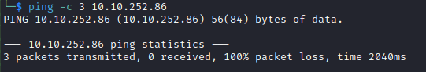

# Lookback Writeup

Name: Lookback
Date:  
Difficulty:  Easy
Goals:  
Learnt:
Beyond Root:

## Recon

The time to live(ttl) indicates its OS. It is a decrementation from each hop back to original ping sender. Linux is < 64, Windows is < 128.

Nuclei found:
[[CVE-2021-34473-https___10.10.252.86_autodiscover_autodiscover.json_@test.com_owa__&Email=autodiscover_autodiscover.json%3F@test.com]]

[packetsecurity article on CVE-2021-34473](https://packetstormsecurity.com/files/cve/CVE-2021-34473) *"This Metasploit module exploits a vulnerability on Microsoft Exchange Server that allows an attacker to bypass the authentication, impersonate an arbitrary user, and write an arbitrary file to achieve remote code execution. By taking advantage of this vulnerability, you can execute arbitrary commands on the remote Microsoft Exchange Server. This vulnerability affects Exchange 2013 CU23 versions before 15.0.1497.15, Exchange 2016 CU19 versions before 15.1.2176.12, Exchange 2016 CU20 versions before 15.1.2242.5, Exchange 2019 CU8 versions before 15.2.792.13, and Exchange 2019 CU9 versions before 15.2.858.9."*

https://github.com/phamphuqui1998/CVE-2021-34473
https://github.com/rapid7/metasploit-framework/blob/master/documentation/modules/exploit/windows/http/exchange_proxyshell_rce.md

## Exploit

## Foothold

## PrivEsc

## Beyond Root

https://github.com/HavocFramework/Havoc
https://github.com/BishopFox/sliver

https://klezvirus.github.io/RedTeaming/AV_Evasion/NoSysWhisper/
https://github.com/jthuraisamy/SysWhispers2
