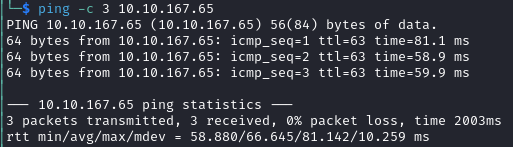

# Probe Writeup

Name: Probe
Date:  
Difficulty:  Easy
Goals:  
Learnt:
Beyond Root:

- [[Probe-Notes.md]]
- [[Probe-CMD-by-CMDs.md]]


## Recon

The time to live(ttl) indicates its OS. It is a decrementation from each hop back to original ping sender. Linux is < 64, Windows is < 128.



What is the version of the Apache server?
```
2.4.41
```
What is the port number of the FTP service?
```
1338
```
What is the FQDN for the website hosted using a self-signed certificate and contains critical server information as the homepage?
```
dev.probe.thm
```
What is the email address associated with the SSL certificate used to sign the website mentioned in Q3?

```
probe@probe.thm
```
What is the value of the **PHP Extension Build** on the server?

```
API20190902,NTS
```
What is the banner for the FTP service?

```
THM{WELCOME_101113}
```
What software is used for managing the database on the server?
```

```
What is the Content Management System (CMS) hosted on the server?

```
wordpress
```
What is the version number of the CMS hosted on the server?
```
6.2.2
```
What is the username for the admin panel of the CMS?
```bash
# You need to disable tls checking or wpscan wont scan the site: 
wpscan --url https://myblog.thm:9007/wp-login.php -e --api-token $(cat $wpscanAPIkey) --disable-tls-checks
```
I thought this was the wrong answer, but that is actually a post by a user joomla

```bash
joomla
# I tried wpscan to brute force the login to: joomla / raihan Time: 00:16:46 <> (18456 / 14344392)  0.12% - before giving up
```


During vulnerability scanning, **OSVDB-3092** detects a file that may be used to identify the blogging site software. What is the name of the file?
```bash
# grep -r /var/lib/nikto 'OSVDB' | grep 3092 
# My version of nikto cannot find this!!'
# OSVDB is stup down!

```
What is the name of the software being used on the standard HTTP port?

```
lighttpd
```
What is the flag value associated with the web page hosted on port 8000?
```

```


## Post-Root-Reflection  

## Beyond Root


