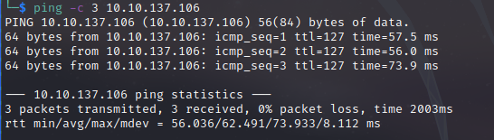

# Razorback Writeup
Name: Razorback
Date:  
Difficulty:  
Goals:  
Learnt:

## Recon

The time to live(ttl) indicates its OS. It is a decrementation from each hop back to original ping sender. Linux is < 64, Windows is < 128.

LDAP

## Exploit

## Foothold

## PrivEsc

      
