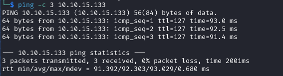

# Relevant Writeup

Name: Relevant
Date:  
Difficulty:  
Goals:  
Learnt:
Beyond Root:

- [[Relevant-Notes.md]]
- [[Relevant-CMD-by-CMDs.md]]

## Recon

The time to live(ttl) indicates its OS. It is a decrementation from each hop back to original ping sender. Linux is < 64, Windows is < 128.

	
## Exploit

## Foothold

## Privilege Escalation

## Post-Root-Reflection  

## Beyond Root

Note - Nothing in this room requires Metasploit
