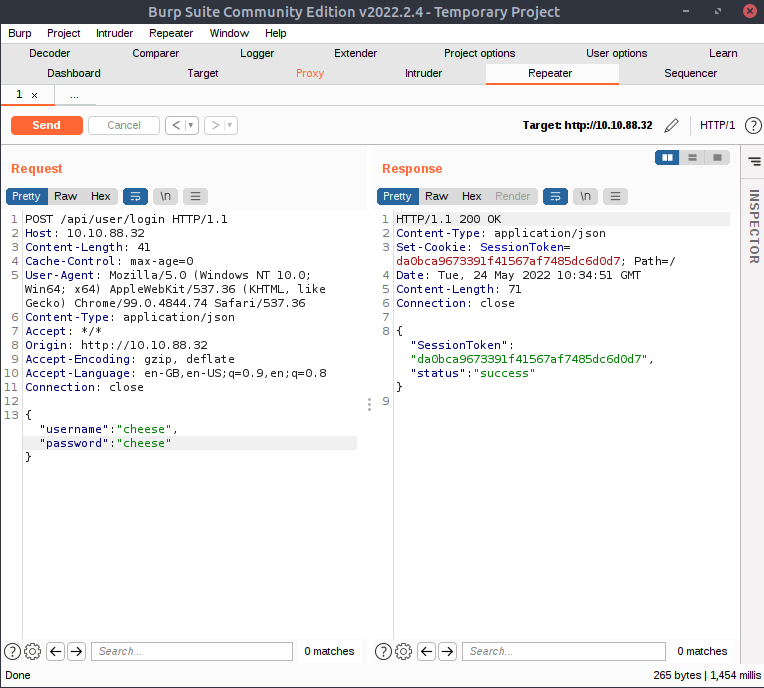
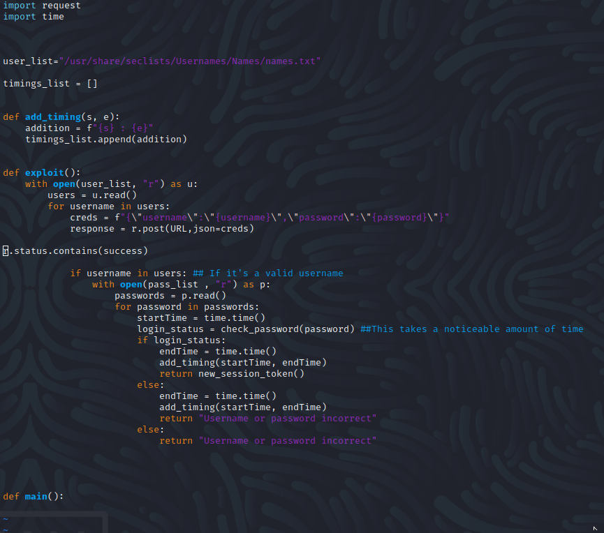

# hackerNote Walkthrough

Name: hackerNote
Date:  16/1/2024
Difficulty: Medium
Description: 
- A custom webapp, introducing username enumeration, custom wordlists and a basic privilege escalation exploit. 
Better Description:  
Goals: 
- Original - Make the python exploit myself
- 2024 Goal - Just Finish It  
Learnt:
Beyond Root:
- Add the tech stack notes and details to my Archive repository.  
## Recon

The time to live(6) indicates its OS. It is a decrementation from each hop back to original ping sender. Linux is < 64, Windows is < 128.

From reviewing this attempt of this machine I really observed the progress made. This progress being both in obtaining some level of capability in hacking and life and everything along the way and in between to observe the correct path taken. It feels good to return old machines and really understand the range of changes and scope of improvements made regardless of how I originally attempted this machine. To my mind doing lots of machine and from what people seem say about doing this is that they either do one thing till moving on or spread out and just try and try different machines. I think what is not said is the unwillingness, which I never feel, coming back to machine undone. I think the unease that is very natural about doing this often stems (and I have done this), just start form the begin again is good mentality, because it actually works - soft eyes fresh eyes - Bunk from the Wire. 

I think there is really value in also taking the time go in very, very jaded in really sitting down and observing and making action to correct and improve while tracing your good and bad steps. With praise in the good and with failure being both funny, but also with serious bent to why did I think this.  To me the initial attempt was a another push towards where I am now and have to state for the reinforcement of learning this discipline is that - I really value these pushes. They will push me for further pushes. I think that doing this enough and returning to some machine I partial did or attempted in a particular tough way when the easy option was available really honed myself. Although I will now do the easy way I am and have in reviewing this page do the neurological `diff` on various parts of what should do. Sometimes the low hanging fruit is sexier because progress in the long term in achieving objective on this machine is good for your well being. Sometimes it is just good to be successful and make it easy to reinforce long term progress forcing it to be jarringly difficult some of the time the ends imposter-syndrome at the expense of alot of success. This is bad in that maybe it wont focus you for an exam or for a course, but I think I wont suffer the massive issues that come from succeeding too much. This sounds twisted, but there are mile stones in learning and growing and capability and then if expressed mathematically as a sum that you then compare to the real world problems you may end facing in your job, life or in some difficult machine - if you are clear over that line you are going to struggle in long term. You may grow, but it will always cost you more than the organisation you join whether a corporation, government or group. 

To me at this point it seems that my peers all around me at this time that are and were successful now have the burden of not performing to the level of their expectations. That gap of expertise expected by other is neither fair or acceptable. I think that information security in general **will** lose in the west if they are bent of the future potential of making cyber security just a bunch of graduate fumblers and ex-military. I have met ordinary people that probably display really threat to their jobs without having any experience in hacking or computers or CTFS or programming challenges - without degrees. I think this is bad for APT level as the asymmetry that will present itself from private sector, which are not able to defend the external adversaries will weaken the entire internet, economy and democracy. I understand the need for governments to push to meet quotas and level of competence and corporations to make profit, it is that the fault of this same long term thinking, stable growth thinking and inability for organisations to retain capability is purely a culture issue of business and management not the people. There are religious orders that have existed for thousands of years even when science can prove practical all of it being scraps of wishful thinking and just absurd. Faith breaks, mathematics has never broken in longer than any of those orders or belief systems.  

So selfish I return to discussing that I have just steadily retained and grown myself. I recent joined a team and it is the most fun I have ever had doing this and I want to do more of it. By myself however with my data made and analysed I have observed and happy pattern. The real growth that some people seemed to be able to achieve in Video Games in myself where in the past I did not succeed at those games. Mostly because I did not really want success with those games, but also because I wanted to be really good and programming, AI, development and computers. I did the same thing as the successful players just in a different discipline and it seems to be really working.

Looking allegorically out upon the real world I think I weathered the massive western push for MORE CYBERS in a way I think other really wont because very long term mindset. Regardless of my lack of letters or jobs or first bloods. It my opinion that really the western world generally suffers from that lack of leadership in have and committing to big objective of global significance in a way that retain long term low-level support from ordinary people. I have happily contrasted this and have spent life achieving heights that no human has ever possibly achieved - fact and to further proven without the massive personality issues that would be present hopefully. When that does come to light the fact will look very unfair to everyone else so being forthright about being good to others I hope will reassure trust.

This may seem like tangent, but the governance of self when trying to be get job in tech or cybersec or get a certification or being successful at bug-bounty is falsehood in the application of your time and energy. All of those and many other unmentioned objective are so valuable for society and yourself, but the problem for the majority of those pushing for something is that the organisation behind interesting in doing any of this care about is quotas and numbers. That is not say there is no value in metrics - it that you are not valuing there strategy and metrics, because *you are not valuing your own data of living and doing something in pursuit of your goals*. To become the machine is to understand the systems and data and the flow of both, which most people seem to think of as magic. Unlike them knowing that it is just the hard work of more people than anyone will ever meet in their life building a couple of pieces on top others.  If you as a player of CTFs or programming challenges do recognise that you are bunch systems and that are governed by abstract laws and human laws that hacking the system in this sense is to grow the most effectively and never die (in some sense).

Finally minor apologies if for some reason you needed a writeup to follow along with a Walkthrough machine on THM. This was the best place for me to spout jibberish without harming anyone elses experiences. Good luck and happy hacking on whatever you are doing, but people and group may have *rules*, but the universe is rules. The best thing to do is really get good in a health way in learning and teaching, governance and strategy, being analytical and persistent in questioning and attempt to understand what you need to. Praise the fact you do not need to wind up a Babbage machine every day unless you that one person at the museum and like do that. 

#### Returning to the hackerNote machine

Pictures are better surrogate for a lot of text.

It probably took more than four hours to write and make the script and way more than that to get comfortable going that. Just because you can use someone's else hard work does not mean you get to neglect due diligence of inspecting whether it is a nasty backdoor and how it works. 

Also this was a really nasty exploit development challenge for myself as really I would need to have do a couple of more real, not custom exploit development. This is due to the just lack to experience in thinking about developing to solve (hack) these sort of problems and it confounded my coming from a more software and programming problems background. Also the intended solution is to use the script meet the objective of hacking the entire machine.
## Exploit

It is 2024 and another word like Password that I hate and I hope are fixed in this decade are Python exploits. Understandably a huge shift in infosec and hacking in 2010s now a horrifying glimpse into the hell that is to come in decades. 

0. System Administration is King and Queen and Emperor of doing anything.Dependencies are the unfortunate hellscape of all things needing other things to work. Kali needs [requests](https://www.kali.org/tools/requests/), because of the changes of python and kali in the last couple of years. 
1. `cp exploit.py ../modded-exploit.py` always track changes and make multiple script per stage of any exploit. One of the only criticisms you probably can ever make against old Ippsec videos is doing multi-stage scripting for exploit development - it makes understanding everything and what you are doing and going to do (if take a break or go down another rabbit hole etc) so so so much easier. 
2. Does the endpoint exist: `curl` is your friend?

3. We need more output or we could be sitting here hoping something works
	- Idiots on the internet will tell you print debugging is for noobs, but the really play is knowing the power of print debugging and giving your KNOWLEDGE ABOUT THE STATE OF THE STATE MACHINE `print(f"{user} - started: {startTime} and ended {endTime}")`
	- These idiots will jibber simperings around using some logging framework or package. Never underestimate the e-p33n self shaming of fools in technical wizard jobs or wanting to be. GOOD LUCK GETTING PEOPLE TO READ LOGS MORON. 
	- They were told it is bad because then the have to change everything - it takes less to less than a minute to recursive change every debug print statement over large project. These idiots forget linux exists! All you then need to do is `sed` or finpython3 modded-exploit.py | tee -a timings-attempt1.txtd and replace everyone - **maybe you are sensible in the first place and put a stub to indicate to you that this with print debug message.**
	- YOU NEED FEEDBACK - NO FEEDBACK BIG PROBLEMS - VACCUUM OF STUPID IS BORN IN THE FIRE OF MOUNT TRENDY IDIOT WITH INSECURITY ABOUT WHAT SOME IDIOT ON THE INTERNET SAYS. Print debugging is awesome. Then you know what information you need for tests, logging - BECAUSE YOU HAVE ALREADY UNDERSTOOD AND NOT NEED TO SPEND 3 MONTHS READING BAD DOCUMENTATION AND TELLING YOURSELF THAT SOME IDIOT MUST BE CORRECT. Right tool for the right good, some people are tools of themselves and do not be their tool for their insecurity. 

4. RTFM, Know your data types and do not forget to improve based from feedback- time.time() returns a float. Floats are generally bad. Conversion between ints and floats is a nightmare you generally want to avoid

- DATA AND TYPE THEORY IS EVERYWHERE   
- Life does not have a manual - RTFM
- Feedback -> Brain -> Questions -> Actions -> Execute -> Feedback -> Repeat
5. Use Linux - its THM box - use brain
- `cat names.txt| grep -ow '\b.\{5\}\b' | tee -a 5-letter-names.txt` use only the 5 letter username adding you own with some editor 
	- Needed AI for -o and -w still
- simply capture the output data is the digital gold `python3 modded-exploit.py | tee -a timings-attempt1.txt` and now you just need to relax for awhile. 

6. Remember it is a CTF there can only be one other than the one you created! Timing attack enumerating payloads takes time. 

## Foothold

## PrivEsc

Simply transfer via `scp`

Do not go what the walkthough says unless you have an exact replica of the target machine. One libcX or .so library difference is pain and suffering. And never panic if it does not work. Question what it is doing and so I manually compiled from the makefile with this one liner:
`cc  -Os -g3  -std=c11 -Wall -Wextra -Wpedantic -static exploit.c -o exploit`

## Beyond Root

#### Making the exploit - 2021-22 unsuccessful

I give myself half an hour to try take the pseudo-code and turn it into and exploit, while reconning in the background other machines that I need to do. I then checked how much I needed from this:

A lot improvements:
1. import json
2. Global URL - still 
3. Use a dictionary not list
4. a wait call to avoid server interaction collisions 
5. time took could be just s-e appended rather than listing of when each  

Good stuff
1. open with is better
2. fstrings