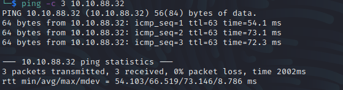
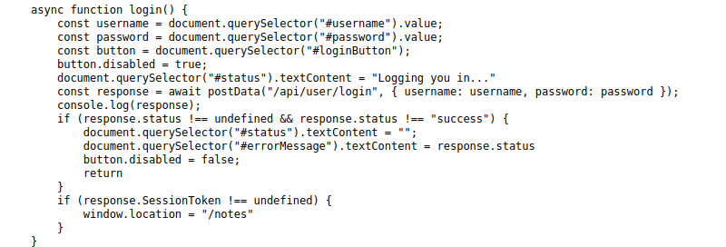
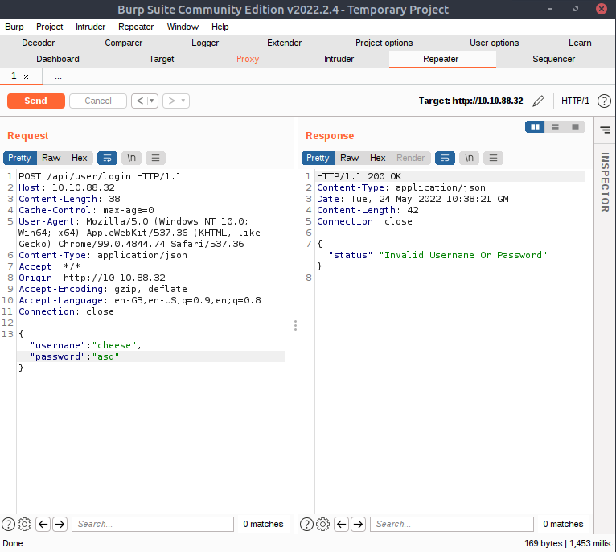
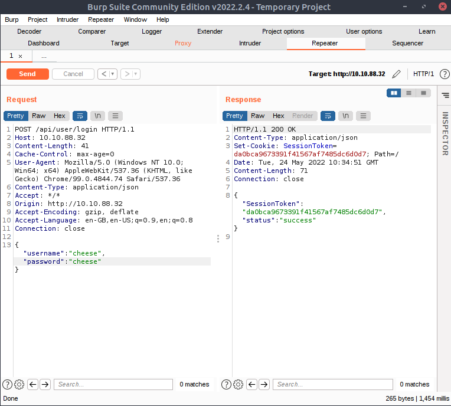
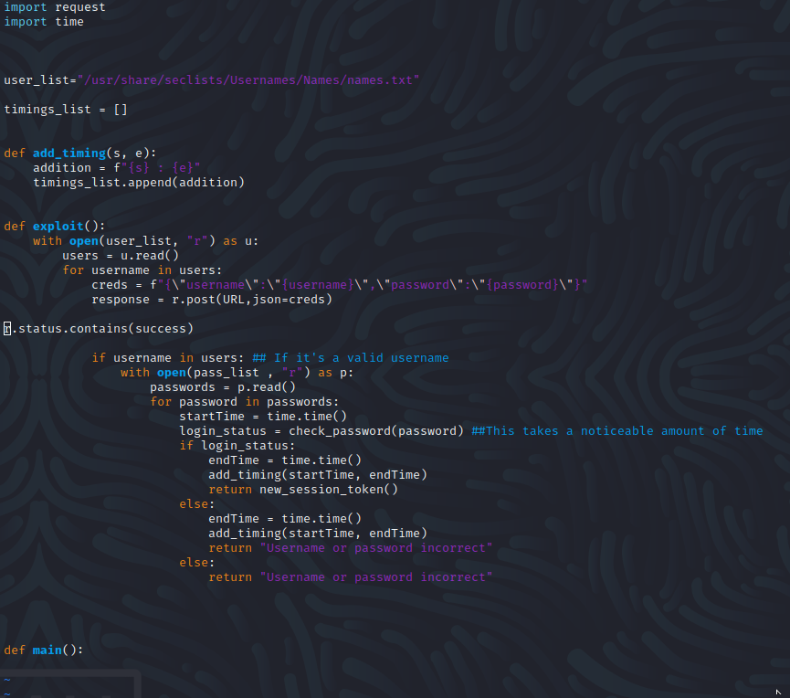

Name: hackerNote
Date:  
Difficulty: Medium
Description: A custom webapp, introducing username enumeration, custom wordlists and a basic privilege escalation exploit. 
Better Description:  
Goals: Make the python exploit myself 
Learnt:

## Recon

## Making the exploit

I give myself hlaf an hour to try take the pseudo-code and turn it into and exploit, while reconning in the background other machines that I need to do. I then checked how much I needed from this:

A lot improvements:
1. import json
2. Global URL - still 
3. Use a dictionary not list
4. a wait call to avoid server interaction collisions 
5. time took could be just s-e appended rather than listing of when each  

Good stuff
1. open with is better
2. fstrings

	
## Exploit

## Foothold

## PrivEsc

      
