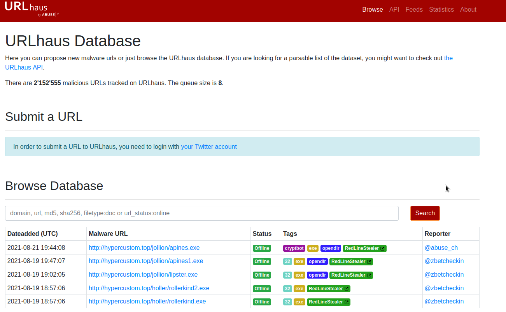

# Masterminds CTF

Name: Masterminds  
Date: 28/04/2022  
Difficulty: Medium  
Description: Practice analyzing malicious traffic using Brim.  
Better Description: First time using Brim here goes where is the first one.. my bad.. well that went well..  
Goals: Early morning brain wake up CTF, more netowrk concept exposure,   
Learnt: A bit of Brim, Zed, Bash  


## Infection 1

Provide the victim's IP address.
192.168.75.249

The victim attempted to make HTTP connections to two suspicious domains with the status '404 Not Found'. Provide the hosts/domains requested. 
```brim
_path "http" | cut id.orig_h, id.resp_h, host, referrer | uniq
```
cambiasuhistoria.growlab.es, www.letscompareonline.com

The victim made a successful HTTP connection to one of the domains and received the response_body_len of 1,309 (uncompressed content size of the data transferred from the server). Provide the domain and the destination IP address.
```brim
_path=="http" | cut id.orig_h, id.resp_h, id.resp_p, method,host, uri,response_body_len | uniq -c 
```
ww25.gocphongthe.com, 199.59.242.153

How many unique DNS requests were made to cab[.]myfkn[.]com domain (including the capitalized domain)?
```brim
_path=="dns" | count() by query | sort -r
```
7 # lowercase one counts

Provide the URI of the domain bhaktivrind[.]com that the victim reached out over HTTP. 
```brim
_path=="http" | cut id.orig_h, id.resp_h, id.resp_p, method,host, uri | uniq -c
```
/cgi-bin/JBbb8/

Provide the IP address of the malicious server and the executable that the victim downloaded from the server.
```brim
event_type=="alert" | alerts := union(alert.category) by src_ip, dest_ip
```
above for IP AND below for ip and file
```brim
_path=="http" | cut id.orig_h, id.resp_h, id.resp_p, method,host, uri | uniq -c
```

Based on the information gathered from the second question, provide the name of the malware using VirusTotal.   
Emotet

## Infection 2

Provide the IP address of the victim machine.  
```brim
_path=="http" | cut id.orig_h, id.resp_h, id.resp_p, method,host, uri | uniq -c
```
192.168.75.146

Provide the IP address the victim made the POST connections to.   
5.181.156.252

How many POST connections were made to the IP address in the previous question?  
3

Provide the domain where the binary was downloaded from.  
```brim
_path=="http" | cut id.orig_h, id.resp_h, id.resp_p, method,host, uri | uniq -c
```
hypercustom.top

Provide the name of the binary including the full URI.    
/jollion/apines.exe

Provide the IP address of the domain that hosts the binary.  
45.95.203.28

There were 2 Suricata "A Network Trojan was detected" alerts. What were the source and destination IP addresses?  
```brim
event_type=="alert" | alerts := union(alert.category) by src_ip, dest_ip
```
192.168.75.146, 45.95.203.28

Taking a look at .top domain in HTTP requests, provide the name of the stealer (Trojan that gathers information from a system) involved in this packet capture using URLhaus Database.   
Redline Stealer

[link](https://urlhaus.abuse.ch/browse.php?search=hypercustom.top)



## Infection 3

RENAME FILE to .pcap!  

Provide the IP address of the victim machine.  

Provide three C2 domains from which the binaries were downloaded (starting from the earliest to the latest in the timestamp)  
efhoahegue.ru, afhoahegue.ru, xfhoahegue.ru
AND
Provide the IP addresses for all three domains in the previous question.  
efhoahegue.ru, afhoahegue.ru, xfhoahegue.ru  

I used these commands:
```brim
event_type=="alert" | alerts := union(alert.category) by src_ip, dest_ip
method=="GET" | cut ts, uid, id, method, host, uri, status_code | sort ts
```
In chronological order  
199.21.76.77 efhoahegue.ru  
162.217.98.146 afhoahegue.ru  
63.251.106.25 xfhoahegue.ru  

How many unique DNS queries were made to the domain associated from the first IP address from the previous answer? 
_path=="dns" | sort query
```
NOTE:I scroll to check, for some reason `count() by query` duplicates  there is probably a good reason and 
2 

How many binaries were downloaded from the above domain in total?
```brim
_path=="http" | cut id.orig_h, id.resp_h, id.resp_p, method,host, uri | uniq -c
```
5

Provided the user-agent listed to download the binaries.
```brim
_path=="http" | cut id.orig_h, id.resp_h, id.resp_p, method,host, uri, user_agent | uniq -c
```
Mozilla/5.0 (Macintosh; Intel Mac OS X 10.9; rv:25.0) Gecko/20100101 Firefox/25.0  

Provide the amount of DNS connections made in total for this packet capture.  
```brim
_path=="dns" | count() by query | sort -r
```
EXPORT as results.csv
```bash
cat results.csv | sed -E 's/^([^,]*[,])//' | tr -d "count" | awk '{ sum += $1 } END { print sum }'
```

With some OSINT skills, provide the name of the worm using the first domain you have managed to collect from Question 2. (Please use quotation marks for Google searches, don't use .ru in your search, and DO NOT interact with the domain directly).  
Phorphiex
