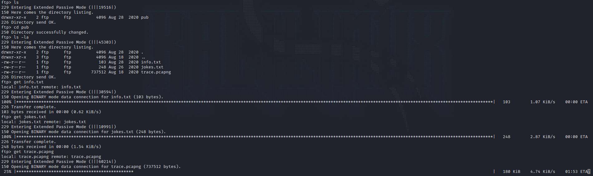

# Misguided Ghosts

Name: Misguided Ghosts
Date:  
Difficulty: Hard
Description: Collaboration between Jake and Blob! 
Better Description:  
Goals:  
Learnt:

## Recon

```bash
ping -c 3 10.10.113.7      
PING 10.10.113.7 (10.10.113.7) 56(84) bytes of data.
64 bytes from 10.10.113.7: icmp_seq=1 ttl=63 time=70.4 ms
64 bytes from 10.10.113.7: icmp_seq=2 ttl=63 time=60.3 ms
64 bytes from 10.10.113.7: icmp_seq=3 ttl=63 time=62.3 ms

--- 10.10.113.7 ping statistics ---
3 packets transmitted, 3 received, 0% packet loss, time 2003ms
rtt min/avg/max/mdev = 60.333/64.344/70.399/4.355 ms

nmap -sC -sV -T 4 -p- 10.10.113.7         
Starting Nmap 7.92 ( https://nmap.org ) at 2022-05-05 17:41 BST
Warning: 10.10.113.7 giving up on port because retransmission cap hit (6).
Nmap scan report for 10.10.113.7
Host is up (0.058s latency).
Not shown: 65447 closed tcp ports (conn-refused), 86 filtered tcp ports (no-response)
PORT   STATE SERVICE VERSION
21/tcp open  ftp     vsftpd 3.0.3
| ftp-anon: Anonymous FTP login allowed (FTP code 230)
|_drwxr-xr-x    2 ftp      ftp          4096 Aug 28  2020 pub
| ftp-syst: 
|   STAT: 
| FTP server status:
|      Connected to ::ffff:10.9.8.139
|      Logged in as ftp
|      TYPE: ASCII
|      No session bandwidth limit
|      Session timeout in seconds is 300
|      Control connection is plain text
|      Data connections will be plain text
|      At session startup, client count was 3
|      vsFTPd 3.0.3 - secure, fast, stable
|_End of status
22/tcp open  ssh     OpenSSH 7.6p1 Ubuntu 4ubuntu0.3 (Ubuntu Linux; protocol 2.0)
| ssh-hostkey: 
|   2048 d9:91:89:96:af:bc:06:b9:8d:43:df:53:dc:1f:8f:12 (RSA)
|   256 25:0b:be:a2:f9:64:3e:f1:e3:15:e8:23:b8:8c:e5:16 (ECDSA)
|_  256 09:59:9a:84:e6:6f:01:f3:33:8e:48:44:52:49:14:db (ED25519)
Service Info: OSs: Unix, Linux; CPE: cpe:/o:linux:linux_kernel

Service detection performed. Please report any incorrect results at https://nmap.org/submit/ .
Nmap done: 1 IP address (1 host up) scanned in 543.42 seconds

```

Anonymous FTP into port 21 loot the machine.



Given the ports avaliable the next step is to decrypt some traffic to get the ssh key.
I ran a UDP nmap scan to check it is a weird backdoor use udp.

Read this checked my [Wireshark Cheatsheet]()
[ssl/tls decryption](https://resources.infosecinstitute.com/topic/decrypting-ssl-tls-traffic-with-wireshark/)
[decodessl](https://packetpushers.net/using-wireshark-to-decode-ssltls-packets/)


