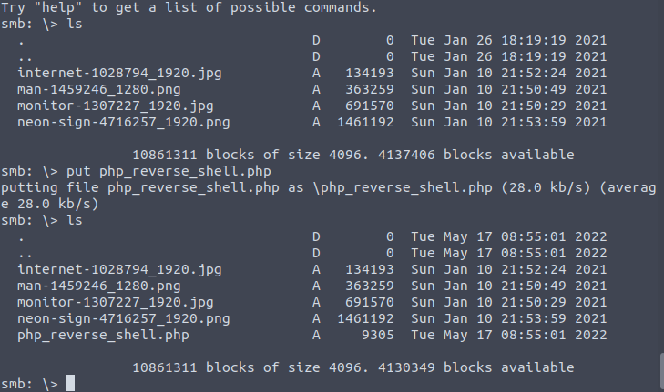
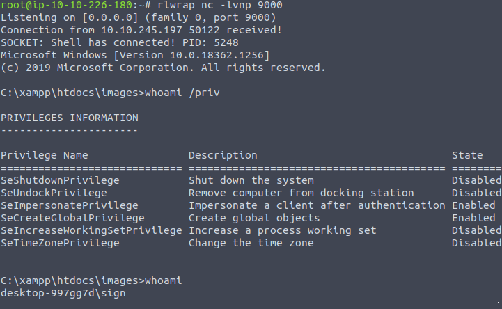

Name: AllSignsPoint2Pwnage
Date:  
Difficulty: Medium
Description: A room that contains a rushed Windows based Digital Sign system. Can you breach it? 
Better Description:  
Goals: Get a taste for a/v evasion 
Learnt: Windows Defender knows some shell code. Getting windows output can take a long time upgrade to a better shell.

```bash
root@ip-10-10-226-180:~# nmap -sC -sV -p- 10.10.245.197 --min-rate 5000

Starting Nmap 7.60 ( https://nmap.org ) at 2022-05-17 08:15 BST
Warning: 10.10.245.197 giving up on port because retransmission cap hit (10).
Nmap scan report for ip-10-10-245-197.eu-west-1.compute.internal (10.10.245.197)
Host is up (0.0079s latency).
Not shown: 62418 closed ports, 3101 filtered ports
PORT      STATE SERVICE        VERSION
21/tcp    open  ftp            Microsoft ftpd
| ftp-anon: Anonymous FTP login allowed (FTP code 230)
|_11-14-20  04:26PM                  173 notice.txt
| ftp-syst: 
|_  SYST: Windows_NT
80/tcp    open  http           Apache httpd 2.4.46 ((Win64) OpenSSL/1.1.1g PHP/7.4.11)
|_http-title: Simple Slide Show
135/tcp   open  msrpc          Microsoft Windows RPC
139/tcp   open  netbios-ssn    Microsoft Windows netbios-ssn
443/tcp   open  ssl/https?
|_http-title: Simple Slide Show
| ssl-cert: Subject: commonName=localhost
| Not valid before: 2009-11-10T23:48:47
|_Not valid after:  2019-11-08T23:48:47
445/tcp   open  microsoft-ds?
3389/tcp  open  ms-wbt-server?
| ssl-cert: Subject: commonName=DESKTOP-997GG7D
| Not valid before: 2022-05-16T07:10:57
|_Not valid after:  2022-11-15T07:10:57
5040/tcp  open  unknown
5900/tcp  open  vnc            VNC (protocol 3.8)
| vnc-info: 
|   Protocol version: 3.8
|   Security types: 
|     Ultra (17)
|_    VNC Authentication (2)
49664/tcp open  msrpc          Microsoft Windows RPC
49665/tcp open  msrpc          Microsoft Windows RPC
49666/tcp open  msrpc          Microsoft Windows RPC
49667/tcp open  msrpc          Microsoft Windows RPC
49668/tcp open  msrpc          Microsoft Windows RPC
49670/tcp open  msrpc          Microsoft Windows RPC
49677/tcp open  msrpc          Microsoft Windows RPC
MAC Address: 02:B5:65:94:17:85 (Unknown)
Service Info: OS: Windows; CPE: cpe:/o:microsoft:windows

Host script results:
|_nbstat: NetBIOS name: DESKTOP-997GG7D, NetBIOS user: <unknown>, NetBIOS MAC: 02:b5:65:94:17:85 (unknown)
| smb2-security-mode: 
|   2.02: 
|_    Message signing enabled but not required
| smb2-time: 
|   date: 2022-05-17 08:20:00
|_  start_date: 1600-12-31 23:58:45

Service detection performed. Please report any incorrect results at https://nmap.org/submit/ .
Nmap done: 1 IP address (1 host up) scanned in 270.80 seconds
root@ip-10-10-57-134:~# nmap --script discovery -p 80 10.10.93.179

Starting Nmap 7.60 ( https://nmap.org ) at 2022-03-16 14:55 GMT
Pre-scan script results:
| targets-asn: 
|_  targets-asn.asn is a mandatory parameter
Nmap scan report for ip-10-10-93-179.eu-west-1.compute.internal (10.10.93.179)
Host is up (0.00022s latency).

PORT   STATE SERVICE
80/tcp open  http
|_http-chrono: Request times for /; avg: 185.69ms; min: 166.81ms; max: 207.84ms
| http-comments-displayer: 
| Spidering limited to: maxdepth=3; maxpagecount=20; withinhost=ip-10-10-93-179.eu-west-1.compute.internal
|     
|     Path: http://ip-10-10-93-179.eu-west-1.compute.internal/#
|     Line number: 29
|     Comment: 
|         
|         // This will display the images at intervals
|     
|     Path: http://ip-10-10-93-179.eu-west-1.compute.internal/jquery-3.5.1.min.js
|     Line number: 1
|     Comment: 
|         /*! jQuery v3.5.1 | (c) JS Foundation and other contributors | jquery.org/license */
|     
|     Path: http://ip-10-10-93-179.eu-west-1.compute.internal/#
|     Line number: 16
|     Comment: 
|         
|         // Lets use the server URL to locate content.php that will give us the JSON string
|     
|     Path: http://ip-10-10-93-179.eu-west-1.compute.internal/#
|     Line number: 14
|     Comment: 
|         
|_        // Lets Get the URL of the host
|_http-date: Wed, 16 Mar 2022 14:55:23 GMT; 0s from local time.
|_http-devframework: Couldn't determine the underlying framework or CMS. Try increasing 'httpspider.maxpagecount' value to spider more pages.
| http-enum: 
|   /icons/: Potentially interesting folder w/ directory listing
|   /images/: Potentially interesting directory w/ listing on 'apache/2.4.46 (win64) openssl/1.1.1g php/7.4.11'
|_  /img/: Potentially interesting directory w/ listing on 'apache/2.4.46 (win64) openssl/1.1.1g php/7.4.11'
|_http-errors: Couldn't find any error pages.
|_http-feed: Couldn't find any feeds.
| http-headers: 
|   Date: Wed, 16 Mar 2022 14:55:21 GMT
|   Server: Apache/2.4.46 (Win64) OpenSSL/1.1.1g PHP/7.4.11
|   Last-Modified: Sat, 14 Nov 2020 14:28:27 GMT
|   ETag: "427-5b411f55edfba"
|   Accept-Ranges: bytes
|   Content-Length: 1063
|   Connection: close
|   Content-Type: text/html
|   
|_  (Request type: HEAD)
|_http-mobileversion-checker: No mobile version detected.
|_http-referer-checker: Couldn't find any cross-domain scripts.
|_http-security-headers: 
| http-sitemap-generator: 
|   Directory structure:
|     /
|       Other: 1; js: 1
|   Longest directory structure:
|     Depth: 0
|     Dir: /
|   Total files found (by extension):
|_    Other: 1; js: 1
|_http-title: Simple Slide Show
|_http-trace: TRACE is enabled
| http-useragent-tester: 
|   Status for browser useragent: 200
|   Allowed User Agents: 
|     Mozilla/5.0 (compatible; Nmap Scripting Engine; https://nmap.org/book/nse.html)
|     libwww
|     lwp-trivial
|     libcurl-agent/1.0
|     PHP/
|     Python-urllib/2.5
|     GT::WWW
|     Snoopy
|     MFC_Tear_Sample
|     HTTP::Lite
|     PHPCrawl
|     URI::Fetch
|     Zend_Http_Client
|     http client
|     PECL::HTTP
|     Wget/1.13.4 (linux-gnu)
|_    WWW-Mechanize/1.34
| http-vhosts: 
|_127 names had status 200
|_http-xssed: No previously reported XSS vuln.
MAC Address: 02:2F:A1:65:61:0B (Unknown)

Host script results:
| dns-brute: 
|   DNS Brute-force hostnames: 
|_    ns0.eu-west-1.compute.internal - 172.16.0.23
|_fcrdns: PASS (ip-10-10-93-179.eu-west-1.compute.internal)
|_ipidseq: Random Positive Increments
|_path-mtu: PMTU == 9001

Nmap done: 1 IP address (1 host up) scanned in 28.64 seconds

root@ip-10-10-57-134:~# nmap --script vuln -p 80 10.10.93.179

Starting Nmap 7.60 ( https://nmap.org ) at 2022-03-16 15:05 GMT
Nmap scan report for ip-10-10-93-179.eu-west-1.compute.internal (10.10.93.179)
Host is up (0.0029s latency).

PORT   STATE SERVICE
80/tcp open  http
|_http-aspnet-debug: ERROR: Script execution failed (use -d to debug)
|_http-csrf: Couldn't find any CSRF vulnerabilities.
|_http-dombased-xss: Couldn't find any DOM based XSS.
| http-fileupload-exploiter: 
|   
|     Couldn't find a file-type field.
|   
|_    Couldn't find a file-type field.
| http-sql-injection: 
|   Possible sqli for queries:
|     http://ip-10-10-93-179.eu-west-1.compute.internal/E.location.href,t.head.appendChild(r)):t=E),o=!n&&%5b%5d,(i=N.exec(e))?%5bt.createElement%28i%5b1%5d%29%5d%3a%28i=xe%28%5be%5d%2ct%2co%29%2co%27%20OR%20sqlspider&S%28o%29.remove%28%29%2cS.merge%28%5b%5d%2ci.childNodes%29%29%29%3bvar=&o.length=&=
|     http://ip-10-10-93-179.eu-west-1.compute.internal/E.location.href,t.head.appendChild(r)):t=E),o=!n&&%5b%5d,(i=N.exec(e))?%5bt.createElement%28i%5b1%5d%29%5d%3a%28i=xe%28%5be%5d%2ct%2co%29%2co&S%28o%29.remove%28%29%2cS.merge%28%5b%5d%2ci.childNodes%29%29%29%3bvar=%27%20OR%20sqlspider&o.length=&=
|     http://ip-10-10-93-179.eu-west-1.compute.internal/E.location.href,t.head.appendChild(r)):t=E),o=!n&&%5b%5d,(i=N.exec(e))?%5bt.createElement%28i%5b1%5d%29%5d%3a%28i=xe%28%5be%5d%2ct%2co%29%2co&S%28o%29.remove%28%29%2cS.merge%28%5b%5d%2ci.childNodes%29%29%29%3bvar=&o.length=%27%20OR%20sqlspider&=
|     http://ip-10-10-93-179.eu-west-1.compute.internal/E.location.href,t.head.appendChild(r)):t=E),o=!n&&%5b%5d,(i=N.exec(e))?%5bt.createElement%28i%5b1%5d%29%5d%3a%28i=xe%28%5be%5d%2ct%2co%29%2co&S%28o%29.remove%28%29%2cS.merge%28%5b%5d%2ci.childNodes%29%29%29%3bvar=&o.length=&=%27%20OR%20sqlspider
|_    http://ip-10-10-93-179.eu-west-1.compute.internal/Tt.href,S.extend(%7bactive:0,lastModified:%7b%7d,etag:%7b%7d,ajaxSettings:%7burl:Tt.href,type:%22GET%22,isLocal:/%5e(?%3aabout%7capp%7capp-storage%7c.%2b-extension%7cfile%7cres%7cwidget%29%3a%24%2f.test%28Tt.protocol%29%2cglobal%3a%210%2cprocessData%3a%210%2casync%3a%210%2ccontentType%3a%22application%2fx-www-form-urlencoded%3b=%27%20OR%20sqlspider
|_http-stored-xss: Couldn't find any stored XSS vulnerabilities.
|_http-vuln-cve2014-3704: ERROR: Script execution failed (use -d to debug)
MAC Address: 02:2F:A1:65:61:0B (Unknown)

Nmap done: 1 IP address (1 host up) scanned in 87.83 seconds


```
## Web Analysis

```bash

```


## Content Discovery

```
root@ip-10-10-226-180:~# gobuster dir -u http://10.10.245.197/ -w /usr/share/wordlists/dirb/common.txt
===============================================================
Gobuster v3.0.1
by OJ Reeves (@TheColonial) & Christian Mehlmauer (@_FireFart_)
===============================================================
[+] Url:            http://10.10.245.197/
[+] Threads:        10
[+] Wordlist:       /usr/share/wordlists/dirb/common.txt
[+] Status codes:   200,204,301,302,307,401,403
[+] User Agent:     gobuster/3.0.1
[+] Timeout:        10s
===============================================================
2022/05/17 08:20:50 Starting gobuster
===============================================================
/.htaccess (Status: 403)
/.htpasswd (Status: 403)
/.hta (Status: 403)
/aux (Status: 403)
/com1 (Status: 403)
/com2 (Status: 403)
/com3 (Status: 403)
/con (Status: 403)
/cgi-bin/ (Status: 403)
/dashboard (Status: 301)
/favicon.ico (Status: 200)
/Images (Status: 301)
/images (Status: 301)
/img (Status: 301)
/index.html (Status: 200)
/licenses (Status: 403)
/lpt1 (Status: 403)
/lpt2 (Status: 403)
/nul (Status: 403)
/phpmyadmin (Status: 403)
/prn (Status: 403)
/server-status (Status: 403)
/server-info (Status: 403)
/webalizer (Status: 403)
===============================================================
2022/05/17 08:21:13 Finished
===============================================================
root@ip-10-10-226-180:~# 
```


## Breaking in 

anonymous ftp and checking if ftp allowed put later, get notice.txt reveals:
```bash

root@ip-10-10-134-40:~# cat notice.txt 
NOTICE
======

Due to customer complaints about using FTP we have now moved 'images' to 
a hidden windows file share for upload and management 
of images.

- Dev Tea
```

## SMB 

```
root@ip-10-10-226-180:~# enum4linux -a 10.10.245.197
WARNING: polenum.py is not in your path.  Check that package is installed and your PATH is sane.
Starting enum4linux v0.8.9 ( http://labs.portcullis.co.uk/application/enum4linux/ ) on Tue May 17 08:25:26 2022

 ========================== 
|    Target Information    |
 ========================== 
Target ........... 10.10.245.197
RID Range ........ 500-550,1000-1050
Username ......... ''
Password ......... ''
Known Usernames .. administrator, guest, krbtgt, domain admins, root, bin, none


 ===================================================== 
|    Enumerating Workgroup/Domain on 10.10.245.197    |
 ===================================================== 
[+] Got domain/workgroup name: WORKGROUP

 ============================================= 
|    Nbtstat Information for 10.10.245.197    |
 ============================================= 
Looking up status of 10.10.245.197
	DESKTOP-997GG7D <00> -         B <ACTIVE>  Workstation Service
	WORKGROUP       <00> - <GROUP> B <ACTIVE>  Domain/Workgroup Name
	DESKTOP-997GG7D <20> -         B <ACTIVE>  File Server Service

	MAC Address = 02-B5-65-94-17-85

 ====================================== 
|    Session Check on 10.10.245.197    |
 ====================================== 
[E] Server doesn't allow session using username '', password ''.  Aborting remainder of tests.
```
Cant null session in 

```bash
root@ip-10-10-226-180:~# rpcclient -U "" -N 10.10.245.197
Cannot connect to server.  Error was NT_STATUS_ACCESS_DENIED
```

Share listing

```bash
root@ip-10-10-226-180:~# smbclient -L 10.10.245.197
WARNING: The "syslog" option is deprecated
Enter WORKGROUP\root's password: 

	Sharename       Type      Comment
	---------       ----      -------
	ADMIN$          Disk      Remote Admin
	C$              Disk      Default share
	images$         Disk      
	Installs$       Disk      
	IPC$            IPC       Remote IPC
	Users           Disk      
Reconnecting with SMB1 for workgroup listing.
Connection to 10.10.245.197 failed (Error NT_STATUS_RESOURCE_NAME_NOT_FOUND)
Failed to connect with SMB1 -- no workgroup available
```

From first attempt

```bash
python3 smbmap.py -u guest -p "" -H 10.10.127.116
[+] IP: 10.10.127.116:445       Name: ip-10-10-127-116.eu-west-1.compute.internal       Status: Authenticated
        Disk                                                    Permissions     Comment
        ----                                                    -----------     -------
        ADMIN$                                                  NO ACCESS       Remote Admin
        C$                                                      NO ACCESS       Default share
        images$                                                 READ, WRITE
        Installs$                                               NO ACCESS
        IPC$                                                    READ ONLY       Remote IPC
        Users                                                   READ ONLY
```

The reason it did not work last time is because I made some assumptions about smb and how these images are hosted in relation to how the pentest monkey reverse shell works.
Given that this is a walkthrough, I check the writeups. I also forgot to comment out the `syslog = 0` in the /etc/samba/smb.conf. 
[Follow Ivan](https://github.com/ivan-sincek/php-reverse-shell). Very very cool update to pentest monkey reverse shell.





Thenon standard share is on the smblient listing output and the flag is on the sign user's desktop.

```powershell
reg query "HKLM\Software\Microsoft\Windows NT\CurrentVersion\Winlogon"
```
After breaking the box again. Went back to the Installs share that was referenced as a answer in the previous task.
I ran `whoami /priv` and I am sure I ran this exploit at some point. Checked out the files in the Installs directory.
`Install_www_and_deloy.bat` - never stick credentials in scripts to deloy stuff. There is only one .exe in this directory. 
VNC is wiki:*UltraVNC is an open-source remote-administration/remote-desktop-software utility. The client supports Microsoft Windows and Linux but the server only supports Windows. It uses the VNC protocol to control/access another computer remotely over a network connection.*
So it has should be stored in Program files and encrypted password is here: `C:\Program Files\uvnc bvba\UltraVNC>type ultravnc.ini`

I just copied this file to the attack box, apt install wine, downlaod the hinted password recovery tool and set copied file as argument to the password recovery tool ran with wine.
Then I got the PrintSpoofer64.exe, [discovered a nice way to figure out the cpu architecture from this link](https://www.windows-commandline.com/check-windows-32-bit-64-bit-command-line/).
```cmd
echo %PROCESSOR_ARCHITECTURE%
```
It is probably slightly steathy it is variable check.

